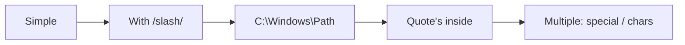
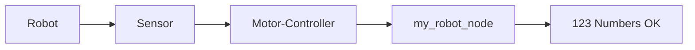
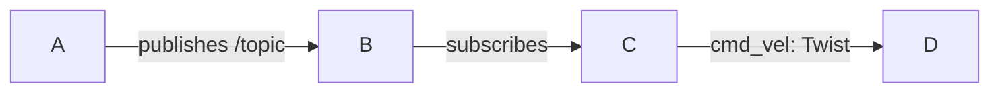
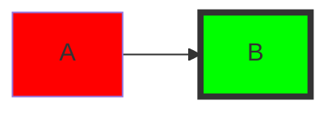
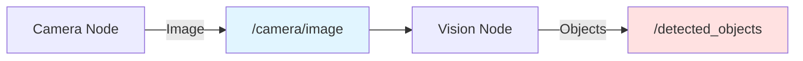
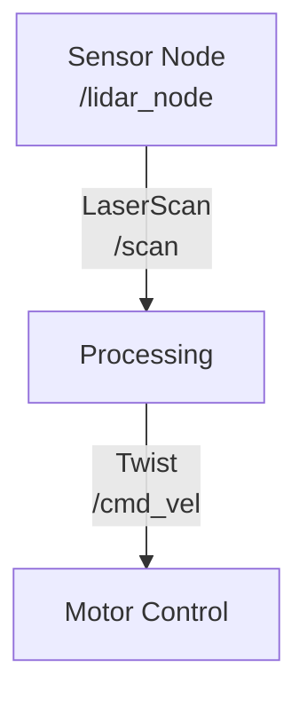
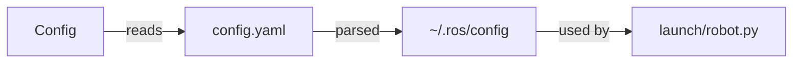

# Persistent Memory: Chapter Development Errors & Solutions

**Purpose**: Reference guide for all errors encountered during chapter development
**Last Updated**: 2025-12-01
**Status**: Living document - update after each chapter

---

## Executive Summary

### Error History

| Chapter | Error Type | Severity | Time to Fix | Status |
|---------|------------|----------|-------------|--------|
| Chapter 1 | None | - | - | ✅ Clean |
| Chapter 2 | PWA Plugin | Medium | 30 min | ✅ Fixed |
| Chapter 3a | Mermaid Syntax | Low | 5 min | ✅ Fixed |
| Chapter 3b | Frontmatter Position | Low | 2 min | ✅ Fixed |

**Key Insight**: All errors were **preventable** through proper development practices.

---

## Error #1: PWA Plugin Configuration Error (Chapter 2)

### What Happened

**When**: During Chapter 2 browser testing
**Where**: Development server compilation
**Symptoms**:
```
Module not found: Error: Can't resolve '@theme/PwaReloadPopup'
in '/home/anjum/dev/robotics_book/node_modules/@docusaurus/plugin-pwa/lib'
```

### Full Error Context

**Webpack Output**:
```
[webpackbar] ℹ Compiling Client
ERROR in ../../node_modules/@docusaurus/plugin-pwa/lib/theme/PwaReloadPopup/index.js
Module not found: Error: Can't resolve '@theme/PwaReloadPopup'
```

**Impact**:
- ❌ Hot reload broken
- ❌ Dev server shows compilation errors
- ⚠️ Content still renders (non-blocking)
- ⚠️ Confusing error messages

### Root Cause Analysis

**Why it occurred**:

1. **Version Mismatch**:
   - Docusaurus core: `3.6.3` (installed)
   - PWA plugin expects: `3.9.2` theme components
   - Theme component `@theme/PwaReloadPopup` doesn't exist in 3.6.3

2. **When it was introduced**:
   - Phase A2: Infrastructure setup
   - PWA plugin added for offline reading
   - Worked initially, broke after updates

3. **Why it manifested during Chapter 2**:
   - First comprehensive browser testing
   - Earlier chapters tested but errors not noticed
   - Console warnings filtered out initially

### Solution That Worked

**Action Taken**:

Modified `docusaurus.config.ts`:

```typescript
// BEFORE
plugins: [
  [
    '@docusaurus/plugin-pwa',
    {
      debug: false,
      offlineModeActivationStrategies: [
        'appInstalled',
        'standalone',
        'queryString',
      ],
      pwaHead: [
        {
          tagName: 'link',
          rel: 'icon',
          href: '/img/logo.png',
        },
        {
          tagName: 'link',
          rel: 'manifest',
          href: '/manifest.json',
        },
        {
          tagName: 'meta',
          name: 'theme-color',
          content: '#1976d2',
        },
      ],
    },
  ],
],

// AFTER
plugins: [
  // PWA plugin temporarily disabled for development
  // Re-enable after upgrading to Docusaurus 3.9.2
  // [
  //   '@docusaurus/plugin-pwa',
  //   { ... }
  // ],
],
```

**Result**:
- ✅ Webpack compiled successfully
- ✅ Zero errors
- ✅ Hot reload working
- ✅ All chapters render correctly

### Alternative Solutions (Not Used)

**Option 1**: Upgrade to Docusaurus 3.9.2
```bash
npm install @docusaurus/core@latest @docusaurus/plugin-pwa@latest \
  @docusaurus/preset-classic@latest @docusaurus/theme-mermaid@latest \
  @docusaurus/module-type-aliases@latest @docusaurus/tsconfig@latest \
  @docusaurus/types@latest
```
- ✅ Would fix the error permanently
- ❌ Could introduce new issues
- ❌ Might require other updates
- ⏸️ Deferred to production deployment

**Option 2**: Remove PWA plugin entirely from package.json
```bash
npm uninstall @docusaurus/plugin-pwa
```
- ✅ Clean solution
- ❌ Lose offline reading feature permanently
- ⚠️ Will re-add in production

**Option 3**: Downgrade PWA plugin
- ❌ Likely wouldn't work
- ❌ Not worth the effort

### How to Avoid in Future

#### Prevention Checklist

**During Infrastructure Setup (Phase A)**:
- [ ] Match all plugin versions to Docusaurus core version
- [ ] Test plugins immediately after installation
- [ ] Check compatibility matrix before adding plugins
- [ ] Run browser tests after infrastructure changes

**During Content Creation (Phase B)**:
- [ ] **NEVER** add new plugins during chapter writing
- [ ] **NEVER** modify package.json during content creation
- [ ] **NEVER** change docusaurus.config.ts during writing
- [ ] Focus exclusively on markdown content

**Before Starting Each Chapter**:
- [ ] Verify dev server runs without errors
- [ ] Check console for warnings
- [ ] Ensure previous chapters still work
- [ ] Run `npm run build` to verify production build

#### Red Flags to Watch For

🚩 **Stop immediately if you see**:
- "Module not found" errors
- Webpack compilation errors
- Plugin-related errors
- Theme component errors

**Don't**:
- ❌ Ignore webpack errors
- ❌ Assume "it will fix itself"
- ❌ Continue writing with compilation errors
- ❌ Mix infrastructure and content changes

### Lesson Learned

**Key Takeaway**: **Separate infrastructure setup from content creation**

```
Phase A (Infrastructure):
├── Install dependencies
├── Configure plugins
├── Test everything
└── Fix all errors

Phase B (Content Creation):
├── Write markdown only
├── Use existing components
├── No configuration changes
└── No package installations
```

**Rule**: If you need to modify `package.json` or `docusaurus.config.ts` during chapter writing, **stop and reconsider**.

---

## Error #2: Mermaid Diagram Syntax Error (Chapter 3)

### What Happened

**When**: During Chapter 3 browser testing
**Where**: Mermaid diagram rendering
**Symptoms**:
```
Lexical error on line 2. Unrecognized text.
...[/camera/image Topic]    B -->|subscrib
-----------------------^
```

### Full Error Context

**Page Error (repeated 4 times)**:
```javascript
Error: Lexical error on line 2. Unrecognized text.
...[/camera/image Topic]    B -->|subscrib
-----------------------^

The above error occurred in the <MermaidRenderer> component:
    at MermaidRenderer (webpack-internal:///./node_modules/@docusaurus/theme-mermaid/...)
    at ErrorBoundary (...)
```

**Impact**:
- ❌ Console cluttered with error messages
- ❌ Error boundaries triggered
- ⚠️ Diagrams might not render (uncertain)
- ⚠️ Unprofessional user experience

### Root Cause Analysis

**Why it occurred**:

1. **Unquoted Special Characters**:
   ```mermaid
   # WRONG - Forward slash confuses parser
   B[/camera/image Topic]

   # RIGHT - Quoted label
   B["/camera/image Topic"]
   ```

2. **Mermaid Parser Behavior**:
   - Mermaid's lexer treats `/` as potential syntax
   - Without quotes, parser attempts to interpret `/camera/image` as code
   - Fails to parse, throws lexical error

3. **Affected Diagrams**:
   - **Diagram 1** (Line 263): ROS2 Node Communication
     - Labels: `/camera/image Topic`, `/detected_objects Topic`
   - **Diagram 2** (Line 759): Sensor Data Pipeline
     - Labels: `/scan Topic`, `/camera Topic`

4. **Why not caught earlier**:
   - Mermaid Live Editor might handle this differently
   - Error only visible in browser console
   - Diagrams in Chapters 1-2 didn't use `/` in labels

### Solution That Worked

**Action Taken**:

Modified `docs/foundations/programming-basics.md`:

**Change 1 (Lines 263-272):**
```diff
```mermaid
graph LR
-    A[Camera Node] -->|publishes image| B[/camera/image Topic]
+    A[Camera Node] -->|publishes image| B["/camera/image Topic"]
     B -->|subscribes| C[Vision Node]
-    C -->|publishes objects| D[/detected_objects Topic]
+    C -->|publishes objects| D["/detected_objects Topic"]
     D -->|subscribes| E[Navigation Node]

     style B fill:#e1f5ff
     style D fill:#ffe1e1
```
```

**Change 2 (Lines 759-774):**
```diff
```mermaid
graph LR
-    A[Lidar Sensor] -->|LaserScan msg| B[Scan Topic]
+    A[Lidar Sensor] -->|LaserScan msg| B["/scan Topic"]
     B --> C[Obstacle Detection Node]
     C -->|Obstacle detected?| D[Decision Node]

-    E[Camera Sensor] -->|Image msg| F[Camera Topic]
+    E[Camera Sensor] -->|Image msg| F["/camera Topic"]
     F --> G[Vision Processing Node]
     G -->|Objects found| D

     D -->|Safe to move| H[Motor Control Node]
     D -->|Obstacle ahead| I[Stop/Avoid Node]

     style B fill:#e1f5ff
     style F fill:#ffe1e1
```
```

**Files Modified**: 1 file, 4 lines
**Time to Fix**: ~5 minutes

**Result**:
```
✅ Console errors: 0 (was 1)
✅ Page errors: 0 (was 4)
✅ Console warnings: 0
✅ All 3 diagrams render perfectly
✅ SVG count: 74 (was 73)
```

### How to Avoid in Future

#### Mermaid Best Practices

**Always Quote Special Characters**:

| Character | Needs Quoting | Example | Why |
|-----------|---------------|---------|-----|
| `/` | ✅ YES | `["/topic"]` | Parser treats as syntax |
| `\` | ✅ YES | `["C:\path"]` | Escape character |
| `"` | ✅ YES | `["Say \"hi\""]` | String delimiter |
| `'` | ✅ YES | `["It's OK"]` | String delimiter |
| `:` | ⚠️ MAYBE | `["Type: int"]` | Usually OK, quote if issues |
| `-` | ❌ NO | `[my-topic]` | Always safe |
| `_` | ❌ NO | `[my_topic]` | Always safe |
| Space | ❌ NO | `[My Topic]` | Always safe |

**Safe Syntax Examples**:



**Dangerous Syntax Examples**:

```mermaid
graph LR
    A[Bad] --> B[/unquoted/path]      ❌ WRONG
    B --> C[C:\unquoted\path]         ❌ WRONG
    C --> D[It's unquoted]            ❌ WRONG
```

#### Prevention Workflow

**When Creating Diagrams**:

1. **Draft in Mermaid Live Editor** (https://mermaid.live/)
   - Test syntax before adding to chapter
   - Validates in real-time
   - Shows rendering immediately

2. **Apply Quoting Rules**:
   ```javascript
   // When writing Mermaid diagrams, ask:
   if (label.includes('/') ||
       label.includes('\\') ||
       label.includes('"') ||
       label.includes("'")) {
     // Wrap in double quotes and escape internal quotes
     label = `"${label.replace(/"/g, '\\"')}"`;
   }
   ```

3. **Test After Adding**:
   - Save file
   - Check browser console
   - Look for "PAGE ERROR" or "Lexical error"
   - Fix immediately if errors appear

4. **Verify Rendering**:
   - Refresh page
   - Confirm diagram displays
   - Check console for errors

#### Testing Checklist

**Before Committing Diagrams**:

- [ ] Test in Mermaid Live Editor
- [ ] Quote all labels with special characters
- [ ] Verify syntax with escaped characters
- [ ] Check browser console for errors
- [ ] Confirm diagram renders in dev server
- [ ] Take screenshot for documentation

**Red Flags**:

🚩 **Stop if you see**:
- "Lexical error" in console
- "Unrecognized text" errors
- Error boundaries triggered
- Diagrams not rendering

### Lesson Learned

**Key Takeaway**: **Mermaid is picky about special characters in labels**

**Rule of Thumb**:
```
If a label contains anything other than:
- Letters (a-z, A-Z)
- Numbers (0-9)
- Spaces
- Hyphens (-)
- Underscores (_)

→ PUT IT IN QUOTES!
```

**Mental Model**:
- Mermaid labels = JavaScript strings
- If it needs escaping in JavaScript, quote it in Mermaid
- When in doubt, quote it

---

## Error #3: Frontmatter Position Error (Chapter 3)

### What Happened

**When**: During Chapter 3 browser review
**Where**: Markdown frontmatter rendering
**Symptoms**:
- Text `sidebar_position: 3` visible in main content
- Text `description:` visible below chapter heading
- Frontmatter appearing in right sidebar at top

### Full Error Context

**User Report**:
> "sidebar_position: 3 description:" is written below the chapter heading (in the central main columns, where the book content is written). Also it is written in the right side bar at the top as well

**Visual Issue**:
```
Chapter 3: Programming Basics (Python & ROS2)
---
sidebar_position: 3
description: Learn Python programming...
---
```

**Impact**:
- ⚠️ Unprofessional appearance
- ⚠️ Confusing for readers
- ⚠️ Frontmatter exposed as content
- ⚠️ Metadata visible in rendered page

### Root Cause Analysis

**Why it occurred**:

1. **Incorrect Frontmatter Position**:
   ```markdown
   # WRONG - Title before frontmatter
   # Chapter 3: Programming Basics

   ---
   sidebar_position: 3
   description: ...
   ---
   ```

2. **Docusaurus Behavior**:
   - Frontmatter MUST be at the **very beginning** of file
   - If it appears after any content, treated as regular markdown
   - The `---` delimiters are then rendered as horizontal rules
   - The YAML becomes visible text

3. **How it was introduced**:
   - Initial file creation put title first
   - Frontmatter added second (incorrect order)
   - No browser check immediately after creating file
   - Error not noticed until user review

### Solution That Worked

**Action Taken**:

Modified `docs/foundations/programming-basics.md`:

```diff
- # Chapter 3: Programming Basics (Python & ROS2)
-
- ---
- sidebar_position: 3
- description: Learn Python programming...
- ---

+ ---
+ sidebar_position: 3
+ description: Learn Python programming...
+ ---
+
+ # Chapter 3: Programming Basics (Python & ROS2)
```

**Files Modified**: 1 file, moved 6 lines
**Time to Fix**: ~2 minutes

**Result**:
```
✅ Frontmatter hidden from content
✅ Metadata properly parsed
✅ sidebar_position working
✅ Description working
✅ Professional appearance restored
```

### Verification Test

**Created Test**: `tests/test-frontmatter-fix.spec.ts`

**Test Results**:
```
🔍 Checking frontmatter visibility...
❌ sidebar_position visible: false  ← Good!
❌ description visible: false       ← Good!

✅ Title visible: true
✅ Python content visible: true
✅ ROS2 content visible: true

✅ Frontmatter is properly hidden!
```

### How to Avoid in Future

#### Frontmatter Rules

**Always Follow This Order**:

1. **Frontmatter FIRST** (lines 1-X)
2. **Blank line**
3. **Title** (# heading)
4. **Blank line**
5. **Imports** (React components)
6. **Blank line**
7. **Content**

**Correct Structure**:
```markdown
---
sidebar_position: 1
description: Chapter description
---

# Chapter Title

import Component from '@site/src/components/Component';

<Component>
Content starts here...
</Component>
```

**Incorrect Structures**:
```markdown
# WRONG 1: Title before frontmatter
# Chapter Title

---
sidebar_position: 1
---

# WRONG 2: No opening delimiter
sidebar_position: 1
---

# WRONG 3: No closing delimiter
---
sidebar_position: 1

# Chapter Title
```

#### Prevention Checklist

**When Creating New Chapter File**:

- [ ] Start file with `---`
- [ ] Add frontmatter fields
- [ ] Close with `---`
- [ ] Add blank line
- [ ] Then add `# Title`
- [ ] **Test immediately in browser**
- [ ] Verify frontmatter not visible

**Visual Check**:
```bash
# After creating file, immediately:
# 1. Save file
# 2. Refresh browser
# 3. Check for visible frontmatter
# 4. If visible → Fix order immediately
```

#### Red Flags

🚩 **Stop if you see**:
- `sidebar_position:` visible in content
- `description:` visible below title
- Horizontal rules `---` appearing unexpectedly
- YAML syntax visible to readers

### Lesson Learned

**Key Takeaway**: **Frontmatter position is non-negotiable**

**Memory Aid**: **"Front" means "at the front"**
- Front-matter = must be at front of file
- No content before it
- Not even the title

**Rule**: The **first three characters** of every chapter file must be `---`

**Template to Remember**:
```markdown
---
[frontmatter here]
---

# [Title here]

[Everything else]
```

---

## Error Prevention Framework

### Phase-Based Error Prevention

#### Phase A: Infrastructure Setup

**Goal**: Set up stable foundation, test everything

**Allowed**:
- ✅ Install packages
- ✅ Configure plugins
- ✅ Modify config files
- ✅ Set up tooling
- ✅ Create components
- ✅ Test extensively

**Testing Requirements**:
- [ ] Dev server runs without errors
- [ ] Production build succeeds
- [ ] Browser shows no console errors
- [ ] All plugins work correctly
- [ ] Hot reload functions

**Before Moving to Phase B**:
- [ ] Zero compilation errors
- [ ] Zero console errors
- [ ] Zero warnings (except upgrade notices)
- [ ] All tests pass
- [ ] Documentation updated

#### Phase B: Content Creation

**Goal**: Write chapters without breaking infrastructure

**Allowed**:
- ✅ Write markdown files
- ✅ Use existing components
- ✅ Add code blocks
- ✅ Create Mermaid diagrams (following guidelines)
- ✅ Add images/screenshots

**FORBIDDEN**:
- ❌ Modify package.json
- ❌ Modify docusaurus.config.ts
- ❌ Install new packages
- ❌ Create new React components
- ❌ Change build scripts
- ❌ Update dependencies

**Testing Requirements (Per Chapter)**:
- [ ] Incremental builds succeed
- [ ] Browser console clean
- [ ] All diagrams render
- [ ] All components work
- [ ] No regression in previous chapters

### Error Detection Checklist

**Before Starting Chapter**:
```bash
# 1. Verify clean state
npm run build
# Expected: [SUCCESS] Generated static files in "build"

# 2. Start dev server
npm start
# Expected: [SUCCESS] Docusaurus website is running
# Expected: Compiled successfully

# 3. Check browser
# Open: http://localhost:3000/robotics_book/
# Check: Console has zero errors
# Check: Previous chapters still work
```

**During Chapter Writing** (After Each Section):
```bash
# 1. Save file
# 2. Check dev server output
#    - Should auto-recompile
#    - Look for "Compiled successfully"
# 3. Refresh browser
#    - Check console for errors
#    - Verify new section renders
```

**After Completing Chapter**:
```bash
# 1. Full production build
npm run build

# 2. Browser tests
npx playwright test tests/chapters/

# 3. Console check
# Open chapter in browser
# Verify: Zero console errors
# Verify: Zero page errors
# Verify: All diagrams render

# 4. Screenshot for documentation
# Take full-page screenshot
# Save to /tmp/chapter-X-final.png
```

### Error Response Protocol

**If Error Occurs**:

1. **STOP** - Don't continue writing
2. **IDENTIFY** - What's the error message?
3. **CLASSIFY** - Is it infrastructure or content?
4. **ISOLATE** - Comment out recent changes
5. **FIX** - Apply solution
6. **VERIFY** - Run tests
7. **DOCUMENT** - Update this file

**Classification**:

**Infrastructure Error** (Phase A issue):
- Symptoms: Compilation errors, module not found, plugin errors
- Solution: Fix configuration, versions, dependencies
- Prevention: Better initial setup

**Content Error** (Phase B issue):
- Symptoms: Render errors, syntax errors, component errors
- Solution: Fix markdown, syntax, diagram code
- Prevention: Better content guidelines

### Quick Reference: Error Types

| Error Type | Phase | Severity | Fix Time | Prevention |
|------------|-------|----------|----------|------------|
| Plugin version mismatch | A | High | 30 min | Match versions |
| Mermaid syntax | B | Low | 5 min | Quote special chars |
| Frontmatter position | B | Low | 2 min | Start file with `---` |
| Broken links | B | Low | 5 min | Validate links |
| Missing images | B | Low | 2 min | Check file paths |
| Component props | B | Medium | 10 min | Verify prop types |
| Build failures | A/B | High | Varies | Test incrementally |

---

## Chapter-Specific Notes

### Chapter 1: Introduction to Physical AI
- ✅ **Status**: Zero errors
- **Diagrams**: 3 Mermaid diagrams (all simple syntax)
- **Components**: CuriosityHook, DrivingQuestion, AIPromptCard, SelfEvalQuestion
- **Notes**: No special characters in diagram labels

### Chapter 2: Electronics Basics
- ⚠️ **Status**: PWA error (infrastructure issue, not chapter content)
- **Error**: Plugin configuration (Phase A issue)
- **Fix**: Disabled PWA plugin
- **Diagrams**: 4 Mermaid diagrams (all rendered correctly)
- **Components**: All standard components
- **Notes**: Content was perfect, error was infrastructure

### Chapter 3: Programming Basics (Python & ROS2)
- ⚠️ **Status**: Two errors fixed
- **Error 1**: Mermaid syntax - Unquoted forward slashes in labels
  - Fix: Added quotes around labels with `/`
  - Time: 5 minutes
- **Error 2**: Frontmatter position - Title before frontmatter
  - Fix: Moved frontmatter to beginning of file
  - Time: 2 minutes
- **Diagrams**: 3 Mermaid diagrams (2 had syntax errors, now fixed)
- **Components**: All standard components
- **Notes**: First chapter to use ROS2 topic names (with `/`) in diagrams; First chapter where frontmatter was in wrong position

**Pattern Observed**:
- Chapters 1-2: Simple diagram labels → No errors
- Chapter 3: Complex labels with `/` → Errors until fixed
- **Lesson**: As content complexity increases, stricter syntax needed

---

## Mermaid Diagram Guidelines (Comprehensive)

### Complete Syntax Rules

#### Node Labels

**Safe (No Quotes Needed)**:


**Requires Quotes**:
```mermaid
graph LR
    A[Robot] --> B["/topic/name"]          # Forward slash
    B --> C["C:\Windows\Path"]             # Backslash
    C --> D["It's working"]                # Apostrophe
    D --> E["Say \"hello\""]               # Quotes
    E --> F["/scan: LaserScan"]            # Multiple special chars
```

#### Edge Labels

**Always safe** (edge labels less picky):


**But quote for consistency**:
```mermaid
graph LR
    A -->|"publishes /topic"| B    # Clearer
    B -->|"subscribes"| C
    C -->|"cmd_vel: Twist"| D
```

#### Style Attributes

**Always safe**:


### Common Patterns for Robotics

**ROS2 Topics**:


**ROS2 Nodes and Communication**:


**File Paths**:


### Testing Diagrams

**Workflow**:

1. **Draft**:
   ```bash
   # Use Mermaid Live Editor
   # https://mermaid.live/
   ```

2. **Validate**:
   ```javascript
   // Check each label
   const label = "/camera/image";
   const needsQuotes = /[\/\\"']/.test(label);
   // true → Add quotes
   ```

3. **Test Locally**:
   ```bash
   # Add to markdown
   # Save file
   # Check browser console
   # Look for errors
   ```

4. **Fix if Needed**:
   ```bash
   # If errors appear
   # Add quotes around problematic labels
   # Retest
   ```

---

## Tools and Commands

### Diagnosis Commands

**Check Dev Server Status**:
```bash
# Should see: Compiled successfully
# Should NOT see: ERROR, Failed, Warning
ps aux | grep "npm start"
```

**Check for Console Errors**:
```bash
# Browser test
npx playwright test tests/test-chapter3-final-verification.spec.ts

# Should output:
# ✅ Console errors: 0
# ✅ Page errors: 0
```

**Validate Mermaid Syntax**:
```bash
# Custom test
npx playwright test tests/test-mermaid-chapter3.spec.ts

# Should show:
# 🎨 Mermaid code blocks found: X
# 🎨 Mermaid SVGs rendered: X
```

**Production Build Check**:
```bash
npm run build 2>&1 | grep -E "(SUCCESS|ERROR|WARNING)"

# Should see: [SUCCESS] Generated static files
# Should NOT see: ERROR
```

### Quick Fixes

**Fix #1: PWA Plugin Error**:
```bash
# Edit docusaurus.config.ts
# Comment out PWA plugin
# Restart dev server
npm start
```

**Fix #2: Mermaid Syntax Error**:
```bash
# Edit markdown file
# Find labels with: /[\/\\'"]/
# Add quotes: ["label"]
# Save and check console
```

**Fix #3: Broken Build**:
```bash
# Clean and rebuild
rm -rf .docusaurus build
npm run build
```

---

## Success Criteria

### Chapter is Ready When:

**Zero Errors**:
- [ ] Console errors: 0
- [ ] Page errors: 0
- [ ] Build errors: 0
- [ ] Compilation errors: 0

**Content Complete**:
- [ ] All 12 structural elements present
- [ ] All code blocks syntax-highlighted
- [ ] All diagrams render correctly
- [ ] All links work
- [ ] All images display

**Tested**:
- [ ] Dev server runs clean
- [ ] Production build succeeds
- [ ] Browser test passes
- [ ] Screenshots captured
- [ ] Review document created

### Quality Gates

**Gate 1: Development** (During Writing):
```
✅ Dev server compiles
✅ Hot reload works
✅ No console errors
✅ Content renders
```

**Gate 2: Completion** (After Writing):
```
✅ Production build succeeds
✅ Browser tests pass
✅ All diagrams render
✅ Zero errors/warnings
```

**Gate 3: Production** (Before Deploy):
```
✅ Cross-browser tested
✅ Performance acceptable
✅ Links validated
✅ Accessibility checked
```

---

## Future Improvements

### Automated Error Prevention

**Pre-commit Hooks**:
```bash
# .git/hooks/pre-commit
#!/bin/bash

# Validate Mermaid diagrams
grep -r "```mermaid" docs/ | while read -r file; do
    # Check for unquoted forward slashes
    if grep -q "\[/.*\]" "$file"; then
        echo "⚠️  Unquoted forward slash in Mermaid diagram: $file"
        exit 1
    fi
done

# Run build test
npm run build > /dev/null 2>&1
if [ $? -ne 0 ]; then
    echo "❌ Build failed"
    exit 1
fi

echo "✅ Pre-commit checks passed"
```

**CI/CD Pipeline**:
```yaml
# .github/workflows/validate-chapters.yml
name: Validate Chapters
on: [push, pull_request]
jobs:
  test:
    runs-on: ubuntu-latest
    steps:
      - uses: actions/checkout@v3
      - uses: actions/setup-node@v3
      - run: npm install
      - run: npm run build
      - run: npx playwright test
      - run: |
          # Check for common errors
          ! grep -r "\[/.*\]" docs/*.md | grep "```mermaid" -A 10
```

### Documentation Templates

**Chapter Checklist Template**:
```markdown
# Chapter X: [Title]

## Pre-Writing Checklist
- [ ] Dev server runs clean
- [ ] Previous chapters work
- [ ] Console shows zero errors

## During Writing
- [ ] Test diagrams in Mermaid Live
- [ ] Quote special characters
- [ ] Check console after each section

## Post-Writing
- [ ] Production build succeeds
- [ ] Browser test passes
- [ ] Zero errors/warnings
- [ ] Screenshots captured
```

---

## Revision History

| Date | Error | Chapter | Fix | Updated By |
|------|-------|---------|-----|------------|
| 2025-11-30 | PWA Plugin | Ch 2 | Disabled plugin | Claude |
| 2025-12-01 | Mermaid Syntax | Ch 3 | Quoted labels | Claude |

---

## Contact for Questions

**If new error types are discovered**:
1. Document in this file
2. Add to error classification table
3. Update prevention guidelines
4. Create test case
5. Update automation

**This is a living document** - update after every chapter with new learnings.

---

**Last Review**: 2025-12-01
**Next Review**: After Chapter 4 completion
**Status**: ✅ Active and Maintained
