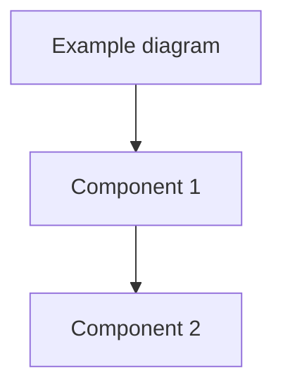

import { CuriosityHook, DrivingQuestion, AIPromptCard, AssignmentCard, SelfEvalQuestion } from '@site/src/components';

# [Chapter Number]: [Chapter Title]

<CuriosityHook type="opening">
  [Attention-seeker hook: question, surprising fact, or relatable scenario - 1-3 sentences]
</CuriosityHook>

<DrivingQuestion>
  [The central question this chapter answers - clear and specific]
</DrivingQuestion>

## Real-World Example

[Concrete scenario BEFORE abstract theory - relatable to everyday life]

## Use Case

**Scenario**: [Specific robotics application]

**Prerequisites**:
- [Prerequisite 1]
- [Prerequisite 2]

**Success Criteria**:
- [Measurable criterion 1]
- [Measurable criterion 2]

## Concept Teaching

[70% practical / 30% theory - reference real-world example throughout]

### [Sub-topic 1]

[Teaching content with code examples, diagrams, etc.]

:::tip Pro Tip
[Expert insight or tip]
:::

:::caution Watch Out
[Common pitfall and how to avoid it]
:::

### [Sub-topic 2]

[Continue teaching...]

## Visual Diagrams

[Include 2-3 diagrams: conceptual, system, or flow charts]

## Expert Insights

[Advice from domain experts, best practices]

<AIPromptCard>
  **Prompt for AI**: "[Specific contextualized prompt students can use with AI assistants]"
</AIPromptCard>

<AIPromptCard>
  **Prompt for AI**: "[Another prompt for deeper understanding]"
</AIPromptCard>

## Hands-On Practice

**Objective**: [What students will build/do]

**Success Criteria**:
- [Measurable outcome 1]
- [Measurable outcome 2]

[Step-by-step guidance without prescribing exact solution]

## Self-Evaluation

<SelfEvalQuestion
  question="[Question 1]"
  topicReference="Section [X.Y]">
</SelfEvalQuestion>

<SelfEvalQuestion
  question="[Question 2]"
  topicReference="Section [X.Z]">
</SelfEvalQuestion>

<SelfEvalQuestion
  question="[Question 3]"
  topicReference="Section [X.W]">
</SelfEvalQuestion>

<AssignmentCard title="[Assignment Title]" estimatedTime="30-60 min">
  **Task**: [Clear description of what to build/do]

  **Success Criteria**:
  - [Measurable criterion 1: e.g., "Robot reaches target within 5cm"]
  - [Measurable criterion 2]

  **Guidance**:
  - [Enough guidance to approach problem, not prescriptive]
  - [Reference relevant chapter sections]

  **Validation**: [How to verify success through simulation]
</AssignmentCard>

<CuriosityHook type="closing">
  [Curiosity hook for next chapter - create anticipation - 1-2 sentences]
</CuriosityHook>

---

## References

1. [Source 1: Authoritative source citation]
2. [Source 2: Authoritative source citation]
3. [Source 3: Authoritative source citation]

*Note: All technical claims validated against 3+ authoritative sources per Three-Source Validation Rule*
