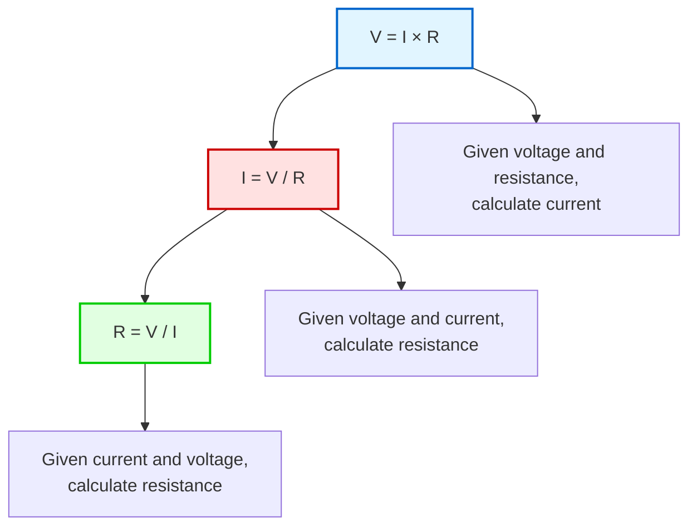
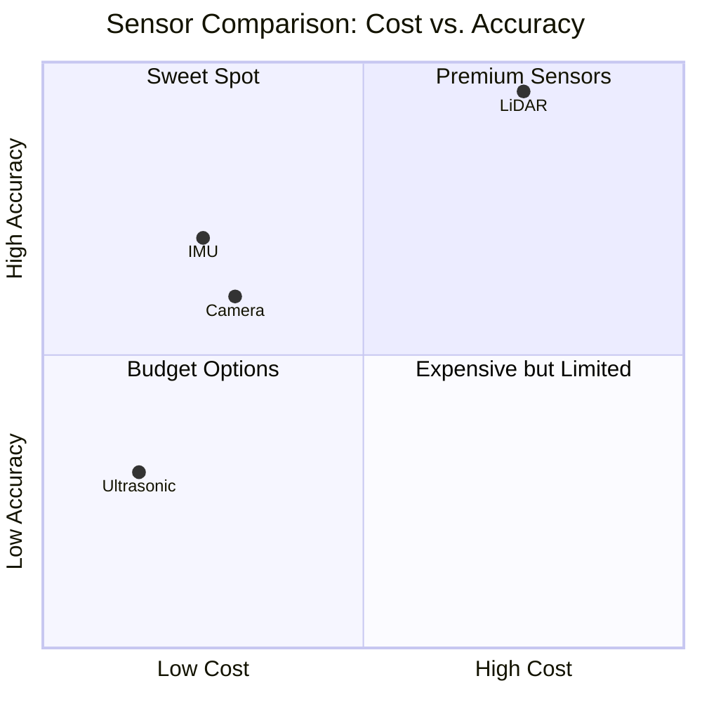
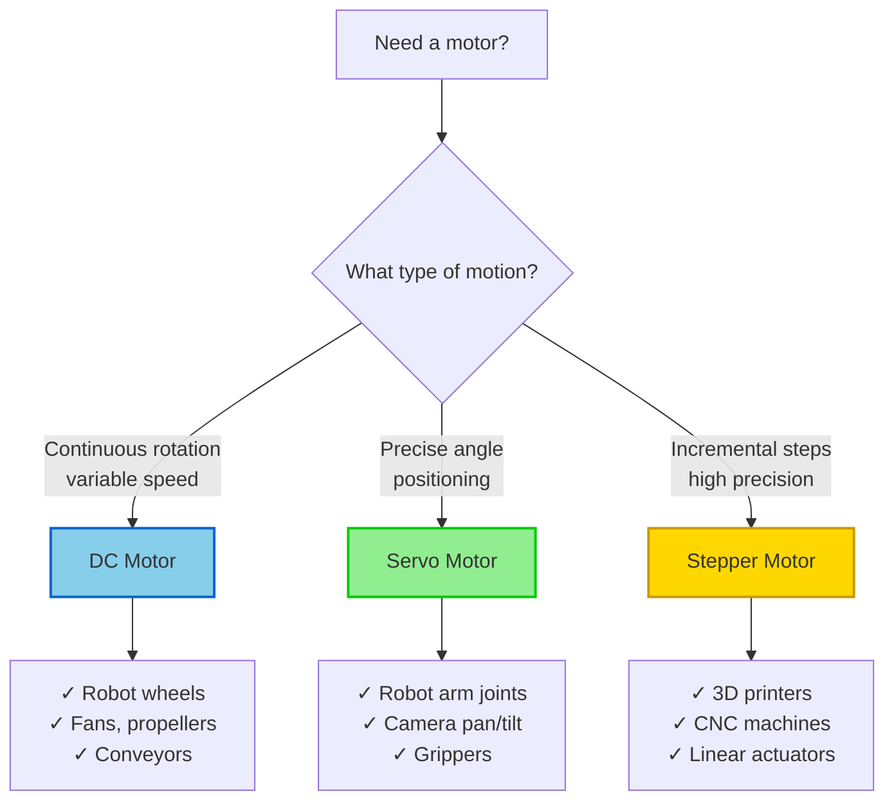
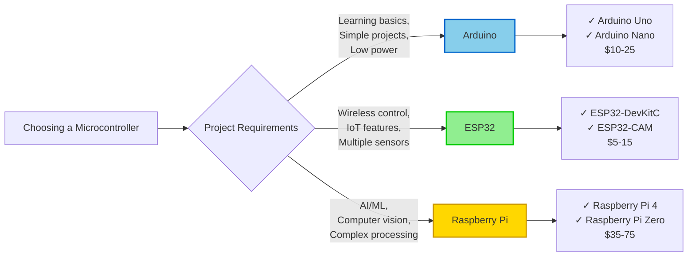
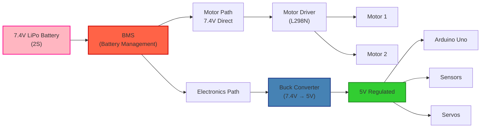

# Chapter 2: Electronics Basics

import CuriosityHook from '@site/src/components/CuriosityHook';
import DrivingQuestion from '@site/src/components/DrivingQuestion';
import AIPromptCard from '@site/src/components/AIPromptCard';
import AssignmentCard from '@site/src/components/AssignmentCard';
import SelfEvalQuestion from '@site/src/components/SelfEvalQuestion';

<CuriosityHook type="opening">
Your smartphone battery knows when it's too hot to charge. Your robot vacuum sees obstacles with invisible laser beams. Your smartwatch counts your steps using tiny sensors. Behind every smart device is a hidden world of electronics—the foundation of all robotics. Let's decode these electronic building blocks so you can build intelligent robots.
</CuriosityHook>

## What You'll Learn

By the end of this chapter, you'll be able to:

1. **Explain Ohm's Law** and calculate voltage, current, and resistance in simple circuits
2. **Identify and describe** the four main sensor types (cameras, LiDAR, ultrasonic, IMU) and their use cases
3. **Compare and contrast** DC motors, servo motors, and stepper motors for different robotic applications
4. **Select appropriate microcontrollers** (Arduino, ESP32, Raspberry Pi) based on project requirements
5. **Read basic circuit diagrams** using standardized symbols and component naming conventions
6. **Design safe power systems** using proper voltage regulation and battery management principles

<DrivingQuestion>
How do robots sense their environment, make decisions, and take action—all powered by circuits small enough to fit in your pocket?
</DrivingQuestion>

## Before We Begin

### What You Should Know

If you've completed Chapter 1, you understand that Physical AI requires physical sensors and actuators to interact with the real world. Now we'll learn exactly *how* those components work and how to choose the right ones for your projects.

**Prerequisites:**
- Basic math (multiplication and division for Ohm's Law)
- Chapter 1 concepts (Physical AI, embodied intelligence)
- No prior electronics experience required—we'll start from scratch!

### What We'll Cover (and What We Won't)

**In this chapter:**
- Fundamental electronics concepts you can use immediately
- How to select sensors, motors, and microcontrollers
- Reading circuit diagrams
- Designing safe, reliable power systems

**Beyond this chapter** (covered in advanced courses):
- Detailed circuit design and PCB manufacturing
- Advanced electronics theory and signal processing
- Wireless communication protocols

**Safety First!**

Electronics is generally safe when you follow basic rules:
- Never connect power backwards (check polarity!)
- Never short circuit a battery
- Handle lithium batteries with care—they can catch fire if damaged
- Start with low voltages (5V or less) until you're comfortable

When in doubt, ask or research before connecting power!

---

## 1. Voltage, Current, and Resistance: The Foundation

Imagine water flowing through pipes. This simple analogy unlocks the three most important concepts in electronics.

### The Water Pipe Analogy

- **Voltage** is like water **pressure** in the pipes. Higher pressure (voltage) pushes water (electricity) harder.
- **Current** is the **flow rate**—how much water (electricity) is actually moving through the pipe.
- **Resistance** is like the **pipe width**. A narrow pipe (high resistance) restricts flow. A wide pipe (low resistance) allows more flow.

Now let's translate this to electronics:

### Voltage (V)

**Definition**: The difference in electrical potential energy per unit of charge between two points in a circuit, measured in **volts (V)**.

**In plain English**: Voltage is the "push" that makes electricity move. It's the energy available from your power source.

**Examples:**
- Standard USB port: 5V
- Single AA battery: 1.5V
- Car battery: 12V
- Wall outlet (US): 120V (dangerous—we won't use this!)

**Why it matters**: Components are designed for specific voltages. Too much voltage can destroy components. Too little, and they won't work.

### Current (I)

**Definition**: The rate of electron flow through a circuit, measured in **amperes (A)** or **milliamperes (mA)**.

**In plain English**: Current is the actual electricity flowing through your circuit—how many electrons are moving per second.

**Examples:**
- LED: ~20 mA (0.020 A)
- Arduino Uno: ~50 mA
- Servo motor: 100-500 mA (0.1-0.5 A)
- DC motor: 1-3 A

**Why it matters**: Every component draws current. Your battery and power supply must provide enough current, or things won't work. Too much current can overheat components.

### Resistance (R)

**Definition**: Opposition to current flow, measured in **ohms (Ω)**.

**In plain English**: Resistance limits how much current can flow. Components called **resistors** deliberately add resistance to control current.

**Examples:**
- Wire (copper): Very low resistance (~0.0001 Ω per meter)
- LED current-limiting resistor: 220 Ω
- Pull-up resistor: 10,000 Ω (10 kΩ)
- Multimeter (open circuit): Infinite resistance

**Why it matters**: Resistors protect components (especially LEDs) from too much current. They also help divide voltage and create reliable digital signals.

### Ohm's Law: The Golden Formula

These three quantities are related by the most important equation in electronics:

**V = I × R**

Where:
- **V** = Voltage (volts)
- **I** = Current (amperes)
- **R** = Resistance (ohms)

You can rearrange this triangle to solve for any quantity:



**Example: LED Circuit**

You want to connect an LED to a 5V Arduino. The LED has a forward voltage of 2V and needs 20 mA (0.020 A) of current. What resistor do you need?

**Step 1**: Calculate voltage across the resistor:
- Voltage across resistor = Supply voltage - LED voltage
- V_resistor = 5V - 2V = 3V

**Step 2**: Apply Ohm's Law to find resistance:
- R = V / I
- R = 3V / 0.020A
- R = 150 Ω

**Answer**: Use a 150Ω resistor (or the nearest standard value: 220Ω).

### Your Essential Tool: The Multimeter

A **multimeter** is a device that measures voltage, current, resistance, and continuity. It's your debug tool for electronics—like a doctor's stethoscope.

**Key measurements:**
- **Voltage**: Connect probes across two points (parallel)
- **Current**: Break the circuit and insert meter in series (advanced)
- **Resistance**: Measure component resistance (power off!)
- **Continuity**: Check if wires are connected (beeps if yes)

For beginners, a basic $15-30 multimeter is perfect. You'll use it constantly!

**Learn more:**
- [Basic Electronics Skills for Robotics](https://www.instructables.com/Basic-Electronics-Skills-for-Robotics/) - Instructables
- [Electrical Basics](https://lessons.barnabasrobotics.com/rover_lessons_home/03/index.html) - Barnabas Robotics
- [WPI Robotics - Electrical Basics](https://wiki.wpi.edu/robotics/Electrical_Basics)

---

## 2. Sensors: The Robot's Senses

If microcontrollers are the brain, **sensors are the eyes, ears, and touch of a robot**. Without sensors, robots are blind and can't respond to their environment. Let's explore the four sensor types you'll use most often.

### Sensor Purpose

Sensors detect and measure physical properties (distance, light, motion, temperature, etc.) and convert them into electrical signals the microcontroller can read.

**The sensing loop:**
1. Physical world event (object approaches)
2. Sensor detects it (ultrasonic sensor measures distance)
3. Sensor outputs electrical signal (voltage changes)
4. Microcontroller reads signal (digital or analog)
5. Microcontroller makes decision (turn to avoid obstacle)

### Sensor Type 1: Cameras

**What they do**: Capture visual data as 2D pixel arrays—essentially, digital pictures.

**How they work**: Light hits an image sensor (CMOS or CCD), which converts photons to electrical signals for each pixel.

**Strengths:**
- Rich visual information (color, texture, shapes)
- Object recognition (detect faces, read signs, identify objects)
- Relatively affordable ($5-50)

**Limitations:**
- Affected by lighting conditions (too dark/bright = poor results)
- Motion blur when moving fast
- Requires significant processing power for computer vision

**Use cases:**
- Line-following robots (detect black line on white surface)
- Face detection and tracking
- Object recognition (sort items by color/shape)
- Reading QR codes or text

**Beginner options:**
- Raspberry Pi Camera Module ($25) - works with Raspberry Pi
- USB webcams ($15-30) - plug into any computer
- ESP32-CAM ($10) - microcontroller with built-in camera

**Learn more:**
- [Common Sensors in Robotics](https://milvus.io/ai-quick-reference/what-are-the-most-common-sensors-used-in-robotics-eg-cameras-lidar-imus) - Milvus AI
- [Types of Sensors in Robotics](https://www.thinkautonomous.ai/blog/types-of-sensors/) - Think Autonomous

### Sensor Type 2: LiDAR (Light Detection and Ranging)

**What they do**: Create precise 3D maps of environments using laser pulses.

**How they work**: Emit rapid laser pulses, measure how long light takes to bounce back, calculate distance (speed of light × time).

**Strengths:**
- Extremely accurate (centimeter-level precision)
- Works in complete darkness
- Not affected by lighting conditions
- Generates 3D point clouds

**Limitations:**
- More expensive ($50-500+ for hobby-grade)
- Sparse data for small or distant objects
- Lower update frequency than cameras

**Use cases:**
- Autonomous navigation (self-driving cars use LiDAR)
- SLAM (Simultaneous Localization and Mapping)
- Precision obstacle detection
- Room mapping

**Beginner options:**
- TF-Luna ($40) - simple 8-meter range LiDAR
- YDLiDAR X2 ($100) - 360° scanning LiDAR
- RPLiDAR A1 ($100) - popular hobby LiDAR

**Learn more:**
- [Sensors in Robotics: How Ultrasonic, LiDAR, and IMU Work](https://mummanajagadeesh.github.io/blog/sensors-in-robotics/)
- [Sensing 101: Beginner's Guide](https://www.coderobo.ai/blogs/sensing-101-beginners-guide-sensors-used-in-robotics/)

### Sensor Type 3: Ultrasonic Sensors

**What they do**: Measure distance using sound waves—like bat echolocation!

**How they work**: Emit ultrasonic sound pulse (above human hearing), measure time until echo returns, calculate distance (speed of sound × time).

**Strengths:**
- Very affordable ($2-5 per sensor)
- Simple to use (one trigger, one echo pin)
- Effective for obstacle detection
- Works in any lighting

**Limitations:**
- Less accurate than LiDAR (±1-2 cm error)
- Limited range (2-400 cm typically)
- Soft or angled surfaces absorb sound (poor detection)
- Slower than other sensors

**Use cases:**
- Basic obstacle avoidance (robot vacuum, parking sensor)
- Distance measurement for simple projects
- Budget-friendly robotics
- Educational projects

**Beginner options:**
- HC-SR04 ($2-5) - most popular ultrasonic sensor
- US-100 ($5-8) - improved version with better range

**Learn more:**
- [Sensors in Robotics](https://mummanajagadeesh.github.io/blog/sensors-in-robotics/)
- [Types of Sensors in Robotics - Complete Guide](https://standardbots.com/blog/every-type-of-sensors-in-robotics---explained) - Standard Bots

### Sensor Type 4: IMU (Inertial Measurement Unit)

**What they do**: Track motion and orientation by measuring acceleration and rotation in 3 axes (X, Y, Z).

**How they work**: Contain accelerometers (measure acceleration) and gyroscopes (measure angular velocity). Some include magnetometers (compass).

**Strengths:**
- High-frequency data (100+ readings per second)
- Tracks orientation in 3D space
- Essential for balancing robots and drones
- Works anywhere (no external reference needed)

**Limitations:**
- Drift over time (accumulates small errors)
- Needs periodic calibration or sensor fusion
- Can't measure absolute position (only changes)

**Use cases:**
- Self-balancing robots (two-wheeled robots, segways)
- Drones (maintain level flight)
- Orientation tracking (know which way robot is facing)
- Detect falls, tilt, sudden movements

**Beginner options:**
- MPU6050 ($3-5) - 6-axis IMU (3-axis accelerometer + 3-axis gyro)
- BNO055 ($20-30) - 9-axis IMU with built-in sensor fusion

**Learn more:**
- [Common Sensors Used in Robotics](https://milvus.io/ai-quick-reference/what-are-the-most-common-sensors-used-in-robotics-eg-cameras-lidar-imus)
- [Review of Sensing Technologies](https://pmc.ncbi.nlm.nih.gov/articles/PMC10893033/) - PMC

### Sensor Fusion: Why Robots Use Multiple Sensors

No sensor is perfect. Each has strengths and blind spots. That's why modern robots combine multiple sensor types—this is called **sensor fusion**.

**Example: Autonomous car**
- **Cameras**: Detect lane lines, read traffic signs, see pedestrians
- **LiDAR**: Precise 3D map of surroundings
- **IMU**: Track vehicle orientation and acceleration
- **Result**: Cross-validate data, reduce errors, more reliable perception

**For your projects**: Even a simple robot benefits from combining sensors. Use ultrasonic for obstacle detection + IMU for orientation = more reliable navigation.



---

## 3. Actuators: Making Robots Move

Sensors tell robots what's happening. **Actuators let robots DO something about it.** In robotics, actuators are primarily motors that convert electrical energy into motion.

### Three Motor Types Every Roboticist Should Know



### Motor Type 1: DC Motors

**What they are**: The simplest motors—two wires (power and ground), continuous rotation.

**How they work**: Current through a coil creates a magnetic field that interacts with permanent magnets, causing rotation. Reverse current, reverse direction.

**Control method**: Speed controlled using **PWM (Pulse Width Modulation)**—rapidly pulsing power on and off. Higher duty cycle (longer "on" time) = faster speed.

**Strengths:**
- Very simple (just apply voltage)
- Affordable ($3-10)
- High speed
- Continuous rotation

**Limitations:**
- No built-in position feedback (don't know angle/position)
- Speed varies with load
- Need H-bridge or motor driver for direction control

**Use cases:**
- Robot wheels (drive motors)
- Fans and propellers
- Conveyor belts
- Any continuous rotation task

**Beginner options:**
- Generic DC motors from hobby kits ($3-10)
- Geared DC motors (slower, more torque): $5-15

**Learn more:**
- [What's the Difference Between DC, Servo & Stepper Motors?](https://thepihut.com/blogs/raspberry-pi-tutorials/whats-the-difference-between-dc-servo-amp-stepper-motors) - The Pi Hut
- [Types of DC Motors](http://www.robotplatform.com/knowledge/actuators/dc_motors.html) - Robot Platform

### Motor Type 2: Servo Motors

**What they are**: Motors with built-in position feedback for precise angle control (typically 0-180°, some continuous).

**How they work**: Contains a DC motor, gearbox, control circuit, and potentiometer (position sensor). Control signal tells it what angle to move to, internal circuit adjusts until it reaches that position.

**Control method**: Send PWM signal (1-2 ms pulses every 20ms). Pulse width determines angle:
- 1.0 ms = 0°
- 1.5 ms = 90°
- 2.0 ms = 180°

**Strengths:**
- Precise position control (±1°)
- Built-in feedback (closed-loop control)
- Holds position when powered
- Consistent torque throughout speed range
- Easy to control from Arduino

**Limitations:**
- Limited rotation (standard servos: 180°)
- More expensive than DC motors ($5-30)
- Higher power draw than small DC motors

**Use cases:**
- Robot arm joints
- Camera pan/tilt mechanisms
- Grippers and claws
- Steering (RC cars)
- Any task requiring precise angle positioning

**Beginner options:**
- SG90 micro servo ($2-5) - small, common, good for light loads
- MG996R ($8-12) - metal gears, higher torque
- Continuous rotation servos ($8-15) - for wheels, controllable speed

**Learn more:**
- [Servomotor](https://en.wikipedia.org/wiki/Servomotor) - Wikipedia
- [How to Choose Motors, Servos, Steppers](https://roboticsbiz.com/how-to-choose-and-use-dc-motors-servos-steppers-and-solenoids/) - RoboticsBiz

### Motor Type 3: Stepper Motors

**What they are**: Motors that rotate in precise, discrete steps (e.g., 200 steps = 360°, so 1.8° per step).

**How they work**: Multiple coils (phases) energized in specific sequences move the rotor one step at a time. Very high magnetic pole density allows precise incremental movement.

**Control method**: Requires stepper motor driver (like A4988 or DRV8825) that sends precise pulse sequences to coils.

**Strengths:**
- Extremely precise positioning
- Holds position when powered (no feedback needed)
- Open-loop control (no encoders required)
- Consistent, repeatable motion

**Limitations:**
- Torque decreases significantly at high speeds
- Requires driver board (more complex)
- Higher power consumption
- Can "skip steps" if overloaded (losing position tracking)

**Use cases:**
- 3D printers (precise extrusion, layer positioning)
- CNC machines (precision cutting, drilling)
- Camera sliders (smooth, repeatable motion)
- Linear actuators with lead screws

**Beginner options:**
- NEMA 17 stepper motor ($10-20) - most common size for hobby projects
- 28BYJ-48 ($3-5) - small, inexpensive stepper with driver board

**Learn more:**
- [Choosing an Actuator to Move Your Project](https://core-electronics.com.au/guides/servos-steppers-or-solenoids-choosing-an-actuator-to-move-your-project/) - Core Electronics
- [DC Motors and Stepper Motors as Actuators](https://www.electronics-tutorials.ws/io/io_7.html) - Electronics Tutorials

### Motor Selection Guide

**Quick decision matrix:**

| Your Need | Choose This Motor | Why? |
|-----------|------------------|------|
| Wheels for mobile robot | DC motor | Continuous rotation, simple, affordable |
| Robot arm joint (0-180°) | Servo motor | Precise angles, holds position, easy control |
| 3D printer axis | Stepper motor | High precision, repeatable positioning |
| Camera gimbal | Servo motor | Smooth position control, consistent torque |
| Drone propeller | Brushless DC motor* | High speed, high efficiency |

*Brushless motors are advanced DC motors—beyond this chapter's scope.

---

## 4. Microcontrollers: The Robot's Brain

Sensors provide data. Actuators create movement. **Microcontrollers connect them and make decisions.** Think of microcontrollers as tiny computers optimized for controlling hardware.

### What is a Microcontroller?

A **microcontroller** is a small computer on a single chip designed to perform dedicated tasks. Unlike your laptop (general-purpose), microcontrollers excel at:
- Reading sensors (digital/analog inputs)
- Controlling motors (PWM outputs)
- Real-time responsiveness
- Low power consumption
- Direct hardware interaction

### The Big Three Platforms for Robotics



### Platform 1: Arduino (Best for Beginners)

**What it is**: An open-source electronics platform with simple hardware and software, designed specifically for beginners and artists.

**Why beginners love it:**
- **Simple IDE**: Arduino software is beginner-friendly (download, install, upload code—done!)
- **Huge community**: Millions of tutorials, forums, example projects
- **Reliability**: Difficult to damage, forgiving of mistakes
- **Low power**: Can run on batteries for weeks/months

**Specifications (Arduino Uno):**
- Microcontroller: ATmega328P
- Operating Voltage: 5V
- Digital I/O Pins: 14 (6 PWM)
- Analog Input Pins: 6
- Flash Memory: 32 KB
- Clock Speed: 16 MHz
- Price: $20-25

**Limitations:**
- No built-in wireless (WiFi/Bluetooth)
- Limited processing power
- Limited memory
- Single-threaded (one task at a time)

**Best for:**
- Learning electronics and programming
- Simple sensor projects
- Basic robots (line followers, obstacle avoiders)
- Controlling LEDs, servos, motors

**Popular models:**
- **Arduino Uno**: Classic, perfect for learning
- **Arduino Nano**: Compact version, breadboard-friendly
- **Arduino Mega**: More pins for complex projects

**Learn more:**
- [Arduino vs Raspberry Pi vs STM32](https://www.richardelectronics.com/blog/projects/raspberry/arduino-vs-raspberry-pi-vs-stm32-choosing-the-right-development-board-for-your-projects) - Richard Electronics

### Platform 2: ESP32 (Best for Wireless Projects)

**What it is**: A powerful, low-cost microcontroller with built-in WiFi and Bluetooth, developed by Espressif Systems.

**Why it's popular:**
- **Built-in wireless**: WiFi and Bluetooth without extra modules
- **Powerful**: Dual-core processor, much faster than Arduino
- **Affordable**: $5-15 (cheaper than Arduino!)
- **Arduino-compatible**: Program using Arduino IDE
- **Low power modes**: Great for battery projects

**Specifications (ESP32-DevKitC):**
- Microcontroller: ESP32 (dual-core)
- Operating Voltage: 3.3V
- Digital I/O Pins: 36
- Analog Input Pins: 18
- Flash Memory: 4 MB
- Clock Speed: 240 MHz (15× faster than Arduino!)
- WiFi: 802.11 b/g/n
- Bluetooth: v4.2 BR/EDR and BLE
- Price: $8-15

**Limitations:**
- Steeper learning curve than Arduino
- Operates at 3.3V (some Arduino shields use 5V)
- More complex pin assignments

**Best for:**
- Wireless robot control (phone app → robot)
- IoT projects (send sensor data to cloud)
- Multiple sensor projects (more pins, more processing power)
- Camera projects (ESP32-CAM variant has built-in camera)

**Popular models:**
- **ESP32-DevKitC**: Standard development board
- **ESP32-CAM**: Built-in camera module ($10)
- **ESP32-S3**: Newest version with better AI support

**Learn more:**
- [ESP32 vs Arduino vs Raspberry Pi](https://www.socketxp.com/iot/esp32-vs-arduino-stm32-raspberry-pi-pico-nrf52-best-iot-microcontroller/) - SocketXP
- [ESP32: The Ultimate Overview](https://www.electronicsforu.com/technology-trends/esp32) - Electronics For You

### Platform 3: Raspberry Pi (Best for Complex Projects)

**What it is**: A full Linux computer on a credit-card-sized board—not technically a "microcontroller" but commonly used in robotics.

**Why it's powerful:**
- **Full operating system**: Runs Linux (Raspberry Pi OS)
- **Programming languages**: Python, C++, Java, JavaScript, etc.
- **Peripherals**: USB ports, HDMI, Ethernet, camera interface
- **Processing power**: Can run computer vision, ROS2, AI/ML
- **Storage**: MicroSD card (expandable)

**Specifications (Raspberry Pi 4 - 4GB):**
- Processor: Quad-core ARM Cortex-A72
- RAM: 4GB (or 8GB model)
- Operating System: Linux (Raspberry Pi OS)
- USB Ports: 2× USB 3.0, 2× USB 2.0
- GPIO Pins: 40
- Clock Speed: 1.5 GHz
- Price: $45-55

**Limitations:**
- Higher power consumption (needs 5V 3A power supply)
- Not real-time (Linux introduces delays)
- More expensive
- Requires SD card, keyboard, monitor for setup
- Can be overkill for simple tasks

**Best for:**
- Computer vision (camera + OpenCV)
- ROS2 projects (robotics middleware)
- AI/Machine Learning on robot
- Complex multi-sensor robots
- Educational projects requiring full programming environment

**Popular models:**
- **Raspberry Pi 4 (4GB/8GB)**: Best for robotics and AI
- **Raspberry Pi Zero 2 W**: Compact, wireless, affordable ($15)

**Learn more:**
- [Top 10 Embedded Development Boards](https://www.theiotacademy.co/blog/embedded-development-boards/) - IoT Academy
- [Understanding Microcontrollers](https://boardor.com/blog/understanding-microcontrollers-51-arduino-esp32-stm32-and-raspberry-pi) - Boardor

### Progression Path: Start Simple, Level Up

**Recommended learning path:**

1. **Start with Arduino Uno** ($25)
   - Learn basics: sensors, LEDs, motors
   - Master programming fundamentals
   - Build simple robots

2. **Add ESP32** ($10-15)
   - Add wireless control
   - Learn IoT concepts
   - Build remotely controlled robots

3. **Graduate to Raspberry Pi** ($45-75)
   - Add camera/computer vision
   - Learn ROS2
   - Build autonomous robots with AI

You don't need all three—pick based on your project! Most roboticists own multiple platforms for different tasks.

---

## 5. Reading Circuit Diagrams: The Universal Language

Circuit diagrams (also called **schematics**) are like maps—once you learn the symbols, you can build anything. Every robot, drone, and electronic device has a schematic showing how components connect.

### Why Schematics Matter

**Problem with photos**: Wiring photos show *one* way to connect components, but wires cross, overlap, and hide connections.

**Solution: Schematics**: Show *exactly* how components connect using standardized symbols and neat layouts. Readable across languages and cultures.

**Analogy**: Like sheet music for musicians—universal notation anyone can read.

### Learning the Symbols

Here are the most common symbols you'll encounter:

**Power and Ground:**
- **Battery**: Long line (positive) and short line (negative)
- **Ground (GND)**: Three descending lines or earth symbol
- **+5V / +3.3V**: Positive voltage rail

**Passive Components:**
- **Resistor**: Zigzag line (US) or rectangle (international)
- **Capacitor**: Two parallel lines
- **LED**: Triangle with arrows pointing outward

**Active Components:**
- **Transistor**: Circle with three connections
- **Integrated Circuit (IC)**: Rectangle with pin numbers
- **Motor**: Circle with "M" inside

**Connections:**
- **Wire**: Straight line
- **Connection (node)**: Dot where lines meet
- **No connection**: Lines cross without dot

### Component Naming Convention

Every component gets a unique identifier:

| Prefix | Component Type | Example |
|--------|---------------|---------|
| R1, R2, R3 | Resistors | R1 = 220Ω, R2 = 10kΩ |
| C1, C2 | Capacitors | C1 = 100µF |
| U1, U2 | Integrated Circuits | U1 = Arduino, U2 = Motor Driver |
| M1, M2 | Motors | M1 = Left wheel, M2 = Right wheel |
| LED1, LED2 | LEDs | LED1 = Power indicator |
| SW1, SW2 | Switches | SW1 = Reset button |

This naming helps you:
- Reference components in parts lists
- Debug ("Check voltage at R3")
- Understand circuit sections

### Reading Direction and Current Flow

**Convention**: Schematics are read **left-to-right** or **top-to-bottom**, following current flow from positive (+) to ground (GND).

**Example reading flow:**
1. Start at battery/power source (left or top)
2. Follow lines through components
3. End at ground (right or bottom)

**Tip**: Trace the path electricity takes—start at +, follow the wires, end at GND.

### Example: Simple LED Circuit

**Schematic:**
```
+5V ----[R1: 220Ω]----[LED1]---- GND
```

**Reading it:**
1. Start at +5V power source
2. Current flows through resistor R1 (220Ω) to limit current
3. Current flows through LED1 (lights up)
4. Current returns to GND (completes circuit)

**Translation to reality**: Connect Arduino 5V → 220Ω resistor → LED long leg (anode), LED short leg (cathode) → Arduino GND.

### Practice: Robot Circuit Diagram

Here's a more complex example—a basic robot:

```
Battery (+7.4V) --→ Motor Driver (U1)
                    ↓
                    Motors (M1, M2)

Battery (+7.4V) --→ Voltage Regulator (U2) --→ +5V
                    ↓
                    Arduino (U3)
                    ↓
                    Sensors (ultrasonic, IMU)
```

**Key insights:**
- Motors powered directly from battery (7.4V)
- Arduino powered through voltage regulator (7.4V → 5V)
- Separate power paths prevent motor noise from affecting Arduino

**Learn more:**
- [How to Read a Schematic](https://learn.sparkfun.com/tutorials/how-to-read-a-schematic/all) - SparkFun Learn
- [Understanding Electrical Schematics](https://jlcpcb.com/blog/understanding-electrical-schematics-a-comprehensive-guide) - JLCPCB
- [How to Read Electrical Schematics](https://www.wevolver.com/article/how-to-read-electrical-schematics-a-comprehensive-guide-for-engineers) - Wevolver

---

## 6. Power Systems: Keeping Your Robot Alive

Power is the lifeblood of robots. **Too much voltage fries components. Too little, and nothing works.** Let's learn to design safe, reliable power systems.

### Why Power Systems Matter

**The challenge**: Different components need different voltages:
- Motors: 6-12V (high current)
- Arduino: 5V (low current, sensitive)
- Sensors: 3.3V or 5V (very low current)
- Servos: 5-6V (medium current, spiky demand)

**The danger**: Motors create electrical noise (voltage spikes/drops) when starting/stopping. This can:
- Reset your microcontroller
- Damage sensors
- Cause erratic behavior
- Fry components

**The solution**: Proper voltage regulation, isolation, and battery management.

### Battery Selection

**Common battery types for robots:**

| Battery Type | Voltage | Pros | Cons | Use Case |
|-------------|---------|------|------|----------|
| **Lithium-Polymer (LiPo)** | 3.7V per cell | High energy density, lightweight, rechargeable | Dangerous if damaged, requires care | Mobile robots, drones |
| **Lithium-Ion (Li-ion)** | 3.7V per cell | High energy density, safer than LiPo | Heavier, more expensive | General robotics |
| **NiMH** | 1.2V per cell | Safe, rechargeable, forgiving | Lower energy density, heavy | Educational robots |
| **Alkaline (AA/AAA)** | 1.5V per cell | Cheap, widely available | Not rechargeable, low capacity | Disposable projects |

**For robotics: LiPo or Li-ion are most common.**

**Battery terminology:**
- **Capacity (mAh)**: How long it lasts. Higher = longer runtime.
- **C-rating**: How fast it can discharge safely. Higher = more current available.
- **Cells (S)**: Number of cells in series. 1S = 3.7V, 2S = 7.4V, 3S = 11.1V

**Example**: "2200mAh 3S LiPo 25C"
- Capacity: 2200 mAh (2.2 Ah)
- Voltage: 3S = 11.1V
- Max current: 2.2A × 25C = 55A burst capacity

### Voltage Regulation: Keeping Things Stable

**Problem**: Battery voltage varies (LiPo: 4.2V full → 3.0V empty per cell). Components need consistent voltage.

**Solution**: Voltage regulators.

**Two types:**

**1. Linear Regulators (e.g., 7805)**
- Convert excess voltage to heat
- Simple, cheap
- Inefficient (wastes power as heat)
- Good for low power loads

**2. DC-DC Buck Converters (Switching Regulators)**
- Convert voltage efficiently (90%+ efficiency)
- More complex circuitry
- Better for battery-powered robots
- Can handle higher currents

**Best practice**: Use buck converters for robots to maximize battery life.

**Common voltage conversions:**
- 12V → 5V: Power Arduino from 12V battery
- 7.4V → 5V: Power electronics from 2S LiPo
- 5V → 3.3V: Power ESP32 or 3.3V sensors



### Power Isolation: Keep Motors and Electronics Separate

**Golden rule**: Isolate motor power from microcontroller power.

**Why?**
- Motors draw high, spiky current
- Motor brushes create electrical noise
- Voltage drops when motors start can reset Arduino

**How to isolate:**

**Option 1: Separate batteries**
- Battery 1 (7.4V) → Motors
- Battery 2 (5V USB power bank) → Arduino + sensors
- **Pros**: Complete isolation, simple
- **Cons**: Two batteries to charge

**Option 2: Shared battery with separate regulators**
- Battery → Motor driver (direct)
- Battery → Buck converter → Arduino + sensors
- **Pros**: One battery, good isolation
- **Cons**: Slightly more complex

**Option 3: Capacitors for filtering (advanced)**
- Use large capacitors (1000µF+) across motor power
- Smooths voltage spikes
- **Pros**: One power source
- **Cons**: Not perfect isolation

**For beginners: Use Option 2** (shared battery, separate regulator).

### Battery Management Systems (BMS)

**What is a BMS?**
A **Battery Management System** monitors and protects rechargeable batteries from dangerous conditions.

**What it does:**
- **Overcharge protection**: Stops charging at 4.2V per cell
- **Over-discharge protection**: Cuts power at 3.0V per cell (prevents battery damage)
- **Overcurrent protection**: Disconnects if too much current drawn
- **Temperature monitoring**: Prevents overheating
- **Cell balancing**: Ensures all cells charge/discharge evenly

**Why you need it:**
- LiPo/Li-ion batteries can catch fire if overcharged, over-discharged, or short-circuited
- BMS prevents these dangerous conditions
- Extends battery life

**Where to get it:**
- Many LiPo batteries have built-in BMS
- Standalone BMS boards: $5-15
- **Never use LiPo batteries without BMS protection!**

### Power Safety Rules

🔴 **Critical safety guidelines:**

1. **Never reverse polarity** (+ to -, - to +) → Instant component death
2. **Never short circuit batteries** → Fire hazard
3. **Always use proper LiPo chargers** → Prevents overcharging
4. **Monitor battery temperature** → Stop use if hot during charge/discharge
5. **Replace damaged/swollen batteries immediately** → Swelling = dangerous
6. **Use fuses** → Protects against overcurrent
7. **Start with low voltages** (5V or less) → Safer for learning

**Learn more:**
- [Powering Your Robots: A Beginner's Guide](https://techietory.com/robotics/powering-your-robots-a-beginners-guide-to-power-systems/) - Techietory
- [Battery Management Systems for Robotics](https://thinkrobotics.com/blogs/learn/battery-management-systems-for-robotics-ensuring-power-efficiency-and-safety) - ThinkRobotics
- [Power Concepts](https://articulatedrobotics.xyz/tutorials/mobile-robot/hardware/power-theory/) - Articulated Robotics
- [Energy Sources of Mobile Robot Power Systems](https://www.mdpi.com/2076-3417/13/13/7547) - MDPI

---

## Real-World Example: Building a Line-Following Robot

Let's bring it all together! Here's how all the electronics concepts combine in a real project.

### The Goal

Build a robot that autonomously follows a black line on a white surface—a classic beginner robotics project.

### Components Needed

**Sensors:**
- 2× IR line sensors ($3 each) - detect black vs. white

**Actuators:**
- 2× DC motors with wheels ($8 each)

**Microcontroller:**
- Arduino Uno ($25)

**Power:**
- 7.4V LiPo battery (2S, 2200mAh, $15)
- DC-DC buck converter (7.4V → 5V, $3)

**Motor Control:**
- L298N motor driver ($6) - controls motor speed and direction

**Total cost**: ~$70

### How It Works

**1. Sensing (IR sensors):**
- Each sensor has an IR LED and IR detector
- Dark surfaces (black line) absorb IR light → LOW signal
- Light surfaces (white paper) reflect IR light → HIGH signal
- Arduino reads digital pins to know if sensor sees black or white

**2. Processing (Arduino):**
```cpp
// Simplified algorithm
if (both sensors see white) {
    // Go straight
    leftMotor = 100;  // Full speed
    rightMotor = 100;
} else if (leftSensor sees black) {
    // Veer left
    leftMotor = 50;   // Slow left motor
    rightMotor = 100; // Keep right motor fast
} else if (rightSensor sees black) {
    // Veer right
    leftMotor = 100;
    rightMotor = 50;
}
```

**3. Actuation (DC motors via motor driver):**
- Arduino sends PWM signals to motor driver
- Motor driver delivers high current to motors
- Motors spin at speeds determined by PWM duty cycle
- Robot steers by varying left/right motor speeds

**4. Power distribution:**
- Battery 7.4V → Motor driver (direct) → Motors
- Battery 7.4V → Buck converter → 5V → Arduino + sensors
- Separate paths prevent motor noise from affecting Arduino

### Circuit Overview

```
Battery (+7.4V)
├── Motor Driver (L298N)
│   ├── Motor 1 (left wheel)
│   └── Motor 2 (right wheel)
│
└── Buck Converter
    └── +5V Regulated
        ├── Arduino Uno
        ├── IR Sensor 1
        └── IR Sensor 2
```

### Key Lessons from This Project

1. **Sensor fusion**: Two sensors better than one (detects which direction to turn)
2. **Power isolation**: Motors on separate path from Arduino
3. **Ohm's Law**: IR sensor resistors calculated to limit current
4. **PWM control**: Variable motor speeds create steering
5. **Real-time loop**: Read sensors → decide → control motors → repeat

This project demonstrates every concept in this chapter working together!

---

## AI Learning Prompts

Use these prompts with AI assistants (like me, Claude!) to deepen your understanding and get help with your projects.

<AIPromptCard
  title="Circuit Design Assistant"
  description="Get help designing circuits for your robot projects"
  prompt={`I'm building a robot with the following components: [describe components]. Can you help me:

1. Suggest the best microcontroller (Arduino/ESP32/Raspberry Pi) and explain why?
2. Calculate the battery capacity (mAh) needed for [X] hours of operation?
3. Design a simple circuit diagram showing power distribution?
4. Identify any potential issues (voltage mismatches, insufficient current, etc.)?

**Example:**
"I'm building a robot with:
- 2× DC motors (1A each at 6V)
- Arduino Uno
- 3× ultrasonic sensors (HC-SR04)
- 2× servos (SG90)
- Target runtime: 2 hours

Can you help me design the power system?"`}
/>

<AIPromptCard
  title="Component Selection Helper"
  description="Choose the right sensors and motors for your project"
  prompt={`I need to build a robot that can [describe task]. Which sensors and actuators would you recommend?

Please compare at least 2 options for each component type, including:
- Cost (beginner budget: under $100 total)
- Accuracy/performance
- Ease of use for beginners
- Power requirements
- Availability

**Example:**
"I need to build a robot that can:
- Navigate around a room autonomously
- Avoid obstacles (walls, furniture, people)
- Operate for at least 30 minutes on battery
- Be controlled via smartphone

Which sensors and microcontroller should I use?"`}
/>

<AIPromptCard
  title="Troubleshooting Assistant"
  description="Debug electronics problems in your robot"
  prompt={`My robot has this problem: [describe symptoms]. Based on these symptoms, can you:

1. Identify the most likely component causing the issue?
2. Explain how to test this with a multimeter?
3. Suggest 3 possible solutions, ranked by likelihood?
4. Provide step-by-step debugging process?

**Example:**
"My robot has this problem:
- Arduino resets (restarts program) whenever I turn on the motors
- Motors work fine when Arduino is powered by USB
- Problem only happens when running on battery

What's wrong and how do I fix it?"`}
/>

---

## Practical Exercise: Build a Virtual Circuit

**Objective**: Apply Ohm's Law, circuit diagram reading, and Arduino basics by building a virtual circuit simulator.

### Tools You'll Need

**Tinkercad Circuits** (free online simulator):
- Go to [tinkercad.com](https://www.tinkercad.com)
- Sign up for free account
- Click "Circuits" → "Create new Circuit"

### Task 1: LED with Button

**Requirements:**
1. Arduino Uno
2. LED connected to pin 13 through resistor
3. Pushbutton connected to pin 2
4. LED turns on when button is pressed, off when released

**Step-by-step:**

**Step 1: Calculate resistor value**
- LED forward voltage: 2V
- LED forward current: 20 mA (0.020 A)
- Arduino pin voltage: 5V
- Voltage across resistor: 5V - 2V = 3V
- Using Ohm's Law: R = V / I = 3V / 0.020A = 150Ω
- **Use 220Ω resistor** (nearest standard value)

**Step 2: Draw circuit diagram (by hand)**
```
Arduino Pin 13 --[220Ω resistor]--[LED]-- GND
Arduino Pin 2 --[Button]-- GND
                   |
              [10kΩ pull-up to +5V]
```

**Step 3: Build in Tinkercad**
- Drag Arduino Uno onto canvas
- Add LED (anode to pin 13, cathode to GND through resistor)
- Add pushbutton (one side to pin 2, other to GND)
- Add 220Ω resistor in series with LED
- Add 10kΩ resistor from pin 2 to +5V (pull-up)

**Step 4: Write Arduino code**
```cpp
const int buttonPin = 2;
const int ledPin = 13;

void setup() {
  pinMode(buttonPin, INPUT_PULLUP);  // Use internal pull-up
  pinMode(ledPin, OUTPUT);
}

void loop() {
  int buttonState = digitalRead(buttonPin);

  if (buttonState == LOW) {  // Button pressed (pull-up inverts logic)
    digitalWrite(ledPin, HIGH);  // Turn LED on
  } else {
    digitalWrite(ledPin, LOW);   // Turn LED off
  }
}
```

**Step 5: Test**
- Click "Start Simulation"
- Click the button → LED should light up
- Release button → LED should turn off

### Task 2: Extension Challenges

**Challenge 1: Blinking LED**
Modify code so the LED blinks when button is NOT pressed.

**Challenge 2: Ultrasonic Distance Sensor**
- Add HC-SR04 ultrasonic sensor
- Display distance on Serial Monitor
- Turn LED on when object is within 20 cm

**Challenge 3: Servo Control**
- Add SG90 servo motor
- Servo sweeps 0-180° when button is pressed
- Use `Servo.h` library

### Verification Checklist

- [ ] Calculated resistor value using Ohm's Law
- [ ] Drew circuit diagram by hand using standard symbols
- [ ] Built circuit in Tinkercad successfully
- [ ] Code compiles without errors
- [ ] Circuit works as expected in simulation
- [ ] Exported circuit screenshot for portfolio

**Time estimate**: 45-60 minutes

**Why simulation first?**
- No risk of damaging components
- Instant feedback (if it doesn't work, fix and retry)
- Build confidence before buying hardware
- Matches simulation-first pedagogy from Chapter 1!

---

## Self-Evaluation Questions

Test your understanding of key concepts. Click to reveal answers.

<SelfEvalQuestion
  question="An LED circuit has a 5V supply, 220Ω resistor, and LED with 2V forward voltage. What is the current through the LED?"
  options={[
    "13.6 mA",
    "22.7 mA",
    "45.5 mA",
    "5 mA"
  ]}
  correctAnswer={0}
  explanation={`
**Correct Answer: A) 13.6 mA**

**Step-by-step solution:**
1. Calculate voltage across resistor:
   - V_resistor = Supply voltage - LED voltage
   - V_resistor = 5V - 2V = 3V

2. Apply Ohm's Law (I = V / R):
   - I = 3V / 220Ω
   - I = 0.01364 A
   - I = 13.6 mA

**Common mistake:** Using 5V instead of 3V (forgetting to subtract LED forward voltage).

**Review:** Section 1 - Ohm's Law
  `}
  topic="Ohm's Law"
/>

<SelfEvalQuestion
  question="You're building an autonomous vacuum robot that needs to avoid walls and furniture. Which sensor combination provides the best balance of cost and reliability?"
  options={[
    "Camera only",
    "LiDAR only",
    "Ultrasonic sensors + bump sensors",
    "IMU only"
  ]}
  correctAnswer={2}
  explanation={`
**Correct Answer: C) Ultrasonic sensors + bump sensors**

**Analysis:**

**A) Camera only:**
- ❌ Computationally expensive (needs Raspberry Pi)
- ❌ Affected by lighting conditions
- ❌ Overkill for simple obstacle avoidance
- ✅ Good for advanced vision tasks

**B) LiDAR only:**
- ✅ Excellent accuracy
- ❌ Expensive ($100+)
- ❌ Overkill for home floor navigation

**C) Ultrasonic + bump sensors:** ⭐ BEST
- ✅ Affordable ($5-10 total)
- ✅ Reliable for obstacle detection
- ✅ Simple to program (Arduino-friendly)
- ✅ Ultrasonic provides early warning, bump sensors as backup
- ✅ Not affected by lighting

**D) IMU only:**
- ❌ Only tracks orientation/acceleration
- ❌ Cannot detect obstacles

**Real-world example:** Most robot vacuums use this exact combination!

**Review:** Section 2 - Sensors
  `}
  topic="Sensor Selection"
/>

<SelfEvalQuestion
  question="You need a motor to precisely position a robot arm at specific angles (e.g., 45°, 90°, 135°). Which motor type is BEST?"
  options={[
    "DC motor with encoder",
    "Servo motor",
    "Stepper motor",
    "Brushless motor"
  ]}
  correctAnswer={1}
  explanation={`
**Correct Answer: B) Servo motor**

**Analysis:**

**A) DC motor with encoder:**
- ✅ Can achieve precise positioning
- ❌ Requires encoder ($10-30)
- ❌ Needs complex PID control code
- ❌ More expensive and difficult for beginners

**B) Servo motor:** ⭐ BEST
- ✅ Built-in position feedback (closed-loop)
- ✅ Precise angle control (±1°)
- ✅ Holds position when powered
- ✅ Easy to control (one PWM signal)
- ✅ Consistent torque throughout range
- ✅ Affordable ($5-30)

**C) Stepper motor:**
- ✅ Precise positioning
- ❌ Harder to program (needs driver board)
- ❌ Torque decreases at speed
- ❌ More complex setup

**D) Brushless motor:**
- ✅ High speed, efficient
- ❌ No built-in position control
- ❌ Expensive and complex

**Why servo wins:** It's purpose-built for exactly this task—positioning at specific angles with minimal setup.

**Review:** Section 3 - Actuators
  `}
  topic="Motor Selection"
/>

<SelfEvalQuestion
  question="You want to build a robot that sends sensor data to your phone via Bluetooth and controls 4 servo motors. Which microcontroller is MOST appropriate?"
  options={[
    "Arduino Uno",
    "ESP32",
    "Raspberry Pi 4",
    "Raspberry Pi Zero"
  ]}
  correctAnswer={1}
  explanation={`
**Correct Answer: B) ESP32**

**Analysis:**

**A) Arduino Uno:**
- ✅ Enough pins for 4 servos
- ❌ No built-in Bluetooth (would need HC-05 module = $5-10 extra)
- ❌ More complex setup with external module

**B) ESP32:** ⭐ BEST
- ✅ Built-in Bluetooth (no extra modules!)
- ✅ Enough PWM pins for 4 servos (36 GPIO pins total)
- ✅ Affordable ($8-15)
- ✅ Low power consumption
- ✅ Arduino-compatible code
- ✅ Powerful enough for sensor processing

**C) Raspberry Pi 4:**
- ✅ Built-in Bluetooth
- ✅ Very powerful
- ❌ Overkill for this task
- ❌ More expensive ($45-55)
- ❌ Higher power consumption (needs 5V 3A)
- ❌ Servo control requires additional libraries/HATs

**D) Raspberry Pi Zero:**
- Similar pros/cons to Pi 4, but slower
- Still overkill for servo + Bluetooth

**Cost comparison:**
- Arduino Uno + Bluetooth module: $25 + $8 = $33
- ESP32: $12
- Raspberry Pi 4: $45+

**Review:** Section 4 - Microcontrollers
  `}
  topic="Microcontroller Selection"
/>

<SelfEvalQuestion
  question="In a circuit diagram, you see a component labeled 'R3'. What type of component is this?"
  options={[
    "The third battery in the circuit",
    "The third resistor in the circuit",
    "The third relay in the circuit",
    "The third regulator in the circuit"
  ]}
  correctAnswer={1}
  explanation={`
**Correct Answer: B) The third resistor in the circuit**

**Component Naming Convention:**

Each component type has a standard letter prefix:

| Prefix | Component | Examples |
|--------|-----------|----------|
| **R** | **Resistor** | R1, R2, R3 |
| C | Capacitor | C1, C2 |
| U | IC / Microchip | U1 = Arduino |
| M | Motor | M1 = Left wheel |
| LED | LED | LED1, LED2 |
| SW | Switch | SW1 = Power button |
| D | Diode | D1, D2 |
| Q | Transistor | Q1, Q2 |

**The number** (3 in "R3") indicates:
- It's the third component of that type
- Helps uniquely identify each component
- Used in parts lists and assembly instructions

**Why this matters:**
- Debugging: "Measure voltage across R3"
- Parts ordering: "Replace R3 with 470Ω resistor"
- Documentation: Everyone uses the same naming system worldwide

**Review:** Section 5 - Reading Circuit Diagrams
  `}
  topic="Circuit Diagrams"
/>

<SelfEvalQuestion
  question="Why should you use separate voltage regulators for motors and microcontrollers in a robot?"
  options={[
    "Motors need AC power, microcontrollers need DC",
    "Motors cause voltage spikes that can damage sensitive microcontroller electronics",
    "Microcontrollers can't handle high voltage",
    "It's easier to wire"
  ]}
  correctAnswer={1}
  explanation={`
**Correct Answer: B) Motors cause voltage spikes that can damage sensitive microcontroller electronics**

**The Problem:**

When motors start, stop, or change speed rapidly, they create:
1. **Voltage spikes** (brief high voltage)
2. **Voltage sags** (brief low voltage)
3. **Electrical noise** (interference)

**Why motors cause noise:**
- Motor brushes create sparks as they switch
- Sudden current changes create magnetic field changes
- Inductive kickback when motors stop

**What happens without isolation:**

❌ **Arduino resets** (voltage drops below minimum)
❌ **Sensors give false readings** (noise on power lines)
❌ **Damaged components** (voltage spikes exceed safe limits)
❌ **Erratic behavior** (random code execution)

**The solution:**

✅ **Separate power paths:**
- Motors → Direct battery connection
- Arduino → Battery → Buck converter → 5V regulated
- Result: Motor noise isolated from Arduino

✅ **Additional protection:**
- Capacitors across motor terminals (absorb spikes)
- Separate ground planes (advanced)

**Why other answers are wrong:**

**A) Motors need AC, microcontrollers need DC:**
- ❌ Both use DC in robotics!

**C) Microcontrollers can't handle high voltage:**
- ⚠️ Partially true, but not the main reason
- Both can run on same battery with regulation

**D) It's easier to wire:**
- ❌ Actually more complex to wire separately!
- We do it for electrical isolation, not convenience

**Review:** Section 6 - Power Systems
  `}
  topic="Power Systems"
/>

---

## Assignment: Design a Complete Robot Electronics System

<AssignmentCard
  title="Design a Simple Robot Electronics System"
  description="Apply all Chapter 2 concepts to design electronics for an autonomous mobile robot"
  timeEstimate="2-3 hours"
  difficulty="intermediate"
/>

### Scenario

You're building a small robot with these requirements:
- Navigate around a room autonomously
- Avoid obstacles (walls, furniture)
- Controlled wirelessly via smartphone app
- Battery-powered with 30-minute runtime minimum
- Budget: Under $100

### Deliverables

#### 1. Component Selection Table

Research and select components, justifying each choice:

| Component Type | Your Choice | Justification | Cost |
|---------------|-------------|---------------|------|
| Microcontroller | (e.g., ESP32-DevKitC) | (Explain why this over Arduino/Raspberry Pi) | $12 |
| Distance Sensor(s) | | | |
| Orientation Sensor | | | |
| Motors (quantity) | | | |
| Motor Driver | | | |
| Battery | | | |
| Voltage Regulator | | | |
| Chassis/Wheels | | | |
| **TOTAL** | | | **$___** |

**Requirements:**
- Explain why you chose each component
- Compare to at least one alternative
- Justify cost vs. performance trade-offs

#### 2. Circuit Diagram

Draw a complete circuit diagram showing:
- All components with correct symbols
- All connections (power and signal)
- Component labels (R1, U1, M1, etc.)
- Voltage levels at key points
- Power distribution (battery → regulators → components)

**Tools:** Hand-drawn (photo) or Tinkercad Circuits (screenshot)

**Must include:**
- [ ] Battery and power switch
- [ ] Voltage regulation circuit
- [ ] Microcontroller with labeled pins
- [ ] All sensors with connections
- [ ] Motor driver with motor connections
- [ ] Ground connections clearly shown

#### 3. Power Budget and Battery Calculations

Calculate total power consumption and required battery capacity:

**Template:**

| Component | Voltage | Current | Qty | Total Current |
|-----------|---------|---------|-----|---------------|
| ESP32 | 3.3V | 80 mA | 1 | 80 mA |
| Ultrasonic sensor | 5V | 15 mA | 3 | 45 mA |
| (continue...) | | | | |
| **TOTAL CURRENT** | | | | **___ mA** |

**Battery Calculation:**
```
Required capacity (mAh) = Total current (mA) × Runtime (hours) × Safety factor

Example:
Total current: 500 mA
Runtime: 0.5 hours (30 minutes)
Safety factor: 1.3 (30% buffer)

Required capacity = 500 mA × 0.5 h × 1.3 = 325 mAh

Choose battery: 500+ mAh (nearest available size)
```

**Show all calculations with units!**

#### 4. Design Decisions Document

Write 1-2 paragraphs explaining your design choices:

**Topics to address:**
- Why did you choose this sensor type for obstacle detection?
- Why this microcontroller over alternatives?
- Why DC motors vs. servos vs. steppers for wheels?
- How does your power system prevent motor noise from affecting the microcontroller?
- What's your main cost vs. performance trade-off?

### Evaluation Criteria

**Component Selection (30 points)**
- [ ] All components properly selected
- [ ] Clear justification for each choice
- [ ] Compared to at least one alternative per category
- [ ] Meets all requirements (autonomous, wireless, 30 min runtime)
- [ ] Budget under $100

**Circuit Diagram (30 points)**
- [ ] Uses correct schematic symbols
- [ ] All connections clearly shown
- [ ] Proper component labeling (R1, U1, etc.)
- [ ] Power distribution clearly indicated
- [ ] Readable and well-organized

**Power Calculations (20 points)**
- [ ] All component power consumption listed
- [ ] Calculations shown with units
- [ ] Battery capacity correctly calculated
- [ ] Safety factor included

**Design Justification (20 points)**
- [ ] Clear explanation of design choices
- [ ] Addresses all required topics
- [ ] Shows understanding of trade-offs
- [ ] Demonstrates critical thinking

### Helpful Hints

**Starting tips:**
1. **Start with sensors**: What do you need to "see"? (obstacle detection = ultrasonic or LiDAR)
2. **Choose microcontroller next**: Based on sensor count and wireless requirement (ESP32 perfect for this)
3. **Select motors**: How many wheels? What speed? (2-4 DC motors with wheels)
4. **Calculate power**: Add up all currents, multiply by runtime
5. **Design power distribution**: Motors on one path, electronics on regulated path

**Common pitfalls:**
- Forgetting motor driver (Arduino can't drive motors directly—needs L298N or similar)
- Underestimating battery capacity (always add 20-30% safety margin)
- Forgetting voltage regulator (7.4V battery → 5V Arduino needs buck converter)
- Not accounting for motor current (motors draw most power!)

**Resources:**
- Use AI prompts from this chapter for component selection help
- Check Tinkercad Circuits for pre-built modules
- Search "Arduino [component name] tutorial" for pinout diagrams

### Extension Challenge (Optional)

**Build it in Tinkercad Circuits!**
- Assemble your complete circuit in the simulator
- Write basic Arduino code (read sensor, control motors)
- Verify it works before buying hardware
- Export screenshot for extra credit!

**Time estimate**: +1 hour

---

<CuriosityHook type="closing">
You now understand the electronic building blocks of robots: sensors to perceive, actuators to move, microcontrollers to think, and power systems to keep it all alive. But components alone don't make a robot intelligent—that requires code. In Chapter 3, you'll learn to program these electronics to work together, turning hardware into autonomous behavior. Your robot will finally come alive.
</CuriosityHook>

## What's Next?

**Chapter 3: Programming Basics (Python & ROS2)**
- Python fundamentals for robotics
- ROS2 architecture (nodes, topics, services)
- Writing your first robot control code
- Sensor data processing and motor control

**Continue Learning:**
- Build the circuits from this chapter in Tinkercad
- Complete the assignment and share on GitHub
- Join robotics communities (Reddit r/robotics, ROS Discourse)
- Start a simple Arduino project (blink → sensor → motor → robot!)

---

## Additional Resources

### Online Circuit Simulators
- [Tinkercad Circuits](https://www.tinkercad.com/circuits) - Free, beginner-friendly
- [Wokwi](https://wokwi.com/) - ESP32/Arduino simulator with custom parts
- [Fritzing](https://fritzing.org/) - Circuit design and PCB layout

### Component Vendors
- [Adafruit](https://www.adafruit.com/) - High-quality, well-documented components
- [SparkFun](https://www.sparkfun.com/) - Tutorials + components
- [Amazon/AliExpress](https://www.amazon.com/) - Budget-friendly kits

### Learning Platforms
- [Arduino Project Hub](https://create.arduino.cc/projecthub) - Thousands of projects
- [Instructables Robotics](https://www.instructables.com/circuits/robots/) - Step-by-step guides
- [SparkFun Tutorials](https://learn.sparkfun.com/tutorials) - Component tutorials

### Communities
- [r/robotics](https://www.reddit.com/r/robotics/) - Reddit robotics community
- [Arduino Forum](https://forum.arduino.cc/) - Help with Arduino projects
- [ROS Discourse](https://discourse.ros.org/) - ROS/ROS2 community

**Keep building, keep learning!** 🤖
