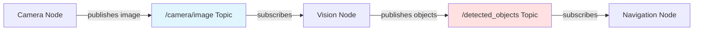
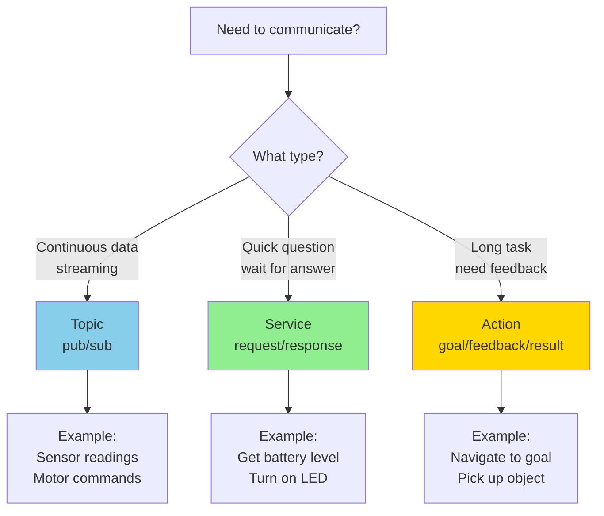
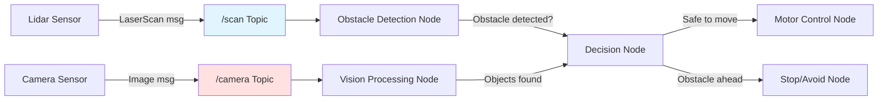

# Chapter 3: Programming Basics (Python & ROS2)

import CuriosityHook from '@site/src/components/CuriosityHook';
import DrivingQuestion from '@site/src/components/DrivingQuestion';
import AIPromptCard from '@site/src/components/AIPromptCard';
import AssignmentCard from '@site/src/components/AssignmentCard';
import SelfEvalQuestion from '@site/src/components/SelfEvalQuestion';

<CuriosityHook type="opening">
Your first robot program is just 10 lines of Python code. In this chapter, you'll write code that makes a simulated robot move, sense obstacles, and navigate autonomously. No CS degree required—just curiosity and willingness to experiment.
</CuriosityHook>

## What You'll Learn

By the end of this chapter, you'll be able to:

1. **Write Python code** using variables, functions, loops, and classes for robotics applications
2. **Explain ROS2 architecture** including nodes, topics, services, and actions
3. **Create publisher and subscriber nodes** in Python using rclpy
4. **Implement services and actions** for request/response and long-running tasks
5. **Process sensor data** from lidar, cameras, and other sensors in ROS2
6. **Control robot motors** using ros2_control framework basics

<DrivingQuestion>
How do you write code that transforms sensor data into intelligent robot behavior?
</DrivingQuestion>

## Before We Begin

### What You Should Know

If you've completed Chapters 1-2, you understand that Physical AI requires both hardware (electronics) and software (programming) working together. Now we'll focus on the programming side—writing code that brings robots to life.

**Prerequisites:**
- Chapter 1: Physical AI concepts, ROS2/Gazebo overview
- Chapter 2: Electronics basics (sensors, motors, microcontrollers)
- No programming experience required—we'll start from scratch!

### What We'll Cover (and What We Won't)

**In this chapter:**
- Python fundamentals you can use immediately
- ROS2 architecture and communication patterns
- Writing your first robot control nodes
- Processing sensor data in real-time
- Controlling motors through code

**Beyond this chapter** (covered in advanced courses):
- Computer vision algorithms
- Path planning algorithms
- Machine learning for robotics
- Advanced ROS2 features (lifecycle nodes, parameters, launch files)

---

## 1. Python Fundamentals for Robotics

Why start with Python? Because ROS2 loves Python! The entire robotics community uses Python for rapid prototyping, and rclpy (ROS Client Library for Python) makes it perfect for beginners.

### Why Python for Robotics?

**Simple syntax** - Read like English:
```python
if obstacle_detected:
    stop_robot()
else:
    move_forward()
```

**Extensive libraries** - NumPy for math, OpenCV for vision, and of course, rclpy for ROS2.

**Strong community** - Millions of tutorials, Stack Overflow answers, and robotics examples.

### Variables and Data Types

Think of variables as labeled boxes that store information:

```python
# Numbers
robot_speed = 0.5  # meters per second (float)
wheel_count = 4    # integer

# Text (strings)
robot_name = "TurtleBot"
status = "moving"

# Lists (collections)
sensor_readings = [2.5, 3.1, 2.8, 4.0]  # distances in meters
robot_position = [0.0, 0.0, 0.0]        # [x, y, theta]

# Dictionaries (key-value pairs)
robot_config = {
    "max_speed": 1.0,
    "wheel_radius": 0.05,
    "mass": 2.5
}
```

**Why this matters for robots:** Every sensor reading, motor command, and robot state is stored in variables.

### Functions: Reusable Code Blocks

Functions let you organize code and reuse it:

```python
def calculate_distance(x1, y1, x2, y2):
    """Calculate Euclidean distance between two points"""
    dx = x2 - x1
    dy = y2 - y1
    distance = (dx**2 + dy**2)**0.5
    return distance

# Use the function
dist = calculate_distance(0, 0, 3, 4)  # Returns 5.0
print(f"Distance: {dist} meters")
```

**Robot example:**
```python
def should_stop(sensor_distance, safety_threshold=0.3):
    """Check if robot should stop based on sensor"""
    if sensor_distance < safety_threshold:
        return True
    return False

# Usage
lidar_reading = 0.25  # 25cm to obstacle
if should_stop(lidar_reading):
    print("Obstacle too close! Stopping.")
```

### Loops: Repeating Actions

Robots do the same things over and over—read sensors, make decisions, send commands. Loops make this easy:

```python
# For loop - when you know how many times
for i in range(10):
    print(f"Robot step {i}")
    move_forward()

# For loop through list
sensor_distances = [0.5, 1.2, 0.3, 2.1]
for distance in sensor_distances:
    if distance < 0.5:
        print(f"Warning: Obstacle at {distance}m")

# While loop - until condition met
distance_to_goal = 10.0
while distance_to_goal > 0.1:  # Until within 10cm
    move_forward()
    distance_to_goal = measure_distance_to_goal()
print("Goal reached!")
```

### Object-Oriented Programming: Classes for Robots

**This is crucial for ROS2!** Every ROS2 node is a Python class.

**Analogy:** A class is like a blueprint for a robot. You can create many robots (objects) from the same blueprint.

```python
class Robot:
    def __init__(self, name, max_speed):
        """Constructor - runs when you create a Robot"""
        self.name = name
        self.max_speed = max_speed
        self.current_speed = 0.0
        self.position = [0.0, 0.0]

    def accelerate(self, speed_increase):
        """Increase speed (up to max_speed)"""
        self.current_speed += speed_increase
        if self.current_speed > self.max_speed:
            self.current_speed = self.max_speed

    def get_status(self):
        """Return current robot status"""
        return f"{self.name} at {self.position}, speed: {self.current_speed}m/s"

# Create robot objects
turtle = Robot("TurtleBot", max_speed=1.0)
turtle.accelerate(0.5)
print(turtle.get_status())  # "TurtleBot at [0.0, 0.0], speed: 0.5m/s"
```

**Why classes matter:** In ROS2, your nodes inherit from the `Node` class, giving them superpowers!

**Learn more:**
- [Python for Robotics - Full Course](https://www.theconstruct.ai/robotigniteacademy_learnros/ros-courses-library/python-robotics/) - The Construct
- [Python Robot Programming 101](https://robodk.com/blog/python-robot-programming/) - RoboDK
- [Python Robotics Programming](https://academy.visualcomponents.com/courses/python-robotics-programming-a-robot-with-python/) - Visual Components Academy

---

## 2. ROS2 Architecture: Nodes, Topics, Services, Actions

ROS2 is like a postal service for robots—it delivers messages between different parts of your robot system. Let's understand the architecture.

### Nodes: The Building Blocks

**Definition:** A node is an individual process that performs a specific task.

**Analogy:** Think of nodes like specialized workers:
- One node reads camera data
- Another node processes images
- Another node controls motors
- Another node makes navigation decisions

**Key principle:** Each node does ONE thing well. A complete robot system has many nodes working together.

```python
# This is a ROS2 node (simplified)
class CameraNode:
    - Reads camera images
    - Publishes images to "/camera/image" topic
    - Runs independently

class NavigationNode:
    - Subscribes to "/camera/image"
    - Processes images to find obstacles
    - Publishes commands to "/cmd_vel" topic

class MotorControllerNode:
    - Subscribes to "/cmd_vel"
    - Sends signals to motors
    - Makes robot move
```

**Why separate nodes?**
- **Modularity**: Change one without breaking others
- **Reusability**: Use camera node for different robots
- **Debugging**: Test each node independently
- **Distributed**: Nodes can run on different computers

### Topics: Continuous Data Streams (Publish/Subscribe)

**Definition:** A topic is a named channel for continuous data streaming.

**Analogy:** Like a radio station. Publishers broadcast, subscribers tune in. Many can subscribe to the same topic.

```
Publisher Node ──► Topic: "/sensor/temperature" ──► Subscriber Node 1
                                                  └─► Subscriber Node 2
                                                  └─► Subscriber Node 3
```

**Characteristics:**
- **One-way communication** (publisher doesn't know who's listening)
- **Asynchronous** (don't wait for response)
- **High-frequency** (can send hundreds of messages per second)

**Use cases:**
- Sensor data (camera images, lidar scans)
- Robot state (position, velocity)
- Motor commands



### Services: Request/Response (Client/Server)

**Definition:** A service implements synchronous request/response pattern.

**Analogy:** Like a phone call. You call (request), wait for answer (response), then hang up.

```
Client Node ──(request)──► Service Server ──(response)──► Client Node
```

**Characteristics:**
- **Two-way communication** (request → response)
- **Synchronous** (client waits for response)
- **Low-frequency** (occasional use, not continuous)

**Use cases:**
- Query robot state: "What's your battery level?"
- Trigger action: "Turn on LED"
- Configuration: "Set max speed to 0.5 m/s"

```python
# Service example (simplified)
# Client sends request
request = "What is current battery level?"

# Server processes and responds
response = check_battery()  # Returns "75%"

# Client receives response
print(f"Battery: {response}")
```

### Actions: Long-Running Tasks with Feedback

**Definition:** Actions are for asynchronous tasks that take time and provide progress updates.

**Analogy:** Like ordering a pizza with delivery tracking. You place order (goal), get updates ("pizza in oven", "out for delivery"), and finally receive pizza (result).

```
Action Client ──(goal)──► Action Server
                          Server provides ongoing feedback ──► Client
                          Server sends final result      ──► Client
```

**Three components:**
1. **Goal**: What you want (e.g., "Navigate to coordinates [5, 3]")
2. **Feedback**: Progress updates (e.g., "50% of the way there")
3. **Result**: Final outcome (e.g., "Goal reached" or "Failed: obstacle")

**Characteristics:**
- **Can be canceled** mid-execution
- **Provides feedback** during execution
- **For long tasks** (seconds to minutes)

**Use cases:**
- Navigation to goal (with progress)
- Manipulation tasks (pick and place)
- Mapping a room

### When to Use Each?



**Learn more:**
- [Understanding Topics - ROS2 Humble](https://docs.ros.org/en/humble/Tutorials/Beginner-CLI-Tools/Understanding-ROS2-Topics/Understanding-ROS2-Topics.html) - Official Docs
- [Understanding Services - ROS2 Foxy](https://docs.ros.org/en/foxy/Tutorials/Beginner-CLI-Tools/Understanding-ROS2-Services/Understanding-ROS2-Services.html) - Official Docs
- [ROS2 Tutorial for Beginners](https://thinkrobotics.com/blogs/tutorials/ros2-tutorial-for-beginners-your-complete-guide-to-robot-operating-system-2) - ThinkRobotics

---

## 3. Writing Your First ROS2 Node (Publisher/Subscriber)

Time to write actual robot code! We'll create two nodes: a "talker" (publisher) and a "listener" (subscriber).

### The Talker (Publisher) Node

This node will publish messages every second:

```python
import rclpy
from rclpy.node import Node
from std_msgs.msg import String

class TalkerNode(Node):
    def __init__(self):
        # Initialize the node with name 'talker'
        super().__init__('talker')

        # Create publisher: (MessageType, topic_name, queue_size)
        self.publisher_ = self.create_publisher(String, 'chatter', 10)

        # Create timer: call timer_callback every 1.0 seconds
        self.timer = self.create_timer(1.0, self.timer_callback)

        self.counter = 0  # Keep track of messages sent

    def timer_callback(self):
        """This function runs every second"""
        # Create message
        msg = String()
        msg.data = f'Hello ROS2! Message #{self.counter}'

        # Publish message
        self.publisher_.publish(msg)

        # Log to console
        self.get_logger().info(f'Publishing: "{msg.data}"')

        self.counter += 1

def main(args=None):
    # Initialize ROS2 Python client library
    rclpy.init(args=args)

    # Create node
    talker = TalkerNode()

    # Spin the node (keep it alive and call callbacks)
    rclpy.spin(talker)

    # Cleanup
    talker.destroy_node()
    rclpy.shutdown()

if __name__ == '__main__':
    main()
```

**What this code does:**
1. **Imports** rclpy and message types
2. **Creates class** inheriting from `Node`
3. **Creates publisher** on topic "chatter"
4. **Sets up timer** to publish every second
5. **Publishes messages** with counter
6. **Logs** to console so you can see it working

### The Listener (Subscriber) Node

This node listens to the "chatter" topic:

```python
import rclpy
from rclpy.node import Node
from std_msgs.msg import String

class ListenerNode(Node):
    def __init__(self):
        super().__init__('listener')

        # Create subscriber: (MessageType, topic_name, callback, queue_size)
        self.subscription = self.create_subscription(
            String,
            'chatter',
            self.listener_callback,
            10
        )

    def listener_callback(self, msg):
        """This function runs whenever a message arrives"""
        self.get_logger().info(f'I heard: "{msg.data}"')

def main(args=None):
    rclpy.init(args=args)

    listener = ListenerNode()

    rclpy.spin(listener)

    listener.destroy_node()
    rclpy.shutdown()

if __name__ == '__main__':
    main()
```

**What this code does:**
1. **Creates subscriber** listening to "chatter" topic
2. **Defines callback** function that runs when message arrives
3. **Logs** received messages to console

### Running Your Nodes

In separate terminals:

```bash
# Terminal 1: Run talker
ros2 run my_package talker

# Output:
# [INFO] Publishing: "Hello ROS2! Message #0"
# [INFO] Publishing: "Hello ROS2! Message #1"
# [INFO] Publishing: "Hello ROS2! Message #2"
```

```bash
# Terminal 2: Run listener
ros2 run my_package listener

# Output:
# [INFO] I heard: "Hello ROS2! Message #0"
# [INFO] I heard: "Hello ROS2! Message #1"
# [INFO] I heard: "Hello ROS2! Message #2"
```

**Congratulations! 🎉** You just created a working ROS2 application with two nodes communicating!

### Key Concepts

**Queue Size (10)**:
- How many messages to buffer if subscriber is slow
- Prevents message loss

**Callbacks**:
- Functions that run when events happen
- `timer_callback`: runs on timer
- `listener_callback`: runs when message arrives

**rclpy.spin()**:
- Keeps node alive
- Calls callbacks when needed
- Handles ROS2 communication

**Learn more:**
- [Writing Publisher/Subscriber (Python) - Humble](https://docs.ros.org/en/humble/Tutorials/Beginner-Client-Libraries/Writing-A-Simple-Py-Publisher-And-Subscriber.html) - Official Tutorial
- [Create Basic Publisher/Subscriber](https://automaticaddison.com/create-a-basic-publisher-and-subscriber-python-ros2-foxy/) - Automatic Addison

---

## 4. ROS2 Services and Actions

### Services: Request/Response Pattern

Services are perfect for occasional tasks where you need an answer.

**Service Server Example:**

```python
from example_interfaces.srv import AddTwoInts

class MathServiceNode(Node):
    def __init__(self):
        super().__init__('math_service')

        # Create service server
        self.srv = self.create_service(
            AddTwoInts,           # Service type
            'add_two_ints',       # Service name
            self.add_callback     # Callback function
        )

    def add_callback(self, request, response):
        """Process request and return response"""
        response.sum = request.a + request.b
        self.get_logger().info(f'Request: {request.a} + {request.b} = {response.sum}')
        return response
```

**Service Client Example:**

```python
from example_interfaces.srv import AddTwoInts

class MathClientNode(Node):
    def __init__(self):
        super().__init__('math_client')

        # Create service client
        self.client = self.create_client(AddTwoInts, 'add_two_ints')

        # Wait for service to be available
        while not self.client.wait_for_service(timeout_sec=1.0):
            self.get_logger().info('Service not available, waiting...')

    def send_request(self, a, b):
        """Send request to service"""
        request = AddTwoInts.Request()
        request.a = a
        request.b = b

        # Call service (async)
        future = self.client.call_async(request)
        return future

# Usage
client = MathClientNode()
future = client.send_request(5, 7)

# Wait for result
rclpy.spin_until_future_complete(client, future)
result = future.result()
print(f'Result: {result.sum}')  # 12
```

### Actions: Goal/Feedback/Result Pattern

Actions are for tasks that take time and need progress updates.

**Action Server (Simplified):**

```python
class FibonacciActionServer(Node):
    def __init__(self):
        super().__init__('fibonacci_action_server')

        # Create action server
        self._action_server = ActionServer(
            self,
            Fibonacci,              # Action type
            'fibonacci',            # Action name
            self.execute_callback   # Goal execution function
        )

    def execute_callback(self, goal_handle):
        """Execute the goal and provide feedback"""
        self.get_logger().info('Executing goal...')

        # Get goal request
        order = goal_handle.request.order

        # Provide feedback during execution
        feedback_msg = Fibonacci.Feedback()
        sequence = [0, 1]

        for i in range(1, order):
            sequence.append(sequence[i] + sequence[i-1])

            # Send feedback
            feedback_msg.partial_sequence = sequence
            goal_handle.publish_feedback(feedback_msg)

            time.sleep(1)  # Simulate long computation

        # Goal complete - send result
        goal_handle.succeed()
        result = Fibonacci.Result()
        result.sequence = sequence
        return result
```

**When to use:**
- Navigation: "Go to (x, y)" with progress updates
- Manipulation: "Pick up object" with status
- Long computations with cancellation option

**Learn more:**
- [Writing Service/Client (Python) - Humble](https://docs.ros.org/en/humble/Tutorials/Beginner-Client-Libraries/Writing-A-Simple-Py-Service-And-Client.html) - Official Tutorial
- [Writing Action Server/Client (Python) - Humble](https://docs.ros.org/en/humble/Tutorials/Intermediate/Writing-an-Action-Server-Client/Py.html) - Official Tutorial

---

## 5. Processing Sensor Data in ROS2

Robots need to process sensor data in real-time. Let's see how to handle different sensor types.

### Processing Lidar Data (LaserScan)

Lidar provides distance measurements in all directions:

```python
from sensor_msgs.msg import LaserScan

class LidarProcessorNode(Node):
    def __init__(self):
        super().__init__('lidar_processor')

        # Subscribe to lidar topic
        self.subscription = self.create_subscription(
            LaserScan,
            '/scan',                    # Topic name
            self.scan_callback,
            10
        )

    def scan_callback(self, msg):
        """Process lidar scan data"""
        # msg.ranges is list of distances (in meters)
        # msg.angle_min, msg.angle_max define scan range

        # Find minimum distance (closest obstacle)
        min_distance = min(msg.ranges)

        # Find index of minimum
        min_index = msg.ranges.index(min_distance)

        # Calculate angle of closest obstacle
        angle = msg.angle_min + (min_index * msg.angle_increment)

        self.get_logger().info(
            f'Closest obstacle: {min_distance:.2f}m at {angle:.2f} radians'
        )

        # Check if obstacle too close
        if min_distance < 0.3:  # 30cm safety threshold
            self.get_logger().warn('WARNING: Obstacle too close!')
```

### Processing Camera Images

```python
from sensor_msgs.msg import Image
from cv_bridge import CvBridge
import cv2

class CameraProcessorNode(Node):
    def __init__(self):
        super().__init__('camera_processor')

        self.subscription = self.create_subscription(
            Image,
            '/camera/image_raw',
            self.image_callback,
            10
        )

        # Bridge to convert ROS images to OpenCV
        self.bridge = CvBridge()

    def image_callback(self, msg):
        """Process camera image"""
        # Convert ROS Image to OpenCV format
        cv_image = self.bridge.imgmsg_to_cv2(msg, desired_encoding='bgr8')

        # Process image (example: find red objects)
        hsv = cv2.cvtColor(cv_image, cv2.COLOR_BGR2HSV)

        # Define red color range
        lower_red = np.array([0, 100, 100])
        upper_red = np.array([10, 255, 255])

        # Create mask
        mask = cv2.inRange(hsv, lower_red, upper_red)

        # Count red pixels
        red_pixels = cv2.countNonZero(mask)

        if red_pixels > 1000:  # Threshold
            self.get_logger().info(f'Red object detected! {red_pixels} pixels')
```

### Processing Ultrasonic/Range Data

```python
from sensor_msgs.msg import Range

class UltrasonicProcessorNode(Node):
    def __init__(self):
        super().__init__('ultrasonic_processor')

        self.subscription = self.create_subscription(
            Range,
            '/ultrasonic/range',
            self.range_callback,
            10
        )

    def range_callback(self, msg):
        """Process ultrasonic range data"""
        distance = msg.range  # Distance in meters

        if distance < msg.min_range or distance > msg.max_range:
            self.get_logger().warn('Reading out of range!')
            return

        if distance < 0.2:  # 20cm
            self.get_logger().warn(f'VERY CLOSE obstacle: {distance:.2f}m')
        elif distance < 0.5:  # 50cm
            self.get_logger().info(f'Close obstacle: {distance:.2f}m')
```

### Sensor Data Pipeline



**Learn more:**
- [ROS2 Lidar Sensors - Isaac Sim](https://docs.omniverse.nvidia.com/app_isaacsim/app_isaacsim/tutorial_ros2_sensors.html) - NVIDIA
- [How to Read LaserScan Data](https://www.theconstruct.ai/read-laserscan-data/) - The Construct
- [Setting Up Sensors - Nav2](https://navigation.ros.org/setup_guides/sensors/setup_sensors.html) - Official Nav2 Docs

---

## 6. Robot Control Programming Basics

Now let's make the robot move! We'll use the ros2_control framework.

### Publishing Velocity Commands

The simplest way to control a robot:

```python
from geometry_msgs.msg import Twist

class SimpleControllerNode(Node):
    def __init__(self):
        super().__init__('simple_controller')

        # Publish to cmd_vel (command velocity) topic
        self.publisher_ = self.create_publisher(Twist, '/cmd_vel', 10)

        # Create timer for control loop (10Hz)
        self.timer = self.create_timer(0.1, self.control_callback)

    def control_callback(self):
        """Send velocity commands to robot"""
        msg = Twist()

        # Linear velocity (forward/backward)
        msg.linear.x = 0.5  # 0.5 m/s forward

        # Angular velocity (rotation)
        msg.angular.z = 0.0  # 0 rad/s (straight)

        self.publisher_.publish(msg)

    def stop(self):
        """Stop the robot"""
        msg = Twist()  # All zeros
        self.publisher_.publish(msg)
```

### Example: Wall Following Robot

Let's combine sensor processing and motor control:

```python
from sensor_msgs.msg import LaserScan
from geometry_msgs.msg import Twist

class WallFollowerNode(Node):
    def __init__(self):
        super().__init__('wall_follower')

        # Subscribe to lidar
        self.scan_sub = self.create_subscription(
            LaserScan,
            '/scan',
            self.scan_callback,
            10
        )

        # Publish velocity commands
        self.cmd_pub = self.create_publisher(Twist, '/cmd_vel', 10)

        self.target_distance = 0.5  # Stay 0.5m from wall

    def scan_callback(self, msg):
        """Process lidar and follow wall"""
        # Get distance to right side (assuming 0° is front)
        # Right side typically at -90° (270°)
        right_index = len(msg.ranges) * 3 // 4

        right_distance = msg.ranges[right_index]

        # Calculate error from target distance
        error = right_distance - self.target_distance

        # Create velocity command
        cmd = Twist()

        # Move forward at constant speed
        cmd.linear.x = 0.3  # 0.3 m/s

        # Turn based on error (simple proportional control)
        cmd.angular.z = -error * 1.0  # Proportional gain

        # Publish command
        self.cmd_pub.publish(cmd)

        self.get_logger().info(
            f'Distance to wall: {right_distance:.2f}m, '
            f'Error: {error:.2f}m, '
            f'Turn rate: {cmd.angular.z:.2f} rad/s'
        )
```

### ros2_control Framework

For more advanced control, use ros2_control:

**Key concepts:**
- **state_interfaces**: Read sensor data (joint positions, velocities)
- **command_interfaces**: Send commands (target positions, velocities)
- **Controllers**: Algorithms that process states and generate commands

**Why use it:**
- Hardware abstraction (same code for different robots)
- Standard interface
- Pre-built controllers (PID, trajectory following)

**Learn more:**
- [ros2_control Documentation](https://control.ros.org/) - Official Docs
- [ROS2 Control, Robot Control the Right Way](https://medium.com/@jiayi.hoffman/ros-2-control-robot-control-the-right-way-d0e72e7f1b6c) - Medium
- [Control Robotic Arm Using ROS2 Control](https://automaticaddison.com/how-to-control-a-robotic-arm-using-ros-2-control-and-gazebo/) - Automatic Addison

---

## Real-World Example: Wall-Following Robot Complete Code

Let's put it all together with a complete, runnable example:

```python
#!/usr/bin/env python3

import rclpy
from rclpy.node import Node
from sensor_msgs.msg import LaserScan
from geometry_msgs.msg import Twist
import math

class WallFollowerRobot(Node):
    def __init__(self):
        super().__init__('wall_follower_robot')

        # Parameters
        self.declare_parameter('target_distance', 0.5)
        self.declare_parameter('max_speed', 0.5)
        self.declare_parameter('kp', 1.0)  # Proportional gain

        self.target_distance = self.get_parameter('target_distance').value
        self.max_speed = self.get_parameter('max_speed').value
        self.kp = self.get_parameter('kp').value

        # Subscribers
        self.scan_sub = self.create_subscription(
            LaserScan,
            '/scan',
            self.scan_callback,
            10
        )

        # Publishers
        self.cmd_pub = self.create_publisher(Twist, '/cmd_vel', 10)

        self.get_logger().info(
            f'Wall follower started! Target distance: {self.target_distance}m'
        )

    def scan_callback(self, msg):
        """Main control logic"""
        # Safety check: minimum distance in front
        front_index = len(msg.ranges) // 2
        front_distance = msg.ranges[front_index]

        if front_distance < 0.3:  # Too close to front obstacle
            self.stop_robot()
            self.get_logger().warn('Front obstacle! Stopping.')
            return

        # Get right side distance
        right_index = len(msg.ranges) * 3 // 4
        right_distance = msg.ranges[right_index]

        # Calculate control
        error = right_distance - self.target_distance
        angular_velocity = -self.kp * error

        # Limit angular velocity
        max_angular = 1.0
        angular_velocity = max(min(angular_velocity, max_angular), -max_angular)

        # Create and publish command
        cmd = Twist()
        cmd.linear.x = self.max_speed
        cmd.angular.z = angular_velocity

        self.cmd_pub.publish(cmd)

    def stop_robot(self):
        """Emergency stop"""
        cmd = Twist()  # All zeros
        self.cmd_pub.publish(cmd)

def main(args=None):
    rclpy.init(args=args)
    wall_follower = WallFollowerRobot()

    try:
        rclpy.spin(wall_follower)
    except KeyboardInterrupt:
        pass
    finally:
        wall_follower.stop_robot()
        wall_follower.destroy_node()
        rclpy.shutdown()

if __name__ == '__main__':
    main()
```

**To run this:**
1. Launch Gazebo with a robot: `ros2 launch turtlebot3_gazebo turtlebot3_world.launch.py`
2. Run the node: `ros2 run my_package wall_follower`
3. Watch your robot follow walls autonomously!

---

## AI Learning Prompts

<AIPromptCard
  title="Code Debugging Assistant"
  description="Get help debugging your ROS2 Python code"
  prompt={`I'm writing a ROS2 node in Python and encountering this error:

[Paste your error message here]

Here's my code:

\`\`\`python
[Paste your code here]
\`\`\`

Can you:
1. Explain what the error means in beginner terms?
2. Identify the specific line causing the problem?
3. Provide a corrected version with explanatory comments?
4. Suggest how to avoid this error in the future?`}
/>

<AIPromptCard
  title="ROS2 Architecture Helper"
  description="Understand when to use topics vs services vs actions"
  prompt={`I need to implement this robot behavior:

[Describe what your robot needs to do]

Should I use a topic, service, or action? Please explain:
1. Which communication pattern is most appropriate and why?
2. What would be the topic/service/action name?
3. What message type should I use (or should I create a custom one)?
4. A simple code skeleton showing the publisher/subscriber or client/server structure?

Example: "My robot needs to navigate to a goal position while avoiding obstacles and I want to monitor progress."`}
/>

<AIPromptCard
  title="Node Design Consultant"
  description="Get advice on structuring your ROS2 nodes"
  prompt={`I'm building a robot that needs to:
- [List requirement 1]
- [List requirement 2]
- [List requirement 3]

How should I structure my ROS2 nodes? Please provide:
1. How many nodes should I create and what should each one do?
2. What topics should connect these nodes?
3. A diagram (in text) showing node communication?
4. Which node responsibilities follow best practices (one task per node)?

Example requirements:
- Read camera images
- Detect red objects in images
- Move toward red objects
- Stop if obstacle detected by lidar`}
/>

---

## Practical Exercise: Temperature Monitoring System

<AssignmentCard
  title="Build a Temperature Monitoring Node"
  description="Create a simple pub/sub system to practice ROS2 basics"
  timeEstimate="45-60 minutes"
  difficulty="beginner"
/>

### Exercise Goals

Create two nodes:
1. **Publisher**: Simulates temperature sensor, publishes readings every second
2. **Subscriber**: Logs warnings if temperature too high

### Requirements

**Temperature Publisher Node:**
- Publish to `/temperature` topic
- Use `std_msgs/msg/Float32` message type
- Simulate temperature: random value between 15°C and 45°C
- Publish every 1 second

**Temperature Monitor Node:**
- Subscribe to `/temperature` topic
- Log INFO if temperature < 30°C
- Log WARN if temperature ≥ 30°C and < 40°C
- Log ERROR if temperature ≥ 40°C
- Display current temperature in each log

**Bonus Challenge:**
- Add a service `/get_current_temp` that returns the latest temperature reading
- Add parameter for warning threshold (instead of hardcoded 30°C)

### Starter Code

```python
# temperature_publisher.py
import rclpy
from rclpy.node import Node
from std_msgs.msg import Float32
import random

class TemperaturePublisher(Node):
    def __init__(self):
        super().__init__('temperature_publisher')
        # TODO: Create publisher
        # TODO: Create timer (1 second)
        pass

    def timer_callback(self):
        # TODO: Generate random temperature
        # TODO: Publish temperature
        pass

# temperature_monitor.py
class TemperatureMonitor(Node):
    def __init__(self):
        super().__init__('temperature_monitor')
        # TODO: Create subscriber
        pass

    def temperature_callback(self, msg):
        # TODO: Check temperature thresholds
        # TODO: Log appropriate message
        pass
```

### Testing Your Code

```bash
# Terminal 1
ros2 run my_package temperature_publisher

# Terminal 2
ros2 run my_package temperature_monitor

# Expected output (monitor):
# [INFO] Temperature OK: 24.5°C
# [INFO] Temperature OK: 28.1°C
# [WARN] Temperature high: 32.7°C
# [ERROR] Temperature critical: 41.2°C
```

---

## Self-Evaluation Questions

<SelfEvalQuestion
  question="What is the main advantage of using Object-Oriented Programming (classes) in ROS2?"
  options={[
    "It makes code run faster",
    "ROS2 nodes inherit from the Node class, gaining built-in communication abilities",
    "It uses less memory",
    "It's required by Python 3"
  ]}
  correctAnswer={1}
  explanation={`
**Correct Answer: B) ROS2 nodes inherit from the Node class**

**Explanation:**

In ROS2, every node is a Python class that inherits from \`rclpy.node.Node\`. When you inherit from Node:

\`\`\`python
class MyRobot(Node):  # Inherits from Node
    def __init__(self):
        super().__init__('my_robot')  # Initialize parent class
        # Now you have access to:
        self.create_publisher()   # Create publishers
        self.create_subscription()  # Create subscribers
        self.create_service()     # Create services
        self.create_timer()       # Create timers
        self.get_logger()         # Access logger
\`\`\`

By inheriting from Node, your class automatically gets:
- Communication capabilities (pub/sub, services, actions)
- Logging system
- Parameter handling
- Timer management
- Lifecycle management

**Why other answers are wrong:**

**A) Makes code run faster:**
- OOP doesn't inherently make code faster
- Performance depends on algorithm, not programming paradigm

**C) Uses less memory:**
- Actually, classes can use slightly more memory than procedural code
- Memory usage is not the primary benefit

**D) Required by Python 3:**
- Python 3 supports multiple paradigms (procedural, OOP, functional)
- OOP is optional, not required

**Review:** Section 1 - Python Fundamentals (Object-Oriented Programming)
  `}
  topic="Python & OOP"
/>

<SelfEvalQuestion
  question="Which communication pattern should you use for continuous, high-frequency sensor data like camera images?"
  options={[
    "Service (request/response)",
    "Action (goal/feedback/result)",
    "Topic (publish/subscribe)",
    "Direct function call"
  ]}
  correctAnswer={2}
  explanation={`
**Correct Answer: C) Topic (publish/subscribe)**

**Explanation:**

Topics are ideal for continuous, high-frequency data because:

**Characteristics of Topics:**
- **One-way communication** (no response needed)
- **Asynchronous** (publisher doesn't wait)
- **Many subscribers** can listen to same topic
- **High frequency** (can handle 30+ fps video streams)
- **Fire-and-forget** (efficient for streaming data)

**Example - Camera Publishing:**
\`\`\`python
# Camera node publishes images 30 times/second
self.publisher = self.create_publisher(Image, '/camera/image', 10)

def publish_frame(self):
    msg = Image()  # Create image message
    self.publisher.publish(msg)  # Publish and move on
    # No waiting for response!
\`\`\`

**Why other patterns don't work:**

**A) Service (request/response):**
- ❌ Synchronous (client waits for each response)
- ❌ Low frequency only
- ❌ Can't stream continuous data
- ✅ Good for: "Get current temperature" (one-time query)

**B) Action (goal/feedback/result):**
- ❌ For long-running tasks, not continuous streams
- ❌ Overhead of goal/feedback/result too much
- ✅ Good for: "Navigate to goal" with progress updates

**D) Direct function call:**
- ❌ Requires nodes in same process
- ❌ No distributed system support
- ❌ Not the ROS2 way

**Real-world analogy:**
- **Topic** = Radio broadcast (many listeners, continuous)
- **Service** = Phone call (one-on-one, wait for answer)
- **Action** = Pizza delivery (order, track, receive)

**Review:** Section 2 - ROS2 Architecture (Topics)
  `}
  topic="ROS2 Communication"
/>

<SelfEvalQuestion
  question="In this code: `self.create_subscription(LaserScan, '/scan', self.callback, 10)`, what does the `10` parameter mean?"
  options={[
    "Publish rate (10 Hz)",
    "Queue size (buffer 10 messages)",
    "Priority level (10 = highest)",
    "Timeout in seconds"
  ]}
  correctAnswer={1}
  explanation={`
**Correct Answer: B) Queue size (buffer 10 messages)**

**Explanation:**

The queue size determines how many messages to buffer if your callback function is processing slower than messages arrive.

**How it works:**

\`\`\`python
self.subscription = self.create_subscription(
    LaserScan,        # Message type
    '/scan',          # Topic name
    self.callback,    # Callback function
    10                # Queue size (QoS parameter)
)
\`\`\`

**What happens with different queue sizes:**

**Queue size = 1:**
- Only keeps most recent message
- Old messages dropped if callback is slow
- Use when: only care about latest state

**Queue size = 10:**
- Buffers up to 10 messages
- Callback processes messages in order
- Use when: all messages important

**Queue size = 100:**
- Larger buffer for high-frequency data
- More memory usage
- Use when: can't afford to miss messages

**Example scenario:**

\`\`\`python
# Lidar publishes 10 messages/second
# Your callback takes 0.2 seconds to process

# With queue size = 1:
# Processes only newest, drops intermediate messages

# With queue size = 10:
# Processes all messages, no drops (up to 1 second delay)
\`\`\`

**Why other answers are wrong:**

**A) Publish rate (10 Hz):**
- ❌ Publish rate set by publisher, not subscriber
- ❌ Subscriber doesn't control publication frequency

**C) Priority level:**
- ❌ ROS2 doesn't use numeric priorities this way
- ❌ Priority is set via QoS policies, not a single number

**D) Timeout in seconds:**
- ❌ There's no timeout parameter in create_subscription
- ❌ Subscribers wait indefinitely for messages

**Best practice:**
- Start with queue size 10 (default)
- Increase if you see "message queue full" warnings
- Decrease if memory is constrained

**Review:** Section 3 - Writing Your First ROS2 Node
  `}
  topic="ROS2 Subscriptions"
/>

<SelfEvalQuestion
  question="What is the primary purpose of `rclpy.spin(node)` in a ROS2 Python program?"
  options={[
    "Make the robot spin in circles",
    "Keep the node alive and call callbacks when events occur",
    "Start the ROS2 system",
    "Compile the Python code"
  ]}
  correctAnswer={1}
  explanation={`
**Correct Answer: B) Keep the node alive and call callbacks when events occur**

**Explanation:**

\`rclpy.spin(node)\` is the "heartbeat" of your ROS2 node. It keeps the node running and handles all the ROS2 communication.

**What spin() does:**

\`\`\`python
def main():
    rclpy.init()              # Initialize ROS2
    node = MyNode()           # Create your node

    rclpy.spin(node)          # THIS LINE:
                              # - Keeps program from exiting
                              # - Checks for incoming messages
                              # - Calls your callbacks
                              # - Handles timers
                              # - Processes ROS2 communication

    node.destroy_node()       # Cleanup (only after spin exits)
    rclpy.shutdown()
\`\`\`

**Without spin(), your program would:**
1. Create the node
2. Immediately exit
3. Never process any messages
4. Never call any callbacks

**Example - What Actually Happens:**

\`\`\`python
class ListenerNode(Node):
    def __init__(self):
        super().__init__('listener')
        self.sub = self.create_subscription(
            String, 'topic', self.callback, 10
        )

    def callback(self, msg):
        print(f"Received: {msg.data}")

# Without spin:
node = ListenerNode()
# Program exits immediately, callback NEVER called!

# With spin:
node = ListenerNode()
rclpy.spin(node)
# Program stays alive, callback called whenever message arrives!
\`\`\`

**spin() variants:**

\`\`\`python
# Regular spin (blocks until Ctrl+C)
rclpy.spin(node)

# Spin once (process one round of callbacks, then return)
rclpy.spin_once(node, timeout_sec=1.0)

# Spin until future completes (for service calls)
rclpy.spin_until_future_complete(node, future)
\`\`\`

**Why other answers are wrong:**

**A) Make robot spin in circles:**
- ❌ That's \`cmd_vel.angular.z = 1.0\`!
- ❌ \`rclpy.spin()\` is software, not robot motion

**C) Start the ROS2 system:**
- ❌ That's \`rclpy.init()\`
- ❌ init() comes before spin()

**D) Compile Python code:**
- ❌ Python is interpreted, not compiled
- ❌ No compilation step needed

**Memory trick:** Think of spinning plates—you keep them spinning (alive) by checking and adjusting them (calling callbacks).

**Review:** Section 3 - Writing Your First ROS2 Node
  `}
  topic="ROS2 Node Lifecycle"
/>

<SelfEvalQuestion
  question="You're processing LaserScan data and `msg.ranges[0]` gives you 0.35. What does this mean?"
  options={[
    "The sensor detected an obstacle 35 meters away",
    "The sensor detected an obstacle 0.35 meters (35 cm) away",
    "The sensor confidence is 35%",
    "The sensor angle is 0.35 radians"
  ]}
  correctAnswer={1}
  explanation={`
**Correct Answer: B) The sensor detected an obstacle 0.35 meters (35 cm) away**

**Explanation:**

In ROS2, LaserScan messages use meters as the standard unit for distance.

**LaserScan message structure:**

\`\`\`python
from sensor_msgs.msg import LaserScan

def scan_callback(self, msg):
    # msg.ranges is a list of distances
    # Each value is in METERS

    distance = msg.ranges[0]  # First ray reading
    # If distance = 0.35 → 0.35 meters = 35 centimeters

    # Other important fields:
    msg.angle_min       # Start angle (radians)
    msg.angle_max       # End angle (radians)
    msg.angle_increment # Angle between rays (radians)
    msg.range_min       # Minimum valid range (meters)
    msg.range_max       # Maximum valid range (meters)
    msg.ranges          # List of distance readings (meters)
\`\`\`

**Example - Processing Full Scan:**

\`\`\`python
def scan_callback(self, msg):
    # Find closest obstacle
    min_distance = min(msg.ranges)  # in meters

    if min_distance < 0.3:  # Less than 30cm
        self.get_logger().warn(
            f'Obstacle very close: {min_distance:.2f}m'
        )

    # Check specific direction (e.g., front)
    front_index = len(msg.ranges) // 2
    front_distance = msg.ranges[front_index]

    if front_distance < 0.5:  # Less than 50cm ahead
        self.stop_robot()
\`\`\`

**Common LaserScan patterns:**

\`\`\`python
# Get distance at specific angle
def get_distance_at_angle(self, msg, angle_rad):
    \"\"\"Get distance at specific angle\"\"\"
    # Calculate index for given angle
    angle_index = int(
        (angle_rad - msg.angle_min) / msg.angle_increment
    )

    if 0 <= angle_index < len(msg.ranges):
        return msg.ranges[angle_index]  # meters
    return None

# Check if path is clear
def is_path_clear(self, msg, min_distance=0.5):
    \"\"\"Check if front path is clear\"\"\"
    # Check front 60 degrees
    front_start = len(msg.ranges) // 2 - 30
    front_end = len(msg.ranges) // 2 + 30

    front_distances = msg.ranges[front_start:front_end]

    return all(d > min_distance for d in front_distances)
\`\`\`

**Why other answers are wrong:**

**A) 35 meters away:**
- ❌ That's 0.35 **kilometers** not meters!
- ❌ Most lidars have range 10-30m, not 35m

**C) Sensor confidence 35%:**
- ❌ Confidence not stored in ranges array
- ❌ Some lidars have intensity field for that

**D) Sensor angle 0.35 radians:**
- ❌ Angle is the index position, not the value
- ❌ Use msg.angle_min + (index * msg.angle_increment)

**Units cheat sheet:**
- **Distances**: Always meters (m)
- **Angles**: Always radians (rad)
- **Time**: Always seconds (s)
- **Velocity**: Always m/s or rad/s

**Review:** Section 5 - Processing Sensor Data
  `}
  topic="Sensor Data Processing"
/>

<SelfEvalQuestion
  question="In the Twist message for robot control, what does `msg.linear.x = 0.5` and `msg.angular.z = 1.0` command the robot to do?"
  options={[
    "Move backward at 0.5 m/s while turning left",
    "Move forward at 0.5 m/s while turning left (counterclockwise)",
    "Move right at 0.5 m/s with no rotation",
    "Move at angle 0.5 radians with speed 1.0 m/s"
  ]}
  correctAnswer={1}
  explanation={`
**Correct Answer: B) Move forward at 0.5 m/s while turning left (counterclockwise)**

**Explanation:**

The Twist message controls both linear and angular velocity simultaneously.

**Twist message structure:**

\`\`\`python
from geometry_msgs.msg import Twist

cmd = Twist()

# Linear velocities (m/s)
cmd.linear.x = 0.5   # Forward (+) / Backward (-)
cmd.linear.y = 0.0   # Left (+) / Right (-) [for holonomic robots]
cmd.linear.z = 0.0   # Up (+) / Down (-) [for drones/submarines]

# Angular velocities (rad/s)
cmd.angular.x = 0.0  # Roll [for drones]
cmd.angular.y = 0.0  # Pitch [for drones]
cmd.angular.z = 1.0  # Yaw: Counterclockwise (+) / Clockwise (-)

self.cmd_pub.publish(cmd)
\`\`\`

**For differential drive robots (like TurtleBot):**

**Direction conventions:**
- **linear.x > 0**: Forward
- **linear.x < 0**: Backward
- **angular.z > 0**: Turn left (counterclockwise)
- **angular.z < 0**: Turn right (clockwise)

**Common motion patterns:**

\`\`\`python
# 1. Move straight forward
cmd.linear.x = 0.5
cmd.angular.z = 0.0

# 2. Move straight backward
cmd.linear.x = -0.5
cmd.angular.z = 0.0

# 3. Rotate in place (left)
cmd.linear.x = 0.0
cmd.angular.z = 1.0

# 4. Move forward while turning left (ANSWER TO QUESTION)
cmd.linear.x = 0.5
cmd.angular.z = 1.0

# 5. Move forward while turning right
cmd.linear.x = 0.5
cmd.angular.z = -1.0

# 6. Stop completely
cmd.linear.x = 0.0
cmd.angular.z = 0.0
\`\`\`

**Visualizing the motion:**

\`\`\`
                 ↑ forward
                 |
    left <---  robot  ---> right
   (CCW)         |         (CW)
              backward

msg.linear.x = 0.5   → moves in ↑ direction
msg.angular.z = 1.0  → turns counterclockwise (left)

Result: curved path to the left
\`\`\`

**Example - Circle motion:**

\`\`\`python
def drive_in_circle(self, radius=1.0):
    \"\"\"Drive in circle of given radius\"\"\"
    linear_speed = 0.5  # m/s

    # For circular motion: angular = linear / radius
    angular_speed = linear_speed / radius

    cmd = Twist()
    cmd.linear.x = linear_speed
    cmd.angular.z = angular_speed

    self.cmd_pub.publish(cmd)
    # Robot follows circular arc!
\`\`\`

**Why other answers are wrong:**

**A) Backward at 0.5 m/s while turning left:**
- ❌ Positive linear.x means **forward**, not backward
- ❌ Backward would be negative: \`linear.x = -0.5\`

**C) Move right at 0.5 m/s with no rotation:**
- ❌ linear.x doesn't mean "right", it means forward/backward
- ❌ Moving right would use \`linear.y\` (on holonomic robots only)

**D) Move at angle 0.5 radians with speed 1.0 m/s:**
- ❌ Twist doesn't specify target angles
- ❌ It specifies **velocities** (rates of change)

**Quick reference:**
- **Straight line**: linear.x ≠ 0, angular.z = 0
- **Rotate in place**: linear.x = 0, angular.z ≠ 0
- **Curved path**: both ≠ 0
- **Stop**: both = 0

**Review:** Section 6 - Robot Control Programming
  `}
  topic="Robot Control"
/>

---

## Assignment: Build an Obstacle Avoidance Node

Create a ROS2 node that reads Lidar data and commands a robot to avoid obstacles autonomously.

### Assignment Goals

Build a complete obstacle avoidance system combining sensor processing and motor control.

### Requirements

**Functional Requirements:**
1. Subscribe to `/scan` topic (LaserScan messages)
2. Publish to `/cmd_vel` topic (Twist messages)
3. If front path clear (> 0.5m): move forward at 0.3 m/s
4. If obstacle detected front-left: turn right
5. If obstacle detected front-right: turn left
6. If obstacle directly ahead (< 0.3m): stop and reverse
7. Log current action to console

**Technical Requirements:**
- Single node inheriting from `Node`
- Clean code with comments
- Proper error handling (check for invalid ranges)
- Adjustable parameters (speeds, thresholds)

### Starter Code

```python
#!/usr/bin/env python3

import rclpy
from rclpy.node import Node
from sensor_msgs.msg import LaserScan
from geometry_msgs.msg import Twist

class ObstacleAvoider(Node):
    def __init__(self):
        super().__init__('obstacle_avoider')

        # TODO: Declare parameters for speeds and thresholds

        # TODO: Create subscription to /scan

        # TODO: Create publisher to /cmd_vel

        self.get_logger().info('Obstacle avoider node started!')

    def scan_callback(self, msg):
        # TODO: Analyze laser scan data
        # - Get front distance
        # - Get left distance
        # - Get right distance

        # TODO: Make decision based on readings
        # - All clear → forward
        # - Left obstacle → turn right
        # - Right obstacle → turn left
        # - Front obstacle close → stop/reverse

        # TODO: Create Twist message

        # TODO: Publish command

        # TODO: Log action
        pass

    def stop(self):
        # TODO: Publish zero velocity
        pass

def main(args=None):
    # TODO: Initialize rclpy
    # TODO: Create node
    # TODO: Spin
    # TODO: Cleanup
    pass

if __name__ == '__main__':
    main()
```

### Testing Your Node

**Prerequisites:**
```bash
# Install TurtleBot3 packages (if not already installed)
sudo apt install ros-humble-turtlebot3-gazebo

# Set TurtleBot3 model
export TURTLEBOT3_MODEL=burger
```

**Run simulation:**
```bash
# Terminal 1: Launch Gazebo world
ros2 launch turtlebot3_gazebo turtlebot3_world.launch.py

# Terminal 2: Run your obstacle avoider
ros2 run my_package obstacle_avoider

# Terminal 3: Monitor topics (optional)
ros2 topic echo /cmd_vel
```

### Success Criteria

- [ ] Robot moves forward when path is clear
- [ ] Robot turns to avoid obstacles
- [ ] Robot stops when obstacle too close
- [ ] Console logs show current actions
- [ ] No crashes in simulation
- [ ] Code is well-commented

### Extension Challenges

1. **Add wall following:** Keep constant distance from right wall
2. **Add goal seeking:** Navigate toward a target position while avoiding obstacles
3. **Add emergency stop service:** Create service to remotely stop robot
4. **Add status publisher:** Publish robot state ("exploring", "avoiding", "stopped")

### Time Estimate

- **Basic implementation**: 60-90 minutes
- **With extensions**: 2-3 hours

---

<CuriosityHook type="closing">
You can now write code that reads sensors and controls motors—the foundation of all robot intelligence. In Chapter 4, you'll integrate these skills with simulation environments to build and test complete robotic behaviors. Your autonomous robot is taking shape!
</CuriosityHook>

## What's Next?

**Chapter 4: Simulation with Gazebo**
- Creating robot models (URDF)
- Designing simulation worlds
- Physics simulation and testing
- Sim-to-real transfer techniques

**Continue Learning:**
- Complete the obstacle avoider assignment
- Experiment with different sensor processing strategies
- Try controlling a simulated robotic arm
- Join ROS community forums (ROS Discourse, r/ROS)

---

## Additional Resources

### Official ROS2 Tutorials
- [ROS2 Humble Tutorials](https://docs.ros.org/en/humble/Tutorials.html) - Comprehensive official documentation
- [ROS2 Foxy Tutorials](https://docs.ros.org/en/foxy/Tutorials.html) - Alternative distribution

### Learning Platforms
- [The Construct](https://www.theconstruct.ai/) - Online ROS courses with simulations
- [Automatic Addison](https://automaticaddison.com/) - Excellent step-by-step tutorials
- [Articulated Robotics](https://articulatedrobotics.xyz/) - Practical robot building guides

### Community
- [ROS Discourse](https://discourse.ros.org/) - Official ROS community forum
- [r/ROS](https://www.reddit.com/r/ROS/) - Reddit ROS community
- [Robotics Stack Exchange](https://robotics.stackexchange.com/) - Q&A for robotics

### Tools
- [ROS2 Command Line Tools](https://docs.ros.org/en/humble/Tutorials/Beginner-CLI-Tools.html) - Master ros2 CLI
- [RViz2](https://github.com/ros2/rviz) - Visualization tool
- [rqt](https://docs.ros.org/en/humble/Concepts/About-RQt.html) - GUI tools for ROS2

**Keep coding, keep building!** 🤖
