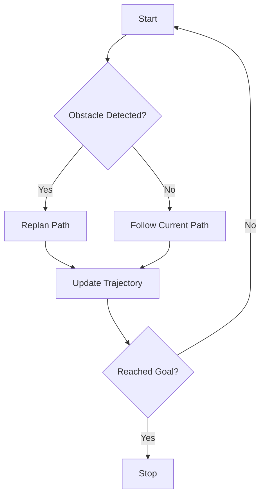

# Contract: Chapter Structure

**Version**: 1.0.0
**Date**: 2025-11-30
**Purpose**: Define the mandatory 12-element structure for all chapters (FR-003)

## Contract Overview

Every chapter MUST follow this exact 12-element structure to pass quality gates. This contract is enforced via:
1. Chapter template (`.specify/templates/chapter-template.mdx`)
2. Automated Playwright validation tests
3. Human review checklist

## Mandatory Elements

### Element 1: Attention-Seeker Hook

**Purpose**: Create curiosity and engagement at chapter start

**Location**: Immediately after title, before any content

**Format**:
```mdx
<CuriosityHook>
[Engaging opening: real-world scenario, surprising fact, or provocative question]
</CuriosityHook>
```

**Validation Rules**:
- Must be present within first 200 characters of content
- Must use `<CuriosityHook>` component
- Content length: 50-300 characters
- Must create anticipation or surprise (no dry introductions)

**Example** (Good):
```mdx
<CuriosityHook>
Self-driving cars use the exact same control technique you'll learn in this chapter—a 90-year-old algorithm invented before computers existed. How does something so old power today's cutting-edge robots?
</CuriosityHook>
```

**Example** (Bad - too dry):
```mdx
<CuriosityHook>
This chapter covers PID controllers.
</CuriosityHook>
```

---

### Element 2: Driving Question

**Purpose**: State the central question this chapter answers

**Location**: Immediately after curiosity hook

**Format**:
```mdx
<DrivingQuestion>
"[Clear, specific question that chapter will answer]"
</DrivingQuestion>
```

**Validation Rules**:
- Must be present within first 500 characters of content
- Must use `<DrivingQuestion>` component
- Must be phrased as a question (ends with "?")
- Length: 10-150 characters
- Should create anticipation for the answer

**Example** (Good):
```mdx
<DrivingQuestion>
"How do robots know where they are and how to get to a target without human guidance?"
</DrivingQuestion>
```

**Example** (Bad - not a question):
```mdx
<DrivingQuestion>
"This chapter explains localization and path planning."
</DrivingQuestion>
```

---

### Element 3: Real-World Example

**Purpose**: Introduce concept via concrete scenario before abstract theory (FR-006)

**Location**: First major section after driving question

**Format**:
```markdown
## Real-World Example: [Example Title]

[Concrete scenario from everyday life or industry]
[Explains concept without jargon]
[References throughout teaching sections]
```

**Validation Rules**:
- Must appear before Element 5 (Concept Teaching)
- Must use H2 heading (##) starting with "Real-World Example:"
- Length: 200-800 words
- Must avoid technical jargon (or define it immediately)
- Must be referenced later in teaching sections ("As we saw in the delivery robot example...")

**Example** (Good):
```markdown
## Real-World Example: Amazon Warehouse Robot

Imagine an Amazon warehouse robot carrying a shelf of packages. It needs to navigate from Point A (shelf location) to Point B (packing station) while avoiding other robots, humans, and obstacles. How does it know its current position? How does it decide which path to take?

The robot uses **localization** to figure out "where am I?" by combining wheel odometry, laser scans of the environment, and a map of the warehouse. It uses **path planning** to figure out "how do I get there?" by computing the shortest safe route that avoids obstacles.

[Continue with accessible explanation...]
```

**Example** (Bad - too abstract, jargon-heavy):
```markdown
## Real-World Example: Autonomous Navigation

Autonomous navigation requires simultaneous localization and mapping (SLAM) combined with global and local path planning algorithms utilizing probabilistic state estimation.

[Too technical for a "real-world example" section]
```

---

### Element 4: Use Case with Knowledge Requirements

**Purpose**: Define what student will learn and achieve

**Location**: After real-world example, before concept teaching

**Format**:
```markdown
## Use Case: [Practical Application]

**Scenario**: [Specific problem student will solve]

**What You'll Learn**:
- [Concept/skill 1]
- [Concept/skill 2]
- [Concept/skill 3]

**Success Criteria**:
- [Measurable outcome 1]
- [Measurable outcome 2]
```

**Validation Rules**:
- Must use H2 heading (##) starting with "Use Case:"
- Must have "Scenario", "What You'll Learn", and "Success Criteria" subsections
- "What You'll Learn" must list 3-7 items
- "Success Criteria" must list 2-5 objective, measurable outcomes
- Success criteria must be simulation-verifiable (for FR-016 compliance)

**Example** (Good):
```markdown
## Use Case: Navigate Robot to Goal

**Scenario**: You'll program a mobile robot in Gazebo to navigate from a starting position to a goal position (5 meters away) while avoiding obstacles.

**What You'll Learn**:
- How to implement a simple path planning algorithm (A*)
- How to use sensor data (laser scans) to detect obstacles
- How to send velocity commands to make the robot follow a path
- How to tune path planning parameters for smooth navigation

**Success Criteria**:
- Robot reaches goal position within 10cm accuracy
- Robot avoids all obstacles (no collisions)
- Path is reasonably efficient (within 20% of optimal length)
- Robot completes task in under 2 minutes simulation time
```

**Example** (Bad - vague success criteria):
```markdown
**Success Criteria**:
- Robot navigates successfully
- Path looks reasonable
```

---

### Element 5: Concept Teaching

**Purpose**: Teach core concepts with 70% practical / 30% theory balance (FR-004)

**Location**: Central content sections

**Format**:
```markdown
## Understanding [Core Concept]

### [Subsection 1]
[Practical examples, code snippets, hands-on activities]

### [Subsection 2]
[Theory explanation when necessary for practice]
```

**Validation Rules**:
- Must use H2 (##) for main concept headers, H3 (###) for subsections
- Must maintain 70/30 practical/theory ratio (estimated via manual review)
- Must define jargon before using it (FR-005)
- Must build incrementally from simple to complex (FR-008)
- Must reference real-world example from Element 3
- Must include code examples or hands-on activities in each subsection

**70/30 Balance Guidelines**:
- **Practical (70%)**: Code examples, step-by-step tutorials, "try this" activities, simulation exercises
- **Theory (30%)**: Equations, abstract concepts, "why this works" explanations, background history

**Example** (Good - 70/30 balance):
```markdown
## Understanding A* Path Planning

### How A* Works: A Simple Analogy

Imagine planning a road trip...

[Practical analogy with diagram]

### Implementing A* in Python

Let's build a basic A* planner step by step:

```python
def a_star(start, goal, grid):
    # TODO: students will implement this
    open_set = [start]
    ...
```

[Step-by-step code walkthrough - 400 words]

### Why A* is Optimal (The Theory Behind It)

A* guarantees finding the shortest path if the heuristic function never overestimates...

[Brief theory explanation - 150 words]

### Hands-On: Tune Your Heuristic

Try different heuristic functions in the code above:
1. Manhattan distance: `h = abs(x - goal_x) + abs(y - goal_y)`
2. Euclidean distance: `h = sqrt((x - goal_x)^2 + (y - goal_y)^2)`

Run the code and observe which is faster. Why?

[Practical exploration activity]
```

---

### Element 6: Visual Diagrams and Flows

**Purpose**: Provide visual representations for abstract concepts (FR-009)

**Location**: Embedded throughout teaching sections

**Format**:
```markdown
[Mermaid diagram or image]

**Figure [N]**: [Clear caption with accessible description]
```

**Validation Rules**:
- Minimum 2 diagrams per chapter
- All diagrams must have:
  - Alt text (for images)
  - Caption with figure number
  - Clear labels and legends
  - WCAG AA contrast (4.5:1 text, 3:1 graphics)
  - Color-blind friendly palette
- SVG format preferred for diagrams
- PNG acceptable for screenshots/photos (<500KB)

**Example** (Good):
```markdown


**Figure 1**: A* path planning decision flowchart. The robot continuously checks for obstacles and replans if needed until reaching the goal position.
```

---

### Element 7: Expert Insights, Tips, and Common Pitfalls

**Purpose**: Provide practical advice from domain experts (FR-012)

**Location**: Embedded throughout teaching sections (3-7 total per chapter)

**Format**:
```mdx
:::tip Expert Insight
[Practical advice or best practice]
:::

:::warning Common Pitfall
[What beginners often get wrong and how to avoid it]
:::

:::note Best Practice
[Industry-standard approach or tip]
:::
```

**Validation Rules**:
- Minimum 3 insights per chapter, maximum 10
- Must use Docusaurus admonition syntax (:::tip, :::warning, :::note)
- Length: 50-300 characters each
- Must be practical (not just theory restatement)
- Distributed throughout content (not clustered)

**Example** (Good):
```mdx
:::warning Common Pitfall
Beginners often set the A* heuristic to zero, thinking it makes the algorithm "safer." This turns A* into Dijkstra's algorithm, which explores far more nodes and is 3-5x slower. Always use a non-zero heuristic that never overestimates.
:::

:::tip Expert Insight
In real robots, sensors have noise. Add a 10cm "inflation radius" around obstacles in your grid to prevent collision when the robot's localization has small errors. This is called a "cost map inflation layer" in ROS2 navigation.
:::
```

---

### Element 8: AI-Assisted Learning Prompts

**Purpose**: Provide prompts for students to use with AI assistants (FR-021, FR-022)

**Location**: After teaching sections, typically 2-5 prompt cards per chapter

**Format**:
```mdx
<AIPromptCard topic="[Concept Name]">
**Try asking an AI assistant**:
- "[Specific prompt 1]"
- "[Specific prompt 2]"
- "[Specific prompt 3]"

**Tip**: [What context to provide AI for better responses]
</AIPromptCard>
```

**Validation Rules**:
- Minimum 2 prompt cards per chapter
- Each card has 2-4 prompts
- Prompts must be specific to chapter content (FR-022)
- NOT generic prompts like "explain path planning" (too broad)
- Encourage providing context ("Here's my code... why doesn't it work?")

**Example** (Good - specific prompts):
```mdx
<AIPromptCard topic="A* Heuristic Tuning">
**Try asking an AI assistant**:
- "I'm using Manhattan distance for A* heuristic but my robot takes a zigzag path. Why might this happen and what heuristic should I try instead?"
- "Explain admissible vs non-admissible heuristics with a simple example. What happens if my heuristic overestimates?"
- "My A* is very slow (takes 30 seconds to plan). How can I make it faster without losing optimality?"

**Tip**: Share your grid size, obstacle density, and current heuristic function for specific advice.
</AIPromptCard>
```

**Example** (Bad - too generic):
```mdx
<AIPromptCard topic="Path Planning">
**Try asking an AI assistant**:
- "Explain A* algorithm"
- "What is path planning?"
</AIPromptCard>
```

---

### Element 9: Hands-On Practice

**Purpose**: Short practice activity to apply learned concepts (FR-003.9)

**Location**: After teaching sections, before self-evaluation

**Format**:
```markdown
## Hands-On Practice

**Exercise**: [Short practice activity description]

**Success Criteria**:
- [Objective measurable outcome 1]
- [Objective measurable outcome 2]

**Starter Code**: [Link to GitHub repo with boilerplate]

[Instructions with hints, no prescriptive solution]
```

**Validation Rules**:
- Must have "Hands-On Practice" H2 heading
- Must have clear success criteria (objective, measurable)
- Must link to starter code/files
- Must provide guidance without full solution (FR-016b)
- Estimated time: 15-30 minutes (shorter than Element 11 assignment)

**Example** (Good):
```markdown
## Hands-On Practice

**Exercise**: Implement the A* open set as a priority queue

Currently, our A* uses a simple list for the open set, which is slow. Replace it with a priority queue (heap) to improve performance.

**Success Criteria**:
- Code still finds the same path as before
- Planning time reduces by at least 50% for large grids (100x100)
- Priority queue pops nodes in correct cost order

**Starter Code**: [Link to A* implementation with list-based open set]

**Hints**:
- Python's `heapq` module provides a min-heap implementation
- You'll need to push `(f_score, node)` tuples onto the heap
- Don't forget to handle nodes with equal f_scores
```

---

### Element 10: Self-Evaluation Questions with Topic References

**Purpose**: Help students assess understanding (FR-013, FR-014)

**Location**: After hands-on practice, before assignment

**Format**:
```markdown
## Check Your Understanding

<SelfEvalQuestion
  question="[Question testing understanding]"
  topicReference="[Section to review if uncertain]"
/>

[3-5 questions total]
```

**Validation Rules**:
- Must have "Check Your Understanding" H2 heading
- Minimum 3 questions, maximum 5 per chapter (FR-013)
- Each question must have topic reference (FR-014)
- NO answer keys provided (FR-013a)
- Questions should be open-ended, not multiple choice

**Example** (Good):
```mdx
## Check Your Understanding

<SelfEvalQuestion
  question="Why is the A* heuristic required to be 'admissible' (never overestimate) for the algorithm to guarantee finding the shortest path?"
  topicReference="See 'Why A* is Optimal (The Theory Behind It)' section above"
/>

<SelfEvalQuestion
  question="Explain the difference between the 'open set' and 'closed set' in A*. What happens if you accidentally add a node to the closed set before exploring all its neighbors?"
  topicReference="Review 'How A* Works' subsection and the algorithm flowchart (Figure 1)"
/>

<SelfEvalQuestion
  question="Your A* planner works on a grid map but takes 10 seconds to plan for a 1000x1000 grid. Suggest three ways to make it faster."
  topicReference="See 'Hands-On Practice' section and Expert Insights throughout the chapter"
/>
```

---

### Element 11: Short Assignment (30-60 min)

**Purpose**: Apply chapter concepts in a practical assignment (FR-015, FR-016)

**Location**: After self-evaluation questions

**Format**:
```mdx
<AssignmentCard
  title="[Assignment Name]"
  estimatedTime="30-60 minutes"
  difficulty="beginner|intermediate"
>

**Objective**: [What student will build/accomplish]

**Requirements**:
1. [Specific requirement 1]
2. [Specific requirement 2]

**Success Criteria** (verify in Gazebo simulation):
- [Objective measurable outcome 1]
- [Objective measurable outcome 2]

**Starter Files**: [Link to boilerplate code]

**Hints**:
- [Hint 1 - guidance without prescribing solution]
- [Hint 2]

**No solution provided** - verify via simulation outcomes and expert insights above.

</AssignmentCard>
```

**Validation Rules**:
- Must use `<AssignmentCard>` component
- Estimated time: 30-60 minutes (FR-015)
- Must have 2-5 requirements
- Must have 2-5 objective, measurable success criteria (FR-016)
- Success criteria must be simulation-verifiable
- Must link to starter files
- Must have 2-5 hints providing guidance (FR-016b)
- NO solution code or answer keys (FR-016a)
- Must state "No solution provided" explicitly

**Example** (Good):
```mdx
<AssignmentCard
  title="Navigate Maze with A*"
  estimatedTime="45 minutes"
  difficulty="intermediate"
>

**Objective**: Implement A* path planning to navigate a robot through a maze in Gazebo simulation.

**Requirements**:
1. Load the maze world file (provided in starter code)
2. Implement A* planner using Manhattan or Euclidean heuristic
3. Convert the planned path into robot velocity commands
4. Handle dynamic obstacles (robot should replan if obstacle appears)

**Success Criteria** (verify in Gazebo simulation):
- Robot reaches goal position within 15cm accuracy
- Robot avoids all walls (no collisions detected)
- Planning time is under 2 seconds for the maze size
- Robot replans within 0.5 seconds if new obstacle appears

**Starter Files**: [github.com/robotics-book-examples/maze-navigation-starter]

**Hints**:
- The maze is already converted to a grid map in `maze.pgm` - load it with OpenCV
- Start with a simple straight-line heuristic (Euclidean distance)
- Use a PID controller (from previous chapter) to follow the planned path smoothly
- For dynamic obstacles, check laser scan data each iteration and replan if obstacles are detected

**No solution provided** - verify via Gazebo simulation output and compare with success criteria above.

</AssignmentCard>
```

---

### Element 12: Curiosity Hook for Next Chapter

**Purpose**: Create anticipation for next chapter, prevent dropout (FR-003.12)

**Location**: Final section of chapter, after assignment

**Format**:
```markdown
## What's Next?

<CuriosityHook>
[Teaser for next chapter - creates anticipation and prevents dropout]
</CuriosityHook>
```

**Validation Rules**:
- Must have "What's Next?" H2 heading
- Must use `<CuriosityHook>` component
- Length: 50-300 characters
- Must create anticipation for next topic
- Must connect current chapter to next logically

**Example** (Good):
```mdx
## What's Next?

<CuriosityHook>
You've mastered planning a path from A to B. But what if the robot doesn't know where it is? What if there's no map? Next chapter, we'll tackle the hardest problem in robotics: **Simultaneous Localization and Mapping (SLAM)** - building a map while figuring out your location within it. Mind-bending? You bet.
</CuriosityHook>
```

**Example** (Bad - no anticipation):
```mdx
## What's Next?

<CuriosityHook>
The next chapter covers SLAM.
</CuriosityHook>
```

---

## Additional Requirements

### References Section

Every chapter MUST end with a References section listing all sources used for validation (FR-034).

**Format**:
```markdown
## References

[^1]: LaValle, S. M. (2006). *Planning Algorithms*. Cambridge University Press. https://doi.org/10.1017/CBO9780511546877
[^2]: ROS 2 Navigation Stack Documentation. (2024). https://navigation.ros.org/
[^3]: Hart, P. E., Nilsson, N. J., & Raphael, B. (1968). A Formal Basis for the Heuristic Determination of Minimum Cost Paths. *IEEE Transactions on Systems Science and Cybernetics*, 4(2), 100-107.
```

**Validation Rules**:
- Minimum 3 sources (FR-034 three-source validation)
- Sources must be authoritative (peer-reviewed papers, textbooks, official docs, research institutions)
- Each source must have full citation (author, year, title, URL/DOI)
- Inline citations throughout content using `[^N]` notation

---

## Validation Checklist

Before marking chapter as "complete":

- [ ] Element 1: Curiosity hook present at start
- [ ] Element 2: Driving question present
- [ ] Element 3: Real-world example before theory
- [ ] Element 4: Use case with learning objectives and success criteria
- [ ] Element 5: Concept teaching with 70/30 practical/theory balance
- [ ] Element 6: At least 2 diagrams with alt text and captions
- [ ] Element 7: 3-7 expert insights/tips/warnings distributed throughout
- [ ] Element 8: 2-5 AI prompt cards with specific prompts
- [ ] Element 9: Hands-on practice exercise with success criteria
- [ ] Element 10: 3-5 self-evaluation questions with topic references
- [ ] Element 11: Assignment (30-60 min) with starter code, hints, NO solution
- [ ] Element 12: Curiosity hook for next chapter
- [ ] References: 3+ authoritative sources cited
- [ ] All 12 elements in correct order
- [ ] All jargon defined before use (FR-005)
- [ ] Tone is soft, polite, lightly humorous, conversational (FR-010)
- [ ] Validation checklist completed separately

---

## Automated Validation (Playwright Test)

The following Playwright test enforces this contract:

```typescript
// tests/content-quality/chapter-structure.spec.ts

const REQUIRED_ELEMENTS = [
  '<!-- ELEMENT 1: Attention-Seeker Hook -->',
  '<!-- ELEMENT 2: Driving Question -->',
  '<!-- ELEMENT 3: Real-World Example -->',
  '<!-- ELEMENT 4: Use Case with Knowledge Requirements -->',
  '<!-- ELEMENT 5: Concept Teaching -->',
  '<!-- ELEMENT 6: Visual Diagrams and Flows -->',
  '<!-- ELEMENT 7: Expert Insights and Tips -->',
  '<!-- ELEMENT 8: AI-Assisted Learning Prompts -->',
  '<!-- ELEMENT 9: Hands-On Practice -->',
  '<!-- ELEMENT 10: Self-Evaluation Questions -->',
  '<!-- ELEMENT 11: Short Assignment -->',
  '<!-- ELEMENT 12: Curiosity Hook for Next Chapter -->',
];

test('Chapter has all 12 required elements in order', async () => {
  const chapterContent = await fs.readFile(chapterPath, 'utf-8');

  REQUIRED_ELEMENTS.forEach((element, index) => {
    expect(chapterContent).toContain(element);

    // Verify elements are in correct order
    if (index > 0) {
      const prevIndex = chapterContent.indexOf(REQUIRED_ELEMENTS[index - 1]);
      const currIndex = chapterContent.indexOf(element);
      expect(currIndex).toBeGreaterThan(prevIndex);
    }
  });
});

test('Chapter has minimum 3 citations', async () => {
  const chapterContent = await fs.readFile(chapterPath, 'utf-8');
  const citationPattern = /\[\^\d+\]:/g;
  const citations = chapterContent.match(citationPattern);
  expect(citations).not.toBeNull();
  expect(citations.length).toBeGreaterThanOrEqual(3);
});

test('Assignment has NO solution', async () => {
  const chapterContent = await fs.readFile(chapterPath, 'utf-8');
  const assignmentSection = extractSection(chapterContent, '<!-- ELEMENT 11: Short Assignment -->');

  // Check for forbidden keywords in assignment section
  const forbidden = ['solution', 'answer key', 'correct answer'];
  forbidden.forEach(keyword => {
    expect(assignmentSection.toLowerCase()).not.toContain(keyword);
  });

  // Ensure it says "No solution provided"
  expect(assignmentSection).toContain('No solution provided');
});
```

---

## Exceptions

**None.** This contract applies to ALL chapters (foundational, robotics, advanced) without exception.

If a chapter cannot follow this structure due to unique constraints, it must be discussed and approved explicitly in a planning session before implementation.
