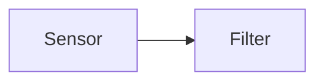
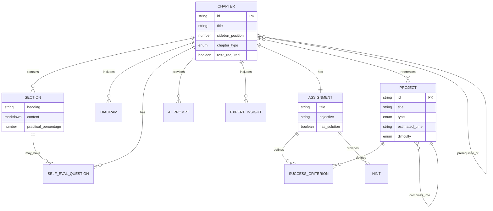

# Data Model: Core Book Platform

**Feature**: 001-book-platform
**Date**: 2025-11-30
**Purpose**: Define content entities, relationships, and structure for the educational book platform

## Overview

The Core Book Platform is a static content platform (no database). All content exists as Markdown/MDX files in a Git repository. This document defines the logical content model and file structure relationships.

## Core Entities

### 1. Chapter

**Description**: A complete learning unit covering a specific topic in Physical AI or Robotics. Represents 1-2 hours of study time.

**Attributes**:
| Field | Type | Required | Validation | Description |
|-------|------|----------|------------|-------------|
| `id` | string | Yes | Unique, kebab-case | Unique identifier (e.g., "ros2-introduction") |
| `title` | string | Yes | 3-60 chars | Display title (e.g., "ROS2 Introduction & Setup") |
| `sidebar_position` | number | Yes | 1-15 | Order in navigation (1 = first chapter) |
| `description` | string | Yes | 50-200 chars | One-line chapter summary for SEO/preview |
| `keywords` | string[] | Yes | 3-10 keywords | SEO and search keywords |
| `chapter_type` | enum | Yes | "foundational" \| "robotics" \| "advanced" | Classification for filtering |
| `prerequisites` | string[] | No | Chapter IDs | Required chapters before this one |
| `estimated_time` | string | Yes | Format: "1-2 hours" | Expected reading/practice time |
| `learning_objectives` | string[] | Yes | 3-7 objectives | What students will learn |
| `ros2_required` | boolean | Yes | - | Whether ROS2 setup is required (foundational: false, robotics: true) |

**File Structure**:
```
docs/
├── foundations/
│   ├── electronics-basics.md        # id: "electronics-basics", chapter_type: "foundational"
│   ├── mechanics-basics.md          # id: "mechanics-basics", chapter_type: "foundational"
│   └── programming-basics.md        # id: "programming-basics", chapter_type: "foundational"
├── robotics/
│   ├── ros2-introduction.md         # id: "ros2-introduction", chapter_type: "robotics"
│   ├── sensor-integration.md        # id: "sensor-integration", chapter_type: "robotics"
│   └── ...
└── advanced/
    └── isaac-sim-gpu-physics.md     # id: "isaac-sim-gpu-physics", chapter_type: "advanced"
```

**Relationships**:
- **Has Many**: Section/Topic (composition, multiple sections per chapter)
- **Has Many**: Diagram/Visual (composition, multiple diagrams per chapter)
- **Has Many**: Exercise/Assignment (composition, 1 assignment per chapter minimum)
- **Has Many**: Self-Evaluation Question (composition, 3-5 questions per chapter)
- **Has Many**: AI Learning Prompt (composition, 2-5 prompts per chapter)
- **Has Many**: Expert Insight (composition, 3-7 insights per chapter)
- **References**: Project (weak reference via links, 1-3 projects per chapter)

**Validation Rules**:
- Must have all 12 structural elements (see Chapter Structure Contract)
- Foundational chapters (Ch 1-3) must have `ros2_required: false`
- Robotics chapters (Ch 4+) must have `ros2_required: true`
- Prerequisites must reference existing chapter IDs only
- Sidebar position must be unique across all chapters

### 2. Foundational Chapter

**Description**: Specialized chapter type for prerequisite knowledge (electronics, mechanics, programming). Designed for complete beginners with minimal background.

**Extends**: Chapter entity (inherits all attributes)

**Additional Constraints**:
- `chapter_type` must be "foundational"
- `ros2_required` must be false
- `prerequisites` should be empty (foundational chapters are entry points)
- Must be in `docs/foundations/` directory
- Sidebar positions 1-3 reserved for foundational content

**Special Characteristics**:
- Can be read in any order (independent of each other)
- Use simpler examples (no robotics-specific jargon)
- Shorter estimated time (45-90 minutes vs 1-2 hours)

### 3. Section/Topic

**Description**: A subdivision within a chapter focusing on a specific concept or skill.

**Attributes**:
| Field | Type | Required | Validation | Description |
|-------|------|----------|------------|-------------|
| `heading` | string | Yes | H2 level (##) | Section title in Markdown |
| `content` | markdown | Yes | - | Teaching content with examples |
| `practical_percentage` | number | No | 0-100 | Estimated % of section that is hands-on (should average 70% across chapter) |

**File Representation**:
```markdown
## Understanding PID Controllers    <!-- Section heading -->

[Content: text, code examples, diagrams]

### Proportional Gain (Kp)         <!-- Subsection (H3) -->
[Content]

### Integral Gain (Ki)
[Content]
```

**Relationships**:
- **Belongs To**: Chapter (composition, section exists only within a chapter)
- **Has Many**: Self-Evaluation Question (optional, 0-2 questions per major section)

**Validation Rules**:
- Must use H2 (##) for section headers, H3 (###) for subsections
- No orphan sections (all must be under a chapter)
- Content must include at least one practical example or code snippet for 70/30 balance

### 4. Project

**Description**: A hands-on learning activity where students apply concepts by building something functional. Three types: small, mid-size, integrated.

**Attributes**:
| Field | Type | Required | Validation | Description |
|-------|------|----------|------------|-------------|
| `id` | string | Yes | Unique, kebab-case | Project identifier (e.g., "sensor-visualization") |
| `title` | string | Yes | 3-50 chars | Project display name |
| `type` | enum | Yes | "small" \| "mid" \| "integrated" | Project complexity level |
| `estimated_time` | string | Yes | Format: "1-3 hours" (small), "5-10 hours" (mid), "10-15 hours" (integrated) | Expected completion time |
| `difficulty` | enum | Yes | "beginner" \| "intermediate" \| "advanced" | Skill level required |
| `description` | string | Yes | 100-300 chars | What student will build |
| `use_case` | string | Yes | 200-500 chars | Real-world scenario/application |
| `knowledge_requirements` | string[] | Yes | Chapter/concept IDs | Prerequisites (which chapters/concepts needed) |
| `success_criteria` | SuccessCriterion[] | Yes | 2-5 criteria | Measurable outcomes for completion |
| `repository_url` | string | Yes | Valid GitHub URL | Link to starter code and solution |
| `related_chapters` | string[] | Yes | Chapter IDs | Which chapters prepare for this project |

**SuccessCriterion** Type:
```typescript
interface SuccessCriterion {
  description: string;          // e.g., "Robot reaches target position"
  measurement: string;           // e.g., "Position error < 5cm"
  verification_method: string;   // e.g., "Check Gazebo robot position output"
}
```

**File Structure**:
```
# Separate Repository: robotics-book-examples
examples/
├── small-projects/
│   ├── sensor-visualization/
│   │   ├── README.md              # Project metadata (title, description, success criteria)
│   │   ├── src/                   # ROS2 Python/C++ source code
│   │   ├── launch/                # ROS2 launch files
│   │   ├── worlds/                # Gazebo world files
│   │   └── models/                # Robot URDF/SDF models
│   ├── basic-motion-control/
│   └── obstacle-detection/
├── mid-projects/
│   ├── autonomous-navigation/
│   └── pick-and-place-vision/
└── integrated-project/
    └── warehouse-robot/
```

**Relationships**:
- **Referenced By**: Chapter (weak reference, chapters link to projects)
- **Requires**: Chapters/Concepts (prerequisite knowledge)
- **Combines**: Projects (for integrated type, references 2-3 small projects)

**Validation Rules**:
- Small projects: 1-3 hours, apply single concept, beginner difficulty
- Mid projects: 5-10 hours, integrate 2-3 concepts, intermediate difficulty
- Integrated project: 10-15 hours, combine 2-3 small projects, intermediate/advanced difficulty
- Success criteria must be objective and measurable (no subjective criteria like "looks good")
- Repository URL must point to working, tested code
- Knowledge requirements must reference existing chapters

**Project Distribution** (from spec requirements):
- **FR-017**: 3-5 small projects total across all chapters
- **FR-018**: 1-2 mid-size projects total
- **FR-019**: 1 integrated project total
- **Total**: 5-8 projects across the entire book

### 5. Diagram/Visual

**Description**: A visual representation of an abstract concept, flow chart, or system diagram.

**Attributes**:
| Field | Type | Required | Validation | Description |
|-------|------|----------|------------|-------------|
| `type` | enum | Yes | "mermaid" \| "image" \| "excalidraw" | Diagram format |
| `file_path` | string | Conditional | Valid path | Image file path (if type is "image" or "excalidraw") |
| `alt_text` | string | Yes | 50-200 chars | Accessible description for screen readers |
| `caption` | string | Yes | 50-300 chars | Figure caption explaining content |
| `figure_number` | number | Yes | Unique per chapter | Sequential figure number (e.g., "Figure 1", "Figure 2") |
| `colorblind_safe` | boolean | Yes | - | Whether color palette is colorblind-friendly |
| `high_contrast` | boolean | Yes | - | Whether meets WCAG AA contrast standards (4.5:1 for text, 3:1 for graphics) |

**File Storage**:
```
# Mermaid diagrams (code-based, inline in MDX)
docs/robotics/sensor-integration.md:


# Image/Excalidraw diagrams (file-based)
static/
├── img/
│   ├── foundations/
│   │   ├── circuit-diagram.svg
│   │   └── force-vectors.svg
│   ├── robotics/
│   │   ├── ros2-architecture.svg
│   │   └── control-loop.png
│   └── advanced/
│       └── gpu-physics.svg
└── diagrams/
    ├── excalidraw-sources/          # Source .excalidraw files for editing
    │   ├── circuit-diagram.excalidraw
    │   └── ros2-architecture.excalidraw
    └── figma-exports/                # Exported from Figma
        └── robot-schematic.svg
```

**Relationships**:
- **Belongs To**: Chapter or Section (diagrams are embedded in content)

**Validation Rules** (FR-009 compliance):
- All diagrams must have alt text (no exceptions)
- Alt text must describe content, not just say "diagram" or "figure"
- Use WCAG AA compliant color palettes (ColorBrewer Safe recommended)
- SVG preferred for scalability
- PNG acceptable for photos/screenshots (optimize for web <500KB)
- Consistent color coding across all diagrams (e.g., sensors = blue, actuators = orange)
- Clear labels and legends on all diagrams

### 6. Exercise/Assignment

**Description**: A practical activity at the end of a chapter requiring students to apply learned concepts. Estimated 30-60 minutes.

**Attributes**:
| Field | Type | Required | Validation | Description |
|-------|------|----------|------------|-------------|
| `title` | string | Yes | 3-50 chars | Assignment display name |
| `objective` | string | Yes | 50-200 chars | What student will accomplish |
| `requirements` | string[] | Yes | 2-5 requirements | Specific tasks to complete |
| `success_criteria` | SuccessCriterion[] | Yes | 2-5 criteria | Measurable outcomes (simulation-verifiable) |
| `starter_files_url` | string | Yes | Valid GitHub URL | Link to boilerplate/starter code |
| `hints` | string[] | Yes | 2-5 hints | Guidance without prescribing exact solution |
| `estimated_time` | string | Yes | Format: "30-60 minutes" | Expected completion time |
| `has_solution` | boolean | Yes | Must be false | NO solutions provided (FR-016a) |

**File Representation** (within chapter MDX):
```mdx
<AssignmentCard
  title="Implement PID Controller"
  estimatedTime="45 minutes"
  difficulty="beginner"
>

**Objective**: Build a PID controller that keeps a robot following a line.

**Requirements**:
1. Implement proportional gain (Kp) to reduce error
2. Add integral gain (Ki) to eliminate steady-state error
3. Tune gains through experimentation

**Success Criteria** (verify in Gazebo simulation):
- Robot stays within 5cm of line centerline
- Completes track in under 60 seconds
- No oscillation greater than 10cm amplitude

**Starter Files**: [GitHub link to boilerplate PID code]

**Hints**:
- Start with Kp only; add Ki after basic control works
- Typical Kp values for this robot: 0.5-2.0
- Watch for integral windup when error is large

**No solution provided** - verify via Gazebo simulation output and expert insights above.

</AssignmentCard>
```

**Relationships**:
- **Belongs To**: Chapter (composition, 1 assignment per chapter, element 11 of 12-element structure)
- **References**: Project (optional, assignment may be simplified version of larger project)

**Validation Rules** (FR-015, FR-016, FR-016a, FR-016b compliance):
- Must have clear success criteria (FR-016)
- Success criteria must be objective and simulation-verifiable (e.g., measurable outcomes)
- NO solution code or answer keys (FR-016a)
- Hints provide guidance without prescribing exact solution (FR-016b)
- Estimated time 30-60 minutes (FR-015)
- Starter files must be tested and functional (no broken boilerplate)

### 7. Self-Evaluation Question

**Description**: A question at the end of a topic section helping students assess understanding.

**Attributes**:
| Field | Type | Required | Validation | Description |
|-------|------|----------|------------|-------------|
| `question` | string | Yes | 50-300 chars | Question testing concept understanding |
| `topic_reference` | string | Yes | Section heading or paragraph reference | Where to review if answer uncertain |
| `has_answer` | boolean | Yes | Must be false | NO answer keys provided (FR-013a) |

**File Representation** (within chapter MDX):
```mdx
<SelfEvalQuestion
  question="What are the three components of a PID controller and what does each one do?"
  topicReference="Understanding PID Controllers section above"
/>

<SelfEvalQuestion
  question="Why does integral gain (Ki) help eliminate steady-state error?"
  topicReference="See 'Integral Gain (Ki)' subsection"
/>
```

**Distribution**:
- 3-5 questions per chapter (FR-013)
- Typically 1-2 questions per major section/topic

**Relationships**:
- **Belongs To**: Chapter or Section (composition)

**Validation Rules** (FR-013, FR-013a, FR-014 compliance):
- Must have topic reference for self-directed review (FR-014)
- NO answer keys or solutions (FR-013a)
- Questions test understanding, not rote memorization
- Phrased as open-ended questions, not multiple choice (encourages deeper thought)

### 8. AI Learning Prompt

**Description**: A suggested prompt students can use with AI assistants to gain deeper understanding of a specific concept.

**Attributes**:
| Field | Type | Required | Validation | Description |
|-------|------|----------|------------|-------------|
| `topic` | string | Yes | 3-50 chars | Concept/topic name |
| `prompts` | string[] | Yes | 2-5 prompts | Specific questions to ask AI |
| `context_needed` | string | No | - | What background students should provide to AI |

**File Representation** (within chapter MDX):
```mdx
<AIPromptCard topic="PID Controller Tuning">
**Try asking an AI assistant**:
- "Explain the Ziegler-Nichols method for PID tuning in simple terms with an example"
- "What happens if my PID controller has too much integral gain? Show me with a graph"
- "Help me understand why derivative gain (Kd) reduces overshoot. Use an analogy"

**Tip**: Share your current Kp, Ki, Kd values and robot behavior for personalized advice.
</AIPromptCard>
```

**Distribution**:
- 2-5 prompts per chapter (FR-021, FR-022 compliance)
- Typically 1 prompt card per major concept

**Relationships**:
- **Belongs To**: Chapter (composition, part of element 8 in 12-element structure)

**Validation Rules** (FR-021, FR-022 compliance):
- Prompts must be specific and contextualized to chapter content (FR-022)
- NOT generic prompts like "explain PID controllers" (too broad)
- Encourage deeper exploration beyond chapter content
- Suggest providing context to AI for better responses

### 9. Expert Insight

**Description**: Advice, tips, common pitfalls, or best practices from domain experts embedded throughout chapters.

**Attributes**:
| Field | Type | Required | Validation | Description |
|-------|------|----------|------------|-------------|
| `type` | enum | Yes | "tip" \| "warning" \| "note" \| "best-practice" | Insight category |
| `content` | markdown | Yes | 50-300 chars | The advice or insight |

**File Representation** (within chapter MDX):
```mdx
:::tip Expert Insight
Real robots have sensor noise. Always add a low-pass filter to your sensor readings before feeding them to the controller. A simple moving average of the last 5 readings works well for beginners.
:::

:::warning Common Pitfall
Beginners often set integral gain (Ki) too high, causing "integral windup." This makes your robot overshoot wildly. Start with Ki = 0 and only increase it gradually.
:::

:::note Best Practice
Log your sensor data and control outputs to a file. When debugging, visualize this data with matplotlib. Patterns emerge that aren't obvious in real-time.
:::
```

**Distribution**:
- 3-7 insights per chapter (FR-012 compliance)
- Distributed throughout chapter (not all clustered at end)

**Relationships**:
- **Belongs To**: Chapter or Section (composition)

**Validation Rules** (FR-012 compliance):
- Must include practical advice or warnings (not just theory restatement)
- Use appropriate type (tip/warning/note/best-practice) for content
- Keep concise (1-3 sentences ideal)
- Based on real experience or common student mistakes

## Content Structure Contract

Every chapter MDX file MUST have this structure to pass validation:

```
<!-- ELEMENT 1: Attention-Seeker Hook -->
<CuriosityHook>...</CuriosityHook>

<!-- ELEMENT 2: Driving Question -->
<DrivingQuestion>...</DrivingQuestion>

<!-- ELEMENT 3: Real-World Example -->
## Real-World Example: ...

<!-- ELEMENT 4: Use Case with Knowledge Requirements -->
## Use Case: ...
**What You'll Learn**: ...
**Success Criteria**: ...

<!-- ELEMENT 5: Concept Teaching (70% practical, 30% theory) -->
## Understanding ...
[Content with subsections]

<!-- ELEMENT 6: Visual Diagrams and Flows -->
[Mermaid diagrams or images with captions]

<!-- ELEMENT 7: Expert Insights and Tips -->
:::tip Expert Insight
...
:::

<!-- ELEMENT 8: AI-Assisted Learning Prompts -->
<AIPromptCard topic="...">...</AIPromptCard>

<!-- ELEMENT 9: Hands-On Practice -->
## Hands-On Practice
[Exercise with success criteria]

<!-- ELEMENT 10: Self-Evaluation Questions -->
## Check Your Understanding
<SelfEvalQuestion question="..." topicReference="..." />

<!-- ELEMENT 11: Short Assignment -->
<AssignmentCard title="..." estimatedTime="30-60 minutes">...</AssignmentCard>

<!-- ELEMENT 12: Curiosity Hook for Next Chapter -->
## What's Next?
<CuriosityHook>...</CuriosityHook>

<!-- References (3+ sources for validation) -->
## References
[^1]: ...
[^2]: ...
[^3]: ...
```

**Validation**:
- Playwright test scans for all 12 comment markers (<!-- ELEMENT N: ... -->)
- Fails if any element is missing or out of order
- Checks for minimum 3 footnote citations ([^N]:)

## Non-Functional Entities

### Validation Checklist

**Description**: Documentation artifact tracking three-source validation (Constitution 2.4, FR-034)

**File Location**: `specs/001-book-platform/validation-checklists/[chapter-id].md`

**Template**: See research.md section 6 for full template

**Attributes**:
- List of technical claims with 3+ sources each
- List of authoritative sources with justification
- Validator signature and date
- Quality gate checklist

### Chapter Research Document

**Description**: Professor persona output documenting validated content before writing

**File Location**: `specs/001-book-platform/research-docs/[chapter-id]-research.md`

**Attributes**:
- Chapter topic and learning objectives
- Technical content validated against 3+ sources
- Common student misconceptions
- Suggested exercises and examples
- Content outline with structure

## Entity Relationships Diagram



## File Naming Conventions

### Chapter Files
- **Format**: `[kebab-case-title].md` or `.mdx`
- **Examples**: `electronics-basics.md`, `ros2-introduction.mdx`, `sensor-integration.md`
- **Location**: `docs/[category]/[filename]`

### Image/Diagram Files
- **Format**: `[kebab-case-description].[svg|png]`
- **Examples**: `circuit-diagram.svg`, `pid-control-loop.png`, `ros2-node-graph.svg`
- **Location**: `static/img/[category]/[filename]`

### Project Directories
- **Format**: `[kebab-case-name]/`
- **Examples**: `sensor-visualization/`, `autonomous-navigation/`, `warehouse-robot/`
- **Location**: `examples/[project-type]/[project-name]/`

## Quality Gates

**Before publishing any chapter**:
1. ✅ All 12 structural elements present (automated Playwright check)
2. ✅ 70/30 practical/theory balance validated (manual review)
3. ✅ 3+ citations present in References section (automated check)
4. ✅ Validation checklist completed (manual review)
5. ✅ All diagrams have alt text (automated check)
6. ✅ No "solution" or "answer" in assignment/self-eval (automated check)
7. ✅ Success criteria are objective/measurable (manual review)
8. ✅ Links to external resources work (automated broken link check)

**Before publishing any project**:
1. ✅ Starter code compiles and runs (automated CI/CD)
2. ✅ Success criteria are simulation-verifiable (manual review)
3. ✅ README has all required sections (automated check)
4. ✅ Unit tests pass (automated CI/CD)
