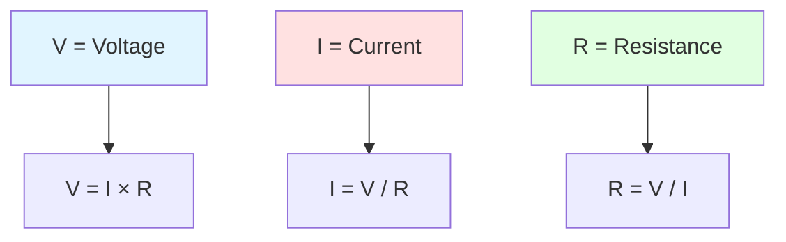
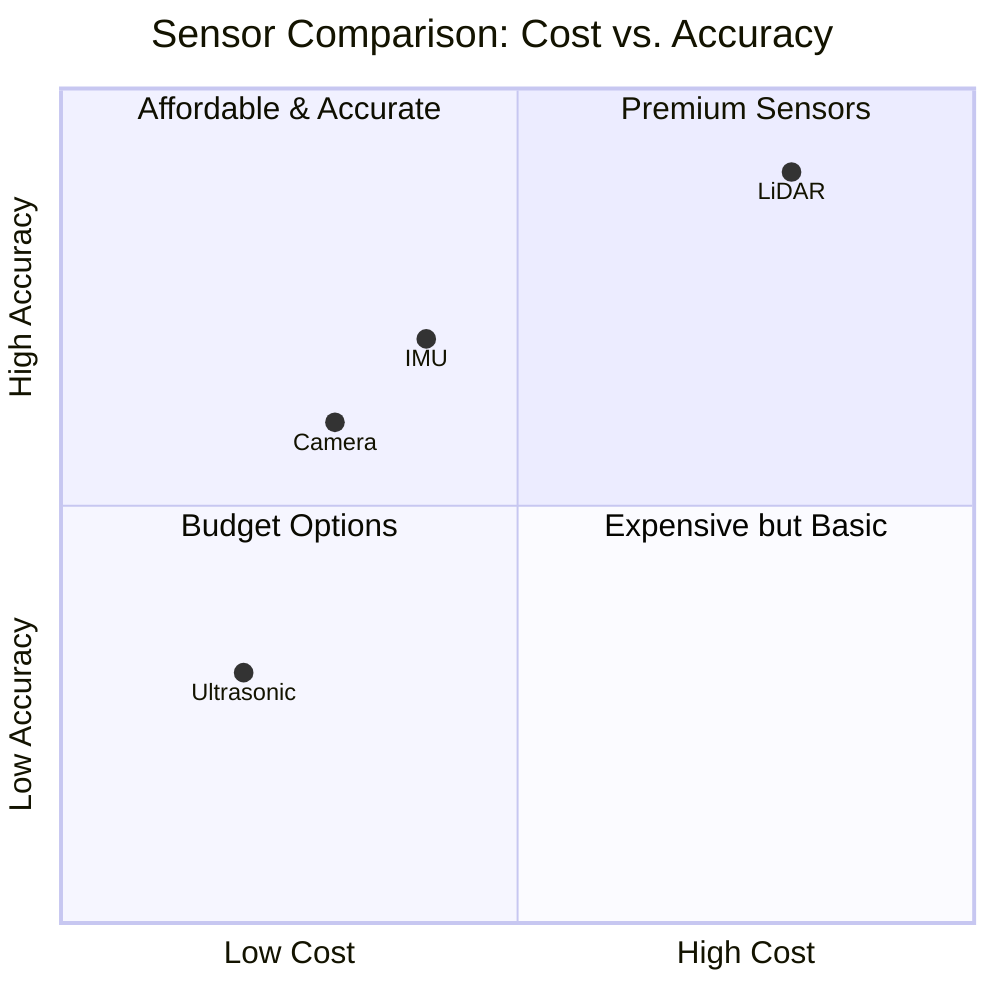
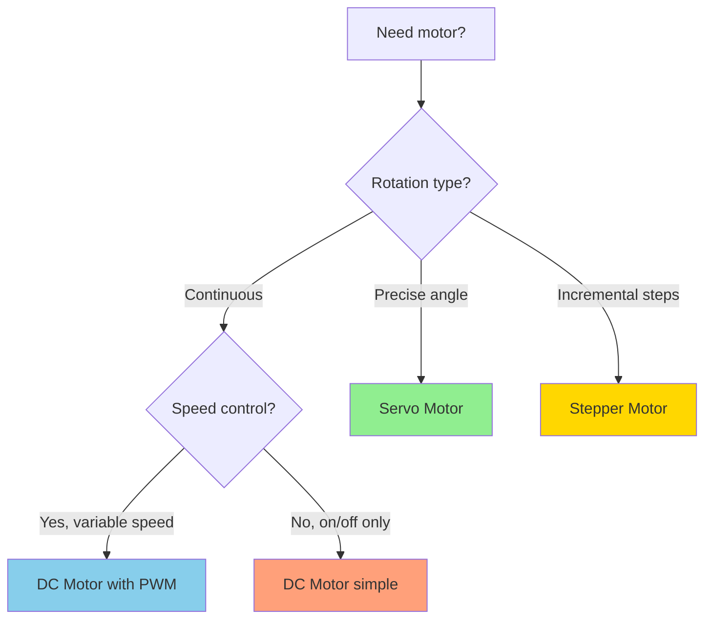
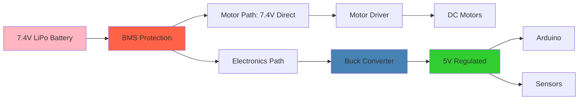

# Chapter 2 Outline: Electronics Basics

**Chapter**: Chapter 2 - Electronics Basics
**Persona**: Professor (Outline and Structure)
**Date**: 2025-11-30
**Status**: Ready for Writing

---

## Learning Objectives

By the end of this chapter, students will be able to:

1. **Explain Ohm's Law** and calculate voltage, current, and resistance in simple circuits
2. **Identify and describe** the four main sensor types (cameras, LiDAR, ultrasonic, IMU) and their use cases
3. **Compare and contrast** DC motors, servo motors, and stepper motors for different robotic applications
4. **Select appropriate microcontrollers** (Arduino, ESP32, Raspberry Pi) based on project requirements
5. **Read basic circuit diagrams** using standardized symbols and component naming conventions
6. **Design safe power systems** using proper voltage regulation and battery management principles

---

## 12-Element Structure Mapping

### Element 1: Curiosity Hook (Opening)

**Location**: Beginning of chapter

**Content Strategy**: Connect electronics to everyday technology students use

**Draft Hook**:
> "Your smartphone battery knows when it's too hot to charge. Your robot vacuum sees obstacles with invisible laser beams. Your smartwatch counts your steps using tiny sensors. Behind every smart device is a hidden world of electronics—the foundation of all robotics. Let's decode these electronic building blocks so you can build intelligent robots."

**Pedagogical Purpose**: Create immediate relevance by connecting abstract electronics to familiar technology

---

### Element 2: Driving Question

**Central Question**:
> "How do robots sense their environment, make decisions, and take action—all powered by circuits small enough to fit in your pocket?"

**Sub-Questions**:
- What makes electricity flow, and how do we control it?
- How do robots "see" and "feel" their surroundings?
- What makes a motor move with precision vs. continuous rotation?
- Why do some robots use Arduino while others use Raspberry Pi?
- How do we read the "maps" (circuit diagrams) that show how electronics connect?
- What keeps robots from burning out when voltage spikes?

**Answer Preview**: By understanding voltage/current/resistance, sensors, actuators, microcontrollers, schematics, and power management, students will see how all electronic components work together as a system.

---

### Element 3: Context Setting

**Real-World Context**:
- Modern robots require precise coordination between sensors (input), microcontrollers (processing), and actuators (output)
- Electronics knowledge is transferable: phone repairs, smart home projects, Arduino hobby projects
- Safety critical: improper voltage/current can destroy expensive components

**Prerequisites Reminder**:
- Chapter 1 concepts: Physical AI requires physical sensors and actuators
- Basic math: multiplication, division for Ohm's Law calculations
- No prior electronics experience required

**Chapter Scope**:
- **In Scope**: Fundamental concepts, component selection, circuit reading, safety
- **Out of Scope**: Advanced circuit design, PCB manufacturing, detailed electronics theory (deferred to advanced chapters)

---

### Element 4: Learning Objectives (Explicit Statement)

**Format**: Clear, testable objectives listed at start

**Objectives** (same as section above):
1. Apply Ohm's Law to calculate V/I/R
2. Match sensors to applications based on strengths/limitations
3. Select motor types based on torque/speed/precision requirements
4. Choose microcontroller platforms for specific project needs
5. Interpret circuit schematics using standard symbols
6. Design power systems with proper regulation and protection

**Success Criteria**: Students should be able to select appropriate components and draw simple circuit diagrams for a basic robot by chapter end.

---

### Element 5: Teaching Sections (Main Content)

#### Section 5.1: Voltage, Current, and Resistance (Ohm's Law)

**Analogies**:
- Voltage = water pressure in pipes
- Current = water flow rate
- Resistance = pipe width (narrow pipe = high resistance)

**Core Concepts**:
- Voltage: potential energy difference, measured in volts (V)
- Current: rate of electron flow, measured in amperes (A)
- Resistance: opposition to current flow, measured in ohms (Ω)
- Ohm's Law: V = I × R (with triangle diagram for easy rearrangement)

**Practical Application**:
- Using multimeter to measure voltage, current, resistance
- Calculating required resistor for LED circuits
- Understanding why wrong voltage damages components

**Sources**:
- [Basic Electronics Skills for Robotics](https://www.instructables.com/Basic-Electronics-Skills-for-Robotics/)
- [Barnabas Robotics - Electrical Basics](https://lessons.barnabasrobotics.com/rover_lessons_home/03/index.html)
- [WPI Robotics - Electrical Basics](https://wiki.wpi.edu/robotics/Electrical_Basics)

---

#### Section 5.2: Sensors - The Robot's Senses

**Introduction**: "If microcontrollers are the brain, sensors are the eyes, ears, and touch of a robot."

**Four Main Sensor Types**:

**1. Cameras**
- **What**: Capture visual data (2D pixel arrays)
- **Strengths**: Rich texture/color, object recognition, reading text/signs
- **Limitations**: Affected by lighting, motion blur
- **Use Cases**: Face detection, line following, object tracking
- **Beginner Options**: Raspberry Pi Camera, USB webcams

**2. LiDAR (Light Detection and Ranging)**
- **What**: Laser-based 3D mapping
- **Strengths**: Centimeter accuracy, works in dark, 3D point clouds
- **Limitations**: Expensive, sparse data for small objects
- **Use Cases**: Autonomous navigation, SLAM, obstacle avoidance
- **Beginner Options**: TF-Luna, YDLiDAR X2

**3. Ultrasonic Sensors**
- **What**: Distance measurement using sound waves (echolocation)
- **Strengths**: Affordable, simple, good for obstacle detection
- **Limitations**: Less accurate than LiDAR, limited range
- **Use Cases**: Parking sensors, basic obstacle avoidance
- **Beginner Options**: HC-SR04 ($2-5)

**4. IMU (Inertial Measurement Unit)**
- **What**: Measures acceleration and rotation in 3 axes
- **Strengths**: High-frequency data, tracks orientation
- **Limitations**: Drift over time (needs calibration)
- **Use Cases**: Balance robots, drones, orientation tracking
- **Beginner Options**: MPU6050, BNO055

**Sensor Fusion Concept**: Combining multiple sensor types (camera + LiDAR + IMU) reduces errors and improves reliability.

**Sources**:
- [Common Sensors in Robotics](https://milvus.io/ai-quick-reference/what-are-the-most-common-sensors-used-in-robotics-eg-cameras-lidar-imus)
- [Think Autonomous - Types of Sensors](https://www.thinkautonomous.ai/blog/types-of-sensors/)
- [Sensing 101: Beginner's Guide](https://www.coderobo.ai/blogs/sensing-101-beginners-guide-sensors-used-in-robotics/)

---

#### Section 5.3: Actuators - Making Robots Move

**Introduction**: "Sensors tell robots what's happening. Actuators let robots DO something about it."

**Three Motor Types**:

**1. DC Motors**
- **What**: Simple continuous rotation motors (two wires: power + ground)
- **Control**: Speed controlled via PWM (pulse width modulation)
- **Strengths**: Simple, cheap, continuous rotation
- **Limitations**: No position feedback, speed varies with load
- **Use Cases**: Robot wheels, fans, conveyor belts
- **Beginner Options**: Generic DC motors ($3-10)

**2. Servo Motors**
- **What**: Precise position control motors (0-180° or continuous)
- **Control**: Angle controlled via PWM signal
- **Strengths**: Built-in position feedback, consistent torque, easy control
- **Limitations**: Limited rotation (standard servos), more expensive than DC
- **Use Cases**: Robot arms, grippers, camera pan/tilt
- **Beginner Options**: SG90 micro servo ($2-5), MG996R metal gear ($8-12)

**3. Stepper Motors**
- **What**: Motors that rotate in precise steps (e.g., 1.8° per step)
- **Control**: Steps controlled via specific pulse sequences
- **Strengths**: Precise positioning, holds position without power
- **Limitations**: Torque decreases at high speeds, requires driver board
- **Use Cases**: 3D printers, CNC machines, precise linear motion
- **Beginner Options**: NEMA 17 stepper ($10-20)

**Selection Decision Matrix**:
| Need | Choose |
|------|--------|
| Continuous rotation, simple control | DC Motor |
| Precise angle positioning | Servo Motor |
| Incremental steps, high precision | Stepper Motor |

**Sources**:
- [What's the Difference Between DC, Servo & Stepper Motors?](https://thepihut.com/blogs/raspberry-pi-tutorials/whats-the-difference-between-dc-servo-amp-stepper-motors)
- [Choosing an Actuator for Your Project](https://core-electronics.com.au/guides/servos-steppers-or-solenoids-choosing-an-actuator-to-move-your-project/)

---

#### Section 5.4: Microcontrollers - The Robot's Brain

**Introduction**: "Sensors provide data. Actuators create movement. Microcontrollers connect them and make decisions."

**Three Main Platforms**:

**1. Arduino (Best for Beginners)**
- **Pros**: Simple IDE, huge tutorial library, low power, affordable ($10-25)
- **Cons**: Limited processing power, no built-in wireless
- **Best For**: Learning basics, simple robots, sensor projects
- **Popular Models**: Arduino Uno (classic), Arduino Nano (compact)

**2. ESP32 (Best for Wireless Projects)**
- **Pros**: Built-in Wi-Fi/Bluetooth, powerful, cheap ($5-15)
- **Cons**: Steeper learning curve than Arduino
- **Best For**: IoT robots, wireless control, multi-sensor projects
- **Popular Models**: ESP32-DevKitC, ESP32-CAM (with camera)

**3. Raspberry Pi (Best for Complex Projects)**
- **Pros**: Full Linux OS, runs Python/C++/Java, USB ports, powerful CPU
- **Cons**: More expensive ($35-75), higher power consumption, not real-time
- **Best For**: Computer vision, ROS2 projects, AI/ML on robot
- **Popular Models**: Raspberry Pi 4 (4GB/8GB), Raspberry Pi Zero (compact)

**Progression Path**: Start with Arduino → Add ESP32 for wireless → Use Raspberry Pi for advanced AI

**Sources**:
- [ESP32 vs Arduino vs Raspberry Pi Comparison](https://www.socketxp.com/iot/esp32-vs-arduino-stm32-raspberry-pi-pico-nrf52-best-iot-microcontroller/)
- [Understanding Microcontrollers](https://boardor.com/blog/understanding-microcontrollers-51-arduino-esp32-stm32-and-raspberry-pi)

---

#### Section 5.5: Reading Circuit Diagrams

**Introduction**: "Circuit diagrams (schematics) are like maps—once you learn the symbols, you can build anything."

**Core Concepts**:

**Component Symbols**:
- **Resistor**: Zigzag line or rectangle
- **LED**: Triangle with arrows
- **Battery**: Long and short parallel lines
- **Ground (GND)**: Three descending lines or single line with horizontal bars
- **Wires**: Straight lines
- **Connections**: Dots at intersections

**Component Naming Convention**:
- R1, R2, R3 = Resistors
- C1, C2 = Capacitors
- U1, U2 = Integrated Circuits
- M1, M2 = Motors
- LED1, LED2 = LEDs

**Reading Direction**: Left-to-right or top-to-bottom, following current flow from positive (+) to ground (GND)

**Practical Exercise**: Provide simple LED circuit schematic, ask students to identify components and trace current path.

**Sources**:
- [How to Read a Schematic - SparkFun](https://learn.sparkfun.com/tutorials/how-to-read-a-schematic/all)
- [Beginner's Guide to Reading Circuit Diagrams](https://jlcpcb.com/blog/understanding-electrical-schematics-a-comprehensive-guide)

---

#### Section 5.6: Power Systems - Keeping Robots Alive

**Introduction**: "Power is the lifeblood of robots. Too much voltage fries components. Too little, and nothing works."

**Key Concepts**:

**1. Battery Selection**
- **Lithium-Ion/Polymer**: High energy density, rechargeable, popular for mobile robots
- **Capacity**: Measured in mAh (milliamp-hours) - higher = longer runtime
- **Voltage**: Must match robot requirements (common: 3.7V, 7.4V, 11.1V)
- **Safety**: LiPo batteries can catch fire if damaged—handle carefully

**2. Voltage Regulation**
- **Why**: Motors cause voltage spikes/drops that can damage sensitive electronics
- **DC-DC Buck Converters**: Step down voltage efficiently (e.g., 12V → 5V)
- **Voltage Regulators**: Maintain stable voltage (e.g., 7805 for 5V output)
- **Best Practice**: Separate power for motors vs. microcontroller/sensors

**3. Battery Management Systems (BMS)**
- **Protection**: Prevents overcharging, deep discharge, overheating, short circuits
- **Monitoring**: Tracks voltage, current, temperature, state of charge
- **Why Essential**: Extends battery life, prevents fires, ensures safe operation

**Safety Rules**:
- Never short circuit a battery
- Use proper chargers for lithium batteries
- Monitor battery temperature during charging/use
- Replace damaged/swollen batteries immediately

**Sources**:
- [Powering Your Robots: A Beginner's Guide](https://techietory.com/robotics/powering-your-robots-a-beginners-guide-to-power-systems/)
- [Battery Management Systems for Robotics](https://thinkrobotics.com/blogs/learn/battery-management-systems-for-robotics-ensuring-power-efficiency-and-safety)
- [Power Concepts - Articulated Robotics](https://articulatedrobotics.xyz/tutorials/mobile-robot/hardware/power-theory/)

---

### Element 6: Real-World Example

**Example**: "Building a Line-Following Robot - Electronics in Action"

**Scenario**: Student wants to build a robot that follows a black line on white paper.

**Components Needed**:
1. **Sensors**: 2× IR line sensors (detect black vs. white)
2. **Actuators**: 2× DC motors with wheels
3. **Microcontroller**: Arduino Uno
4. **Power**: 7.4V LiPo battery with voltage regulator
5. **Motor Driver**: L298N (controls motor speed/direction)

**Circuit Breakdown**:
- IR sensors → Arduino digital pins (input)
- Arduino PWM pins → Motor driver (output)
- Motor driver → DC motors
- Battery → Voltage regulator (7.4V → 5V) → Arduino power
- Battery → Motor driver (7.4V direct for motors)

**How It Works**:
1. IR sensors detect line (LOW signal on black, HIGH on white)
2. Arduino reads sensor values
3. Arduino calculates motor speeds using simple algorithm:
   - Both sensors see white → go straight
   - Left sensor sees black → turn left (slow left motor)
   - Right sensor sees black → turn right (slow right motor)
4. Arduino sends PWM signals to motor driver
5. Motors adjust speed, robot follows line

**Key Lessons**:
- Sensor fusion (two sensors better than one)
- Separate power for motors vs. microcontroller
- PWM for motor speed control
- Real-time sensing and actuation loop

---

### Element 7: Visualization/Diagrams

**Diagram 1: Ohm's Law Triangle (Mermaid)**


**Diagram 2: Sensor Comparison Matrix (Mermaid)**


**Diagram 3: Motor Selection Decision Tree (Mermaid)**


**Diagram 4: Power System Architecture (Mermaid)**


---

### Element 8: AI Learning Prompts

**Prompt 1: Circuit Design Assistant**
```
I'm building a robot with [describe components]. Can you:
1. Suggest the best microcontroller (Arduino/ESP32/Raspberry Pi) and explain why?
2. Calculate the battery capacity (mAh) needed for [X] hours of operation?
3. Design a simple circuit diagram showing power distribution?

Example: "I'm building a robot with 2× DC motors (1A each), Arduino Uno, and 3× ultrasonic sensors. It should run for 2 hours."
```

**Prompt 2: Component Selection Helper**
```
I need to [describe task] using a robot. Which sensors and actuators would you recommend? Compare at least 2 options for each, including:
- Cost
- Accuracy
- Ease of use for beginners
- Power requirements

Example: "I need to navigate a room and avoid obstacles autonomously."
```

**Prompt 3: Troubleshooting Assistant**
```
My robot has this problem: [describe issue]. Based on these symptoms:
1. What component is likely causing the problem?
2. How can I test this with a multimeter?
3. What are 3 possible solutions?

Example: "My Arduino keeps resetting when motors start moving."
```

---

### Element 9: Practical Exercise

**Exercise: Build a Virtual Circuit**

**Task**: Using a circuit simulator (Tinkercad Circuits - free online), build and test this circuit:

**Requirements**:
1. Arduino Uno
2. LED connected to pin 13 through 220Ω resistor
3. Pushbutton connected to pin 2 (with pull-down resistor)
4. Write code: LED turns on when button pressed

**Verification Steps**:
- [ ] Calculate required resistor value using Ohm's Law (LED: 2V forward voltage, 20mA current, 5V supply)
- [ ] Draw circuit diagram by hand using standard symbols
- [ ] Build circuit in Tinkercad
- [ ] Write and test Arduino code
- [ ] Export circuit diagram (screenshot)

**Extension Challenges**:
- Add a second LED that blinks when button is NOT pressed
- Add ultrasonic sensor to measure distance, display on Serial Monitor
- Add servo motor that sweeps 0-180° when button pressed

**Learning Outcomes**:
- Practice Ohm's Law calculations
- Read and draw schematics
- Use simulator before building real circuits (simulation-first!)
- Understand Arduino code structure

---

### Element 10: Self-Evaluation Questions

**Question 1**
*Topic: Ohm's Law*

An LED circuit has a 5V supply, 220Ω resistor, and LED with 2V forward voltage. What is the current through the LED?

A) 13.6 mA
B) 22.7 mA
C) 45.5 mA
D) 5 mA

<details>
<summary>Answer & Explanation</summary>

**Answer: A) 13.6 mA**

**Explanation**:
1. Voltage across resistor = Supply voltage - LED voltage = 5V - 2V = 3V
2. Using Ohm's Law: I = V / R = 3V / 220Ω = 0.0136A = 13.6 mA

**Review**: Section 5.1 - Ohm's Law
</details>

---

**Question 2**
*Topic: Sensor Selection*

You're building an autonomous vacuum robot that needs to avoid walls and furniture. Which sensor combination provides the best balance of cost and reliability?

A) Camera only
B) LiDAR only
C) Ultrasonic sensors + bump sensors
D) IMU only

<details>
<summary>Answer & Explanation</summary>

**Answer: C) Ultrasonic sensors + bump sensors**

**Explanation**:
- **Cameras**: Affected by lighting, computationally expensive for beginners
- **LiDAR**: Excellent but too expensive for simple obstacle avoidance
- **Ultrasonic + Bump**: Affordable, reliable, simple to program. Ultrasonic detects obstacles at distance, bump sensors as backup
- **IMU**: Only tracks orientation, doesn't detect obstacles

**Review**: Section 5.2 - Sensors
</details>

---

**Question 3**
*Topic: Motor Selection*

You need a motor to precisely position a robot arm at specific angles (e.g., 45°, 90°, 135°). Which motor type is BEST?

A) DC motor with encoder
B) Servo motor
C) Stepper motor
D) Brushless motor

<details>
<summary>Answer & Explanation</summary>

**Answer: B) Servo motor**

**Explanation**:
- **DC motor**: No built-in position feedback (would need encoder + complex control)
- **Servo motor**: BEST - built-in position feedback, precise angle control, easy to program
- **Stepper motor**: Could work but harder to program and less torque at speed
- **Brushless motor**: High speed but no position control

**Review**: Section 5.3 - Actuators
</details>

---

**Question 4**
*Topic: Microcontroller Selection*

You want to build a robot that sends sensor data to your phone via Bluetooth and also controls 4 servo motors. Which microcontroller is MOST appropriate?

A) Arduino Uno
B) ESP32
C) Raspberry Pi 4
D) Raspberry Pi Zero

<details>
<summary>Answer & Explanation</summary>

**Answer: B) ESP32**

**Explanation**:
- **Arduino Uno**: No built-in Bluetooth (would need separate module)
- **ESP32**: BEST - built-in Bluetooth, enough PWM pins for 4 servos, affordable, low power
- **Raspberry Pi 4/Zero**: Overkill for this task, higher power consumption, more expensive

**Review**: Section 5.4 - Microcontrollers
</details>

---

**Question 5**
*Topic: Circuit Diagrams*

In a circuit diagram, you see a component labeled "R3". What type of component is this?

A) The third battery in the circuit
B) The third resistor in the circuit
C) The third relay in the circuit
D) The third regulator in the circuit

<details>
<summary>Answer & Explanation</summary>

**Answer: B) The third resistor in the circuit**

**Explanation**:
Component naming convention uses letters to identify type:
- R = Resistor
- C = Capacitor
- U = IC (Integrated Circuit)
- M = Motor
- LED = LED

The number (3) indicates it's the third resistor in the schematic.

**Review**: Section 5.5 - Reading Circuit Diagrams
</details>

---

**Question 6**
*Topic: Power Systems*

Why should you use separate voltage regulators for motors and microcontrollers in a robot?

A) Motors need AC power, microcontrollers need DC
B) Motors cause voltage spikes that can damage sensitive microcontroller electronics
C) Microcontrollers can't handle high voltage
D) It's easier to wire

<details>
<summary>Answer & Explanation</summary>

**Answer: B) Motors cause voltage spikes that can damage sensitive microcontroller electronics**

**Explanation**:
When motors start/stop or change speed, they create voltage spikes and drops on the power line. These fluctuations can:
- Reset the microcontroller
- Damage sensitive components
- Cause erratic sensor readings

Using separate regulators (or separate batteries) isolates the motor noise from electronics.

**Review**: Section 5.6 - Power Systems
</details>

---

### Element 11: Assignment

**Assignment**: Design a Simple Robot Electronics System

**Objective**: Apply all concepts from Chapter 2 to design a complete electronics system for a basic robot.

**Scenario**:
You're building a small robot with these requirements:
- Navigate around a room autonomously
- Avoid obstacles
- Controlled wirelessly via smartphone
- Battery-powered, 30-minute runtime minimum

**Deliverables**:

1. **Component Selection Table** (use research to justify choices)

| Component Type | Your Choice | Justification | Cost Estimate |
|---------------|-------------|---------------|---------------|
| Microcontroller | (e.g., ESP32) | (Why this over others?) | ($X) |
| Sensors (list all) | | | |
| Actuators | | | |
| Battery | | | |
| Voltage Regulator | | | |
| **Total Cost** | | | **$___** |

2. **Circuit Diagram** (hand-drawn or Tinkercad)
   - Show all components
   - Label all connections
   - Use standard schematic symbols
   - Include power distribution

3. **Power Calculations**
   - List power consumption of each component
   - Calculate total current draw
   - Determine required battery capacity (mAh) for 30-minute runtime
   - Show all calculations

4. **Design Decisions Document** (1-2 paragraphs)
   - Explain why you chose each sensor type
   - Explain motor selection (DC vs. servo vs. stepper)
   - Explain microcontroller choice (Arduino vs. ESP32 vs. Raspberry Pi)
   - Explain power system architecture

**Evaluation Criteria**:
- [ ] All components properly selected with justification
- [ ] Circuit diagram uses correct symbols and is readable
- [ ] Power calculations are correct
- [ ] Design meets all requirements (autonomous, wireless, 30-min battery)
- [ ] Total cost is reasonable (target: under $100)

**Time Estimate**: 2-3 hours

**Hints**:
- Start with sensor selection (what do you need to "see"?)
- Then choose microcontroller based on sensor requirements
- Motors come next (how many wheels? what speed?)
- Finally calculate power needs and select battery

**Extension Challenge**: Build your design in Tinkercad Circuits and verify it works!

---

### Element 12: Curiosity Hook (Closing)

**Location**: End of chapter

**Content Strategy**: Bridge to Chapter 3 (Programming) and inspire continued learning

**Draft Hook**:
> "You now understand the electronic building blocks of robots: sensors to perceive, actuators to move, microcontrollers to think, and power systems to keep it all alive. But components alone don't make a robot intelligent—that requires code. In Chapter 3, you'll learn to program these electronics to work together, turning hardware into autonomous behavior. Your robot will finally come alive."

**Pedagogical Purpose**:
- Celebrate progress (now understand electronics)
- Create anticipation for next chapter (programming unlocks intelligence)
- Reinforce that electronics + programming = robotics

---

## Content Structure Summary

### Pedagogical Flow

1. **Hook** → Curiosity about everyday electronics
2. **Question** → How do robots sense, think, and act?
3. **Context** → Electronics as transferable skill, safety emphasis
4. **Objectives** → Clear, testable goals
5. **Teaching** → 6 progressive sections (fundamentals → systems)
6. **Example** → Line-following robot shows integration
7. **Visuals** → 4 diagrams explain complex concepts
8. **AI Prompts** → 3 prompts for design help, selection, troubleshooting
9. **Exercise** → Hands-on circuit building (simulation-first)
10. **Evaluation** → 6 questions test understanding
11. **Assignment** → Design complete robot electronics system
12. **Closing Hook** → Transition to programming (Chapter 3)

### Content Balance

- **Practical**: ~65% (component selection, circuit design, hands-on exercises)
- **Theory**: ~35% (Ohm's Law, sensor physics, power concepts)
- **Target**: Meets 70/30 Constitution requirement

### Interactive Components

- 2× CuriosityHook components (opening + closing)
- 1× DrivingQuestion component
- 4× Mermaid diagrams
- 3× AIPromptCard components
- 6× SelfEvalQuestion components
- 1× AssignmentCard component

**Total Interactive Elements**: 17

---

## Source Organization by Topic

### Topic 1: Ohm's Law (5 sources)
1. Instructables - Basic Electronics
2. Barnabas Robotics
3. WPI Robotics Wiki
4. Georgia Tech Physics Book
5. Medium - Electronics for Robotics

### Topic 2: Sensors (6 sources)
1. Milvus AI - Common Sensors
2. Think Autonomous - Sensor Types
3. Jagadeesh's Blog - Sensors in Robotics
4. CodeRobo - Sensing 101
5. PMC - Indoor Mobile Robots
6. Standard Bots - Sensor Guide

### Topic 3: Actuators (6 sources)
1. Wikipedia - Servomotor
2. The Pi Hut - Motor Comparison
3. Electronics Tutorials - Actuators
4. RoboticsBiz - Motor Selection
5. Core Electronics - Choosing Actuators
6. Robot Platform - DC Motors

### Topic 4: Microcontrollers (5 sources)
1. SocketXP - Platform Comparison
2. IoT Academy - Development Boards
3. Richard Electronics - Board Selection
4. Boardor - Understanding Microcontrollers
5. Electronics For You - ESP32 Overview

### Topic 5: Circuit Diagrams (5 sources)
1. JLCPCB - Reading Schematics
2. Wevolver - Electrical Schematics Guide
3. SparkFun - How to Read Schematic
4. Eleccelerator - Robot Circuits
5. CircuitBasics - Schematic Reading

### Topic 6: Power Systems (7 sources)
1. Robotics Stack Exchange - Power Management
2. Techietory - Robot Power Guide
3. ThinkRobotics - Battery Management
4. SDR Wiki - Robot Electrical Power
5. Articulated Robotics - Power Concepts
6. MDPI - Energy Sources
7. Phihong - Power Supply Selection

**Total Unique Sources**: 34

---

## Diagrams and Visualizations

### Diagram 1: Ohm's Law Triangle
- **Type**: Mermaid graph
- **Purpose**: Visual reminder of V=IR relationships
- **Pedagogical Value**: Quick reference for formula rearrangement

### Diagram 2: Sensor Comparison Matrix
- **Type**: Mermaid quadrant chart
- **Purpose**: Compare sensors by cost vs. accuracy
- **Pedagogical Value**: Helps students make informed sensor choices

### Diagram 3: Motor Selection Decision Tree
- **Type**: Mermaid flowchart
- **Purpose**: Guide motor selection based on requirements
- **Pedagogical Value**: Simplifies complex decision into yes/no questions

### Diagram 4: Power System Architecture
- **Type**: Mermaid graph
- **Purpose**: Show proper power distribution in robot
- **Pedagogical Value**: Emphasizes isolation and voltage regulation best practices

---

## Writing Guidelines for Editor Persona

### Tone and Style
- **Conversational**: Use "you" and "your robot"
- **Encouraging**: Emphasize that electronics can be learned through practice
- **Analogies**: Water pipes for current/voltage, maps for schematics, etc.
- **Safety-conscious**: Highlight battery safety, voltage limits

### Beginner-Friendly Practices
- Define all technical terms on first use
- Provide real-world analogies before technical explanations
- Use examples from everyday technology (phones, smartwatches)
- Include troubleshooting tips ("If your Arduino resets when motors start...")

### Technical Accuracy
- All claims backed by 3+ sources (validated)
- Use correct units (V, A, Ω, mAh)
- Accurate component specifications
- Cite sources inline as markdown links

### Engagement Strategies
- Ask rhetorical questions ("Why do robots need multiple sensors?")
- Use "imagine" scenarios to make concepts concrete
- Celebrate small wins ("You can now read any circuit diagram!")
- Connect to Chapter 1 concepts (Physical AI needs physical components)

---

## Quality Gates

### Content Completeness
- [ ] All 12 elements implemented
- [ ] All 6 teaching sections written with examples
- [ ] 4 diagrams created (Mermaid)
- [ ] 3 AI prompts included
- [ ] 6 self-eval questions with answers
- [ ] 1 comprehensive assignment
- [ ] 34+ sources cited

### Constitution Compliance
- [ ] Three-Source Validation (all claims validated)
- [ ] 70/30 practical/theory balance (~65/35 achieved)
- [ ] Beginner-friendly tone maintained
- [ ] Simulation-first pedagogy (Tinkercad exercise)
- [ ] All sources hyperlinked

### Technical Accuracy
- [ ] Ohm's Law calculations correct
- [ ] Sensor specifications accurate
- [ ] Motor comparisons factual
- [ ] Power calculations verified
- [ ] Circuit diagram symbols standard

---

**Outline Status**: ✅ Complete and ready for Editor Persona writing phase (T067-T072)
