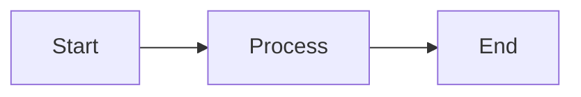

# Quick Start Guide: Core Book Platform

**Feature**: 001-book-platform
**Date**: 2025-11-30
**Purpose**: Get started with local development and content creation

## Prerequisites

### Required Software

- **Node.js**: 18.x LTS or 20.x LTS ([Download](https://nodejs.org/))
- **npm**: Comes with Node.js (verify with `npm --version`)
- **Git**: For version control
- **Code Editor**: VS Code recommended (with MDX extension)

### Optional Software (for ROS2 content development)

- **Docker Desktop**: For testing ROS2 examples locally
- **ROS2 Humble/Iron**: If developing on Linux
- **Gazebo Sim**: For testing simulation examples

## Initial Setup

### 1. Clone the Repository

```bash
git clone https://github.com/ShehzadAnjum/AI_Robotics_Bppl.git
cd AI_Robotics_Bppl
```

### 2. Install Dependencies

```bash
npm install
```

This installs:
- Docusaurus 3.x
- React and related libraries
- MDX processor
- Mermaid diagram plugin
- PWA plugin for offline support
- Testing dependencies (Playwright, Lighthouse)

### 3. Start Development Server

```bash
npm start
```

This command:
- Builds the site in development mode
- Starts a local server at `http://localhost:3000`
- Enables hot reloading (changes update automatically)
- Opens the site in your default browser

### 4. Verify Setup

Visit `http://localhost:3000` and you should see:
- Book homepage
- Navigation sidebar with chapter list
- Search functionality
- Responsive design (try resizing browser)

## Project Structure Overview

```
AI_Robotics_Bppl/
├── docs/                      # Chapter content (Markdown/MDX)
│   ├── intro.md              # Landing page
│   ├── foundations/          # Foundational chapters (Ch 1-3)
│   └── robotics/             # Robotics chapters (Ch 4+)
├── src/                      # React components
│   ├── components/           # Custom components (CuriosityHook, etc.)
│   └── css/                  # Custom styling
├── static/                   # Static assets (images, diagrams)
├── tests/                    # Playwright tests
├── docusaurus.config.js      # Main configuration
├── sidebars.js               # Sidebar navigation structure
└── package.json              # Dependencies and scripts
```

## Common Tasks

### Create a New Chapter

1. **Choose chapter location** based on type:
   - Foundational (Ch 1-3): `docs/foundations/`
   - Robotics (Ch 4+): `docs/robotics/`
   - Advanced: `docs/advanced/`

2. **Copy chapter template**:
   ```bash
   cp .specify/templates/chapter-template.mdx docs/robotics/my-new-chapter.mdx
   ```

3. **Fill in frontmatter**:
   ```mdx
   ---
   sidebar_position: 5
   title: "My New Chapter"
   description: "Learn about..."
   keywords: [keyword1, keyword2]
   ---
   ```

4. **Fill in all 12 elements** (see template comments)

5. **Add to sidebar** (auto-generated from `sidebar_position`)

6. **Preview changes**: Development server auto-reloads

### Add a Diagram

**Mermaid (code-based)**:
```mdx


**Figure 1**: Description of the diagram
```

**Image (file-based)**:
```mdx


**Figure 2**: Description of the diagram
```

**Save images to**: `static/img/[category]/[filename]`

### Run Tests

**All tests**:
```bash
npm test
```

**Specific test suite**:
```bash
npm run test:structure    # Chapter structure validation
npm run test:links        # Broken link detection
npm run test:performance  # Load time checks
```

**Watch mode** (re-run on file changes):
```bash
npm run test:watch
```

### Build for Production

```bash
npm run build
```

This creates an optimized production build in `build/` directory.

**Test production build locally**:
```bash
npm run serve
```

Visit `http://localhost:3000` to preview the production build.

### Deploy to GitHub Pages

**Manual deploy**:
```bash
npm run deploy
```

**Automatic deploy** (configured in `.github/workflows/deploy.yml`):
- Pushes to `main` branch trigger automatic deployment
- GitHub Actions builds and deploys to `gh-pages` branch
- Live site updates within 2-3 minutes

## Content Creation Workflow

### Method 1: Using Skills (Recommended)

**Step 1: Research & Validation (Professor Persona)**
```bash
# Invoke professor-researcher skill
# Provide: Chapter topic, learning objectives
# Receives: Chapter Research Document with 3+ validated sources
```

**Step 2: Content Creation (Editor Persona)**
```bash
# Invoke editor-writer skill
# Provide: Chapter Research Document
# Receives: Draft chapter in 12-element MDX format
```

**Step 3: Quality Validation**
```bash
# Run quality-auditor skill
npm run validate:chapter docs/robotics/my-chapter.mdx
```

**Step 4: Human Review**
- Review technical accuracy
- Review engagement and tone
- Check validation checklist
- Approve or request revision

### Method 2: Manual Creation

1. Copy chapter template
2. Research topic from 3+ authoritative sources
3. Fill validation checklist
4. Write content following 12-element structure
5. Add diagrams, code examples, exercises
6. Run automated tests
7. Human review

## Development Tips

### Hot Reloading

- Save file → Browser auto-refreshes
- If hot reload breaks: `Ctrl+C` and `npm start` again
- For component changes: May need manual refresh

### MDX Syntax

**Import components**:
```mdx
import { CuriosityHook } from '@site/src/components';
```

**Use components**:
```mdx
<CuriosityHook>
Content here
</CuriosityHook>
```

**Embed JSX in Markdown**:
```mdx
## Regular Markdown heading

<div className="special-box">
  Custom JSX content
</div>

More markdown content...
```

### Debugging Build Errors

**Error**: `Module not found`
- **Fix**: Check import paths, ensure file exists

**Error**: `Unexpected token`
- **Fix**: MDX syntax error, check for unclosed tags

**Error**: `Invalid frontmatter`
- **Fix**: Verify YAML frontmatter syntax (3 dashes, valid YAML)

**See build logs**:
```bash
npm run build -- --verbose
```

### Search Configuration

**Built-in search** (default):
- Automatically indexes all content
- Works offline after first visit
- No external service needed

**Algolia DocSearch** (optional, better UX):
- Configure in `docusaurus.config.js`:
  ```js
  themeConfig: {
    algolia: {
      apiKey: 'YOUR_API_KEY',
      indexName: 'YOUR_INDEX',
      appId: 'YOUR_APP_ID',
    },
  }
  ```

## Troubleshooting

### Port 3000 Already in Use

```bash
# Option 1: Kill process using port 3000
# macOS/Linux:
lsof -ti:3000 | xargs kill -9

# Windows:
netstat -ano | findstr :3000
taskkill /PID [PID_NUMBER] /F

# Option 2: Use different port
npm start -- --port 3001
```

### Build Fails on GitHub Actions

1. Check CI/CD logs in GitHub Actions tab
2. Common causes:
   - Broken links
   - Missing images
   - Invalid MDX syntax
   - Test failures
3. Fix locally, test with `npm run build`, then push

### Slow Build Times

- **Clear cache**: `npm run clear`
- **Disable PWA in dev**: Comment out PWA plugin in `docusaurus.config.js`
- **Use incremental builds**: Already enabled by default

## Next Steps

1. **Read documentation**:
   - [spec.md](./spec.md) - Feature requirements
   - [plan.md](./plan.md) - Technical architecture
   - [data-model.md](./data-model.md) - Content structure
   - [contracts/](./contracts/) - Quality contracts

2. **Explore templates**:
   - `.specify/templates/chapter-template.mdx`
   - `.specify/templates/validation-checklist.md`

3. **Review existing content** (when available):
   - `docs/foundations/electronics-basics.md`
   - `docs/robotics/ros2-introduction.md`

4. **Join workflow**:
   - Create your first chapter using the skills workflow
   - Run validation tests
   - Submit for human review
   - Iterate based on feedback

## Useful Commands Reference

| Command | Purpose |
|---------|---------|
| `npm start` | Start development server |
| `npm run build` | Build for production |
| `npm run serve` | Serve production build locally |
| `npm test` | Run all tests |
| `npm run deploy` | Deploy to GitHub Pages |
| `npm run clear` | Clear Docusaurus cache |
| `npm run write-translations` | Extract text for i18n |

## Getting Help

- **Documentation Issues**: Check [Docusaurus docs](https://docusaurus.io/)
- **ROS2 Questions**: Check [ROS2 docs](https://docs.ros.org/)
- **Project Questions**: Create issue in GitHub repo
- **Constitution Reference**: See `.specify/memory/constitution.md`
- **Process Questions**: See `CLAUDE.md` for development workflow

## Checklist: Ready to Start

Before creating your first chapter:

- [ ] Development server running (`npm start`)
- [ ] Can view book at `http://localhost:3000`
- [ ] Chapter template copied to correct location
- [ ] Validation checklist template available
- [ ] Understand 12-element structure (see contracts/)
- [ ] Know how to run tests (`npm test`)
- [ ] Read spec.md and understand requirements

**You're ready!** Start with a foundational chapter or contribute to existing content.
