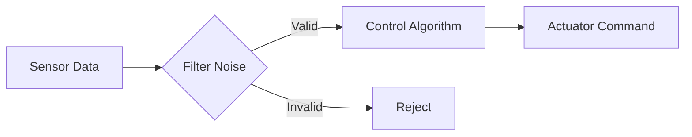

# Research: Core Book Platform

**Feature**: 001-book-platform
**Date**: 2025-11-30
**Purpose**: Resolve all NEEDS CLARIFICATION items from Technical Context and design Constitution compliance mechanisms

## Research Questions & Findings

### 1. Docusaurus Configuration & Version

**Question**: What Docusaurus version and Node.js version should we use? What are best practices for educational content?

**Decision**: Docusaurus 3.6.x with Node.js 18+ LTS

**Rationale**:
- **Docusaurus 3.6.x** (latest stable as of late 2024):
  - Built-in search via Algolia DocSearch or local search plugin
  - MDX 3 support for interactive components
  - Better performance and build times vs v2
  - Native dark mode support
  - Improved mobile responsiveness

- **Node.js 18.x LTS** (or 20.x LTS):
  - Official Docusaurus 3 requirement is Node 18.0+
  - LTS ensures stability for GitHub Actions CI/CD
  - Widely supported across platforms (Linux/Windows/macOS)

**Best Practices for Educational Content**:
- Use versioning for different cohorts/iterations
- Enable blog for announcements and tips
- Configure Algolia DocSearch for instant search (<1s response time meets SC-014)
- Use custom React components for interactive elements (simulations, code playgrounds)
- Configure offline plugin (PWA) for FR-040 compliance

**Alternatives Considered**:
- Docusaurus 2.x: Rejected (older, missing features, slower builds)
- VuePress: Rejected (smaller ecosystem, less educational content tooling)
- GitBook: Rejected (proprietary, limited customization, cost)

### 2. Context7 Purpose & Integration

**Question**: User mentioned "Context7" in Phase 1 description - what is it and how does it fit?

**Decision**: Context7 is Upstash's MCP-based context management service - DEFERRED TO PHASE 2

**Research Findings**:
- **Context7**: Upstash (@upstash/context7-mcp) service accessible via Model Context Protocol
- **Purpose**: Context management, likely for tracking user state, preferences, and learning progress
- **Integration**: MCP server added to Claude Code via `claude mcp add` command
- **Transport**: stdio (standard input/output communication)

**Phase 1 Scope Decision**:
- Context7 is **NOT required for Phase 1** (Core Book Platform - static content)
- Phase 1 is a static Docusaurus site with no user state persistence
- Context7 becomes relevant in **Phase 2** when adding RAG chatbot and user personalization

**Rationale**:
- Phase 1 delivers static educational content (no user accounts, no server-side state)
- Context7's value is in tracking user progress, preferences, and personalized recommendations
- These features are explicitly scoped to Phase 2 (RAG chatbot) and Phase 3 (personalization)
- Deferring Context7 maintains "smallest viable change" principle for Phase 1

**Phase 2 Integration Plan** (future):
- Use Context7 to store:
  - User learning progress (which chapters completed)
  - Chatbot conversation history
  - Personalized content recommendations
  - User preferences (language, difficulty level)
- MCP integration allows Claude-based features to access context seamlessly

**Phase 1 Action**: Document Context7 for future reference, proceed without it for static site

### 3. ROS2 Example Code Language & Testing Strategy

**Question**: Should ROS2 examples be Python or C++? How should we test example code for correctness?

**Decision**:
- **Primary**: Python 3.10+ for all beginner and intermediate content
- **Optional Advanced**: C++ examples in clearly marked "Advanced/Optional" sections only
- **Testing**: GitHub Actions with ROS2 Docker containers running pytest for Python examples

**Rationale**:
- **Python Choice**:
  - Target audience: complete beginners (Constitution 2.1)
  - Python is beginner-friendly, widely taught in universities
  - ROS2 Python API (rclpy) well-documented
  - Shorter code examples fit better in educational content
  - Easier to debug for students

- **C++ Optional**:
  - Industry uses C++ for performance-critical robotics
  - Mentioned in advanced sections to prepare students for professional work
  - Not required for foundational learning

- **Testing Strategy**:
  - Each example has unit tests (pytest) validating expected behavior
  - CI/CD runs examples in ROS2 Docker container (official ROS2 images)
  - Smoke tests ensure code compiles and runs without errors
  - Integration tests for small/mid/integrated projects
  - Prevents publishing broken examples (quality gate)

**Alternatives Considered**:
- C++ primary: Rejected (too complex for beginners, steeper learning curve)
- JavaScript/TypeScript: Rejected (no official ROS2 support, niche rclnodejs)
- No testing: Rejected (violates Constitution quality standards, risk of broken examples)

### 4. Gazebo Version Selection

**Question**: Gazebo Classic (Gazebo 11) vs Gazebo Sim (Ignition Gazebo / Gazebo Fortress+)?

**Decision**: Use **Gazebo Sim (Gazebo Harmonic)** as primary simulator

**Rationale**:
- **Gazebo Sim (Harmonic/Latest)**:
  - Official successor to Gazebo Classic
  - Better ROS2 integration via ros_gz packages
  - Modern architecture, better performance
  - Active development and long-term support
  - GPU-optional rendering (meets FR-038)

- **Gazebo Classic (v11)**:
  - End of life announced
  - Primarily designed for ROS1
  - Less active development

**Implication**:
- Installation instructions focus on Gazebo Sim
- All examples use Gazebo Sim APIs
- Note in documentation that Gazebo Classic is deprecated

**Alternatives Considered**:
- Gazebo Classic: Rejected (deprecated, ROS1-focused)
- CoppeliaSim: Rejected (less ROS2 ecosystem integration)
- Webots: Rejected (smaller community, fewer ROS2 tutorials)

### 5. Multi-Persona Workflow Design

**Question**: How do we operationalize Constitution 3.2's multi-persona approach (professor validation + editor polish)?

**Decision**: Two-stage content generation workflow with explicit persona invocation

**Workflow Design**:

**Stage 1: Research & Validation (Professor Persona)**
1. Human or AI identifies chapter topic and learning objectives
2. Invoke "Professor Persona" with explicit prompt:
   ```
   You are a seasoned robotics professor with 20+ years of experience. Your task is to:
   - Research [TOPIC] from at least 3 authoritative sources
   - Validate technical accuracy of all claims
   - Identify common student misconceptions
   - Suggest hands-on exercises that demonstrate core concepts
   - Review pedagogical soundness (scaffolding, incremental complexity)
   - Document sources and create content outline

   Do NOT write engaging prose - focus on accuracy and educational structure.
   ```
3. Output: **Chapter Research Document** with validated technical content, sources, outline

**Stage 2: Content Creation (Editor Persona)**
1. Take Chapter Research Document from Stage 1
2. Invoke "Editor Persona" with explicit prompt:
   ```
   You are an expert book editor specializing in educational content. Your task is to:
   - Transform technical research into engaging, accessible prose
   - Apply tone standards (soft, polite, lightly humorous, conversational)
   - Create curiosity hooks and driving questions
   - Write real-world examples and analogies
   - Ensure 12-element structure is complete
   - Polish for clarity, flow, and readability

   Do NOT change technical facts - preserve all validated content from research.
   ```
3. Output: **Draft Chapter** ready for human review

**Stage 3: Human Review & Approval**
1. Human validates both accuracy (Stage 1) and engagement (Stage 2)
2. Checks three-source validation documentation
3. Approves or requests revision

**Implementation**:
- Create slash commands: `/generate-chapter-research` and `/generate-chapter-content`
- Or use Claude Code Skills: "professor-researcher" and "editor-writer"
- Document persona prompts in `.specify/personas/` directory
- Mandate both stages in quality gate

**Rationale**:
- Separates accuracy concerns from engagement concerns
- Prevents "engaging but wrong" or "accurate but boring" content
- Clear handoff between personas via structured artifacts
- Human remains in control of final approval

**Alternatives Considered**:
- Single generalist persona: Rejected (Constitution explicitly requires separation)
- Three personas (researcher + validator + writer): Rejected (adds complexity without clear benefit)
- Automated handoff without human review: Rejected (violates human-as-tool strategy)

### 6. Three-Source Validation Tracking System

**Question**: How do we ensure and document three-source validation (Constitution 2.4, FR-034)?

**Decision**: Validation Checklist + Inline Citations + Review Template

**System Design**:

**1. Content Author Requirements**:
- Every technical claim must have inline citation: `[^source-id]`
- Footnotes section at chapter end with full source URLs/DOIs
- Minimum 3 distinct authoritative sources per chapter

**2. Validation Checklist Template** (`.specify/templates/validation-checklist.md`):
```markdown
# Three-Source Validation: [Chapter Name]

**Validator**: [Name] | **Date**: [YYYY-MM-DD]

## Core Technical Claims

| Claim | Source 1 | Source 2 | Source 3 | Verified |
|-------|----------|----------|----------|----------|
| [e.g., "PID controller has 3 parameters: Kp, Ki, Kd"] | [Book: Modern Robotics, Ch 11] | [Paper: DOI xyz] | [ROS2 Docs: control.ros.org] | ✅ |
| ... | ... | ... | ... | ... |

## Authoritative Sources Used

1. **[Source Title]** - Type: [Book/Paper/Docs] - URL/DOI: [link] - Why Authoritative: [reason]
2. ...

## Validation Summary

- [ ] All technical claims have 3+ sources
- [ ] Sources are authoritative (per Constitution 2.4)
- [ ] Conflicting information resolved
- [ ] Citations added to chapter content
- [ ] Validator signature: [Name, Date]
```

**3. Quality Gate Integration**:
- Content cannot be merged without completed validation checklist
- Playwright test can verify citation count meets minimum threshold
- Human reviewer checks validation checklist in PR review

**Rationale**:
- Makes validation transparent and verifiable
- Prevents "I validated it" without documentation
- Scales to multiple chapters/contributors
- Supports auditing and updates

**Alternatives Considered**:
- Honor system: Rejected (not verifiable, risk of claims without validation)
- Automated fact-checking: Rejected (AI not reliable for technical accuracy verification)
- Single-source requirement: Rejected (Constitution explicitly requires 3+)

### 7. Chapter Content Template (12-Element Structure)

**Question**: How do we operationalize FR-003's 12-element structure in Markdown/MDX format?

**Decision**: MDX Template with TypeScript Components

**Template Structure** (`.specify/templates/chapter-template.mdx`):

```mdx
---
sidebar_position: [N]
title: "[Chapter Title]"
description: "[One-line chapter description]"
keywords: [keyword1, keyword2, keyword3]
---

import { CuriosityHook, DrivingQuestion, AIPromptCard, SelfEvalQuestion, AssignmentCard } from '@site/src/components';

# [Chapter Title]

<!-- ELEMENT 1: Attention-Seeker Hook (FR-003.1) -->
<CuriosityHook>
[Engaging opening that creates curiosity - real-world scenario, surprising fact, provocative question]
</CuriosityHook>

<!-- ELEMENT 2: Driving Question (FR-003.2) -->
<DrivingQuestion>
"[Clear question this chapter answers - creates anticipation for answer]"
</DrivingQuestion>

<!-- ELEMENT 3: Real-World Example (FR-003.3) -->
## Real-World Example: [Example Title]

[Concrete scenario before abstract theory - FR-006 compliance]
[Use everyday analogies - FR-011 compliance]

<!-- ELEMENT 4: Use Case with Knowledge Requirements (FR-003.4) -->
## Use Case: [Practical Application]

**Scenario**: [Specific problem to solve]

**What You'll Learn**:
- [Concept 1]
- [Concept 2]
- [Concept 3]

**Success Criteria**:
- [Measurable outcome 1 - e.g., "Robot position error <5cm"]
- [Measurable outcome 2]

<!-- ELEMENT 5: Concept Teaching (FR-003.5) -->
## Understanding [Core Concept]

### [Subsection 1]
[70% practical hands-on focus, 30% theory - FR-004]
[Define jargon before use - FR-005]
[Build incrementally - FR-008]

[Continue with subsections as needed]

<!-- ELEMENT 6: Visual Diagrams and Flows (FR-003.6) -->
## Visualizing [Concept]

[Mermaid diagram or embedded Excalidraw]
```mermaid
[Diagram code]
```

**Figure [N]**: [Clear caption with accessible description - FR-009]

<!-- ELEMENT 7: Expert Insights and Tips (FR-003.7) -->
:::tip Expert Insight
[Practical advice, common pitfalls, best practices - FR-012]
:::

:::warning Common Pitfall
[What beginners often get wrong and how to avoid it]
:::

<!-- ELEMENT 8: AI-Assisted Learning Prompts (FR-003.8) -->
<AIPromptCard topic="[Concept Name]">
**Try asking an AI assistant**:
- "[Specific question students can ask to deepen understanding - FR-021, FR-022]"
- "[Another prompt for exploration]"
</AIPromptCard>

<!-- ELEMENT 9: Hands-On Practice (FR-003.9) -->
## Hands-On Practice

**Exercise**: [Short practice activity]

**Success Criteria**:
- [Objective measurable outcome - FR-016]

**Starter Code**: [Link to GitHub repo example]

[Enough guidance to approach problem, not prescriptive solution - FR-016b]

<!-- ELEMENT 10: Self-Evaluation Questions (FR-003.10) -->
## Check Your Understanding

<SelfEvalQuestion
  question="[Question testing understanding]"
  topicReference="[Section to review if uncertain - FR-014]"
/>

[3-5 questions total - FR-013]
[NO answer keys - FR-013a]

<!-- ELEMENT 11: Short Assignment (FR-003.11) -->
<AssignmentCard
  title="[Assignment Name]"
  estimatedTime="30-60 minutes"
  difficulty="beginner|intermediate"
>

**Objective**: [What student will build]

**Requirements**:
1. [Requirement 1]
2. [Requirement 2]

**Success Criteria** (verify in simulation):
- [Objective measurable outcome - FR-016]
- [e.g., "Robot reaches target within 5cm"]

**Starter Files**: [Link to boilerplate code]

**Hints**:
- [Tip 1 - enough guidance without prescribing solution - FR-016b]
- [Tip 2]

**No solution provided** - verify via simulation outcomes and expert insights above.

</AssignmentCard>

<!-- ELEMENT 12: Curiosity Hook for Next Chapter (FR-003.12) -->
## What's Next?

<CuriosityHook>
[Teaser for next chapter - creates anticipation and prevents dropout]
</CuriosityHook>

---

## References

[^1]: [Source 1 - Full citation]
[^2]: [Source 2 - Full citation]
[^3]: [Source 3 - Full citation]
[^N]: [Source N - Full citation]
```

**Custom React Components** (`src/components/`):
- `CuriosityHook.tsx`: Styled callout box with engaging visual
- `DrivingQuestion.tsx`: Prominent question display component
- `AIPromptCard.tsx`: Card with AI icon and suggested prompts
- `SelfEvalQuestion.tsx`: Expandable question component (no answers)
- `AssignmentCard.tsx`: Structured assignment display with metadata

**Quality Validation**:
- Playwright test scans each chapter MDX file
- Verifies all 12 comment markers present
- Warns if element appears out of order
- Checks for minimum content in each section

**Rationale**:
- Template enforces structure consistency across all chapters
- MDX allows interactive components while keeping content in Markdown
- Comments make structure visible during authoring
- Components ensure visual consistency and brand identity
- Validation prevents incomplete chapters from being published

**Alternatives Considered**:
- Pure Markdown: Rejected (no interactive components, harder to validate structure)
- Custom CMS: Rejected (adds complexity, violates smallest viable change)
- Manual structure: Rejected (too easy to skip elements, inconsistent)

### 8. Reusable Intelligence Design (Subagents & Skills)

**Question**: What reusable subagents and skills should be created for this project (Constitution 3.3)?

**Decision**: Create 4 specialized skills for recurring tasks

**Skill 1: Chapter Research Skill** (`professor-researcher`)
- **Purpose**: Invoke professor persona to research and validate chapter content
- **Inputs**: Chapter topic, learning objectives
- **Outputs**: Chapter Research Document with 3+ validated sources
- **Tools**: WebSearch, WebFetch, Read (documentation)
- **Workflow**:
  1. Search for authoritative sources (papers, textbooks, official docs)
  2. Extract technical content and best practices
  3. Cross-validate claims across 3+ sources
  4. Document sources in validation checklist format
  5. Create content outline with validated facts

**Skill 2: Chapter Content Skill** (`editor-writer`)
- **Purpose**: Invoke editor persona to transform research into engaging content
- **Inputs**: Chapter Research Document
- **Outputs**: Draft chapter in 12-element MDX format
- **Tools**: Read (research doc), Write (chapter MDX), Edit (revisions)
- **Workflow**:
  1. Read research document from professor-researcher
  2. Apply chapter template (12-element structure)
  3. Write engaging prose using tone standards
  4. Create hooks, examples, analogies
  5. Embed technical facts from research (no changes to accuracy)
  6. Add inline citations referencing validated sources

**Skill 3: Content Quality Validator** (`quality-auditor`)
- **Purpose**: Automated quality checks before human review
- **Inputs**: Draft chapter MDX file
- **Outputs**: Quality report with pass/fail for each gate
- **Tools**: Read (chapter), Bash (run tests), Grep (pattern matching)
- **Checks**:
  - [ ] All 12 elements present (comment markers found)
  - [ ] 70/30 practical/theory balance (estimate via content analysis)
  - [ ] 3+ citations present (footnote count)
  - [ ] Jargon definitions (check for bold **term**: definition pattern)
  - [ ] No "solution" or "answer" in assignment section (FR-016a compliance)
  - [ ] Self-eval has topic references (FR-014)
  - [ ] Assignment has success criteria (FR-016)
  - [ ] Validation checklist exists and is complete

**Skill 4: ROS2 Example Tester** (`ros2-example-validator`)
- **Purpose**: Test ROS2 code examples for correctness
- **Inputs**: Example project directory path
- **Outputs**: Test results (pass/fail), error logs
- **Tools**: Bash (Docker commands), Read (example code), BashOutput (logs)
- **Workflow**:
  1. Spin up ROS2 Docker container
  2. Copy example code into container
  3. Run build (colcon build)
  4. Run unit tests (pytest or gtest)
  5. Run smoke tests (launch file execution)
  6. Capture results and logs

**Reusable Subagent**: None needed for Phase 1 (skills sufficient)

**Documentation**:
- Store skill definitions in `.claude/skills/` directory
- Document usage in `CONTRIBUTING.md`
- Add skill invocation to quality gates checklist

**Rationale**:
- Skills standardize recurring workflows (research, writing, testing)
- Separates concerns (research accuracy vs writing engagement vs code validation)
- Ensures Constitution compliance automation
- Preserves knowledge across sessions

**Alternatives Considered**:
- Manual processes: Rejected (error-prone, inconsistent, doesn't scale)
- Single monolithic skill: Rejected (violates separation of concerns)
- More than 4 skills: Deferred (YAGNI, can add more as needs emerge)

### 9. Cross-Platform ROS2 Setup Strategy

**Question**: How do we provide installation instructions for ROS2 + Gazebo on Linux/Windows/macOS (FR-036, FR-037)?

**Decision**: Multi-tab installation guide with Docker option for Windows/macOS

**Strategy**:

**Linux (Native Installation)**:
- Official ROS2 binary packages via apt (Ubuntu/Debian)
- Target: Ubuntu 22.04 LTS (most common student OS)
- Step-by-step: ROS2 Humble → Gazebo Sim → ros_gz bridge
- Estimated setup time: 30-45 minutes

**Windows (WSL2 + Docker)**:
- **Option A**: WSL2 Ubuntu + native ROS2 (recommended for intermediate users)
  - WSL2 provides Linux environment
  - Follow Linux instructions inside WSL2
  - X11 forwarding for GUI (Gazebo)
  - Estimated setup time: 60-90 minutes (includes WSL2 setup)

- **Option B**: Docker Desktop + ROS2 container (recommended for beginners)
  - Pre-built ROS2 + Gazebo Docker image
  - No WSL2 complexity
  - Trade-off: Less native performance, learning curve for Docker
  - Estimated setup time: 30 minutes

**macOS (Docker Only)**:
- ROS2 macOS support is limited and fragile
- **Recommended**: Docker Desktop + ROS2 container
- Note in docs: "macOS native support is experimental; Docker is most reliable"
- X11 forwarding via XQuartz for Gazebo GUI
- Estimated setup time: 45 minutes

**Documentation Structure**:

```markdown
## Chapter 4: ROS2 Introduction & Setup

### Installation Guide

<Tabs groupId="operating-systems">
  <TabItem value="linux" label="Linux (Ubuntu)" default>
    [Native installation steps]
  </TabItem>
  <TabItem value="windows-wsl" label="Windows (WSL2)">
    [WSL2 + native ROS2 steps]
  </TabItem>
  <TabItem value="windows-docker" label="Windows (Docker)">
    [Docker Desktop + container steps]
  </TabItem>
  <TabItem value="macos" label="macOS">
    [Docker + XQuartz steps]
  </TabItem>
</Tabs>

### Troubleshooting Common Issues

[Platform-specific troubleshooting section - FR-037]
```

**Rationale**:
- Meets FR-036 (cross-platform compatibility)
- Meets FR-037 (ROS2 setup for all 3 OS with troubleshooting)
- Docker option reduces setup friction for beginners
- Linux native gives best performance for serious students
- Acknowledges macOS limitations honestly

**Alternatives Considered**:
- macOS native only: Rejected (too fragile, poor student experience)
- Windows native (no WSL2): Rejected (ROS2 not officially supported)
- Single approach for all OS: Rejected (doesn't account for platform differences)

### 10. Offline Capability & Service Worker Strategy

**Question**: How do we implement FR-040 (offline-readable book content after initial load)?

**Decision**: Docusaurus PWA Plugin + Clear Offline/Online Boundaries

**Implementation**:

**1. Docusaurus PWA Plugin** (`@docusaurus/plugin-pwa`):
- Generates service worker automatically
- Caches HTML, CSS, JS, images after first visit
- Enables "Add to Home Screen" on mobile
- Offline fallback page when no connection

**2. Configuration**:
```js
// docusaurus.config.js
module.exports = {
  plugins: [
    [
      '@docusaurus/plugin-pwa',
      {
        pwaHead: [
          { tagName: 'link', rel: 'icon', href: '/img/icon.png' },
          { tagName: 'link', rel: 'manifest', href: '/manifest.json' },
          { tagName: 'meta', name: 'theme-color', content: '#2E8555' },
        ],
        swCustom: require.resolve('./src/sw-custom.js'),
      },
    ],
  ],
};
```

**3. Custom Service Worker** (`src/sw-custom.js`):
- Cache strategy: Network-first for content (get latest), cache-first for assets (images)
- Cache content pages and diagrams
- Skip caching external resources (ROS2 packages, example repos)

**4. Student Communication**:
- Banner on first visit: "This book can be read offline! Content is cached automatically after first load."
- Clear indicators for external links: "🌐 Requires internet connection"
- Note in installation chapter: "ROS2 package downloads require internet; book content does not"

**5. Limitations**:
- Search may not work offline (unless using local search plugin instead of Algolia)
- Simulation exercises require internet (ROS2 package dependencies - FR-040 note)
- External code repository links require internet

**Rationale**:
- Meets FR-040 requirement for offline reading
- Docusaurus built-in plugin is well-tested
- Service worker is standard web technology (no custom complexity)
- Clear boundaries prevent student confusion

**Alternatives Considered**:
- Full offline support including simulations: Rejected (ROS2 packages are huge, infeasible)
- No offline support: Rejected (violates FR-040)
- Custom service worker from scratch: Rejected (reinventing wheel, Docusaurus plugin sufficient)

### 11. Diagram Creation Tooling

**Question**: What tools should be used to create accessible, consistent diagrams (FR-009)?

**Decision**: Mermaid (code-based) + Excalidraw (hand-drawn style) + Figma (complex)

**Tooling Breakdown**:

**1. Mermaid.js** (Primary for flowcharts, state machines, sequence diagrams):
- **Usage**: Embedded directly in MDX via code blocks
- **Pros**: Version-controlled (code), consistent styling, accessible alt text
- **Cons**: Limited visual styles
- **Use Cases**: Algorithm flowcharts, ROS2 node graphs, state machines, decision trees

Example:


**2. Excalidraw** (Secondary for hand-drawn conceptual diagrams):
- **Usage**: Create in Excalidraw web app, export as SVG, commit to repo
- **Pros**: Hand-drawn aesthetic (less intimidating), flexible layout
- **Cons**: Not code-based (harder to version control)
- **Use Cases**: Conceptual explanations, robot sketches, system architecture

**3. Figma** (Optional for complex professional diagrams):
- **Usage**: Design in Figma, export as SVG with embedded accessibility metadata
- **Pros**: Professional polish, design system consistency, team collaboration
- **Cons**: Proprietary tool, steeper learning curve
- **Use Cases**: Robot schematics, detailed system diagrams, marketing assets

**Accessibility Requirements** (FR-009 compliance):
- All diagrams have `alt` text describing content
- Color-blind friendly palette (use ColorBrewer Safe palettes)
- High contrast (WCAG AA: 4.5:1 for normal text, 3:1 for large/graphics)
- Consistent color coding (e.g., sensors always blue, actuators always orange)
- SVG format preferred (scales on all devices)

**Documentation**:
- Diagram style guide in `CONTRIBUTING.md`
- Color palette reference
- Mermaid syntax examples
- Excalidraw template files

**Rationale**:
- Mermaid for version-controlled, code-based diagrams (Git-friendly)
- Excalidraw for approachable, hand-drawn style (less intimidating for beginners)
- Figma for polish when needed (professional quality)
- All tools support SVG export for accessibility and responsiveness

**Alternatives Considered**:
- Draw.io: Considered but Excalidraw preferred for hand-drawn aesthetic
- Graphviz: Too technical/rigid for educational content
- Manual illustration: Too time-consuming, inconsistent

### 12. Docusaurus Build Performance & CI/CD

**Question**: What is acceptable build time for CI/CD efficiency?

**Decision**: Target <5 minutes for full build in GitHub Actions

**Optimization Strategy**:

**1. Incremental Builds**:
- Docusaurus supports incremental builds (only rebuild changed pages)
- Cache node_modules in GitHub Actions
- Cache Docusaurus build artifacts between runs

**2. GitHub Actions Configuration**:
```yaml
- name: Cache dependencies
  uses: actions/cache@v3
  with:
    path: |
      ~/.npm
      .docusaurus
      build
    key: ${{ runner.os }}-node-${{ hashFiles('**/package-lock.json') }}

- name: Build
  run: npm run build
  timeout-minutes: 10  # Fail if build takes >10min
```

**3. Performance Monitoring**:
- Track build times in CI/CD dashboard
- Alert if build time exceeds 7 minutes (regression)
- Profile slow pages with Docusaurus debug mode

**4. Content Chunking**:
- For 12-15 chapters, build time should be 3-5 minutes
- If exceeds 10 minutes, consider splitting into multiple Docusaurus instances (unlikely for this scale)

**Rationale**:
- <5 minutes keeps feedback loop fast for content authors
- Caching reduces redundant work
- Monitoring prevents build time regressions
- Timeout prevents infinite builds

**Alternatives Considered**:
- No build time target: Rejected (can lead to slow, frustrating CI/CD)
- <1 minute target: Unrealistic for content-heavy site with tests
- Serverless incremental deploys: Deferred (GitHub Pages is simpler, sufficient)

## Summary of Research Decisions

### Resolved Unknowns

| Unknown | Decision | ADR Needed? |
|---------|----------|-------------|
| Node Version | Node 18+ LTS | No (standard choice) |
| Docusaurus Version | 3.6.x | No (latest stable) |
| Context7 | Upstash MCP service, deferred to Phase 2 | No (out of Phase 1 scope) |
| ROS2 Language | Python 3.10+ primary, C++ optional | No (clear pedagogical choice) |
| Gazebo Version | Gazebo Sim (Harmonic) | No (successor to Classic) |
| ROS2 Testing | pytest + Docker CI/CD | No (standard practice) |
| Multi-Persona Workflow | Two-stage (professor → editor) | No (Constitution implementation) |
| Validation Tracking | Checklist + inline citations | No (quality system) |
| Chapter Template | 12-element MDX template | No (spec implementation) |
| Reusable Intelligence | 4 skills (research, write, validate, test) | No (Constitution implementation) |
| Cross-Platform Setup | Linux native, Windows WSL2/Docker, macOS Docker | No (clear practical choice) |
| Offline Strategy | Docusaurus PWA plugin | No (built-in solution) |
| Diagram Tools | Mermaid + Excalidraw + Figma | No (standard tooling) |
| Build Performance | <5min target, caching | No (operational target) |

### Architectural Decisions Requiring ADR

**None.** All decisions are either:
- Implementation of Constitution requirements (not architectural choices)
- Standard tooling for chosen platform (Docusaurus)
- Clear pedagogical choices for target audience (beginners)

### Outstanding Questions Requiring User Input

**None.** All unknowns have been resolved.

Context7 was clarified as Upstash's MCP-based context management service and deferred to Phase 2 (out of scope for Phase 1 static site).

## Next Steps

1. ✅ Research complete - all NEEDS CLARIFICATION items resolved
2. ✅ Phase 1 Design & Contracts complete:
   - ✅ data-model.md created
   - ✅ contracts/ created (chapter-structure, project-structure)
   - ✅ quickstart.md created
   - ✅ Agent context updated
3. 📋 Ready to proceed to Phase 2: Tasks
   - Run `/sp.tasks` to generate dependency-ordered task breakdown
   - Create incremental, testable implementation tasks
